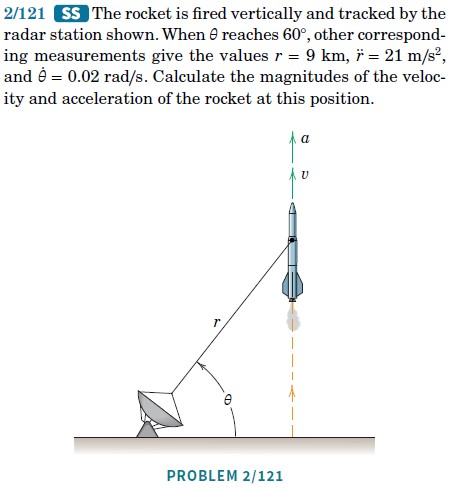

## Position, Velocity, and Acceleration

Consider a particle moving in $\mathbb{E}^3$. Its position vector relative to a fixed origin $O$ is denoted by ${\bf r} \in \mathbb{E}^3$. As time $t$ evolves, so does ${\bf r}(t)$.

```{r}
#| engine: tikz
#| echo: false
#| fig-align: center
#| fig-width: 3
\begin{tikzpicture}

    % Draw the random smooth curve
    \draw[thick] plot[smooth, tension=1] coordinates {(-2,-1) (0,2) (2,-1) (4,1)};

    % Draw the particle on the curve
    \node[circle, fill=red, inner sep=2pt, label=below:{$P$}] at (0,2) {};

    % Draw the origin
    \node[circle, fill=black, inner sep=2pt, label=below:{$O$}] at (-2,-2) {};

    % Draw the position vector to the particle
    \draw[->, thick, blue] (-2,-2) -- (0,2) node[midway, above left] {${\bf r}$};

\end{tikzpicture}
```

Let $\Delta t$ be a finite time elapsed:
\begin{align}
    \Delta{\bf r} = {\bf r}(t+\Delta t)-{\bf r}(t).
\end{align}
As $\Delta t \rightarrow 0$, $\Delta t$ becomes $dt$ and $\Delta {\bf r}$ becomes $d{\bf r}$. The '$d$' means differential. We denote the time derivative of ${\bf r}$ by $\dot{\bf r}$ or $\frac{d{\bf r}}{dt}$.

```{r}
#| engine: tikz
#| echo: false
#| fig-align: center
\usetikzlibrary{calc}
\begin{tikzpicture}

% --- Left Diagram ---
\draw[dashed] (-0.5,1.8) to[out=0,in=160] (2,1) to[out=-20,in=140] (4,0.5);

\draw[thick] (0,0) -- (0,1);
\draw[thick] (0,0) -- (-0.7,-0.5);
\draw[thick] (0,0) -- (0.7,-0.5);

\coordinate (A) at (1.5,1.2);
\coordinate (B) at (3,0.8);

\fill (A) circle (0.05);
\fill (B) circle (0.05);

\draw[->,thick] (0,0) -- (A);
\draw[->,thick] (0,0) -- (B);
\draw[->,thick] (A) -- (B);

\node[above] at (A) {$\mathbf{r}(t)$};
\node[right] at (B) {$\mathbf{r}(t+\Delta t)$};
\node[above] at ($(A)!0.5!(B)$) {$\Delta \mathbf{r}$};

% --- Right Diagram ---
\begin{scope}[xshift=7cm]
\draw[dashed] (-0.5,1.8) to[out=20,in=140] (4,0.5);

\node at (0,-0.3) {$O$};

\coordinate (C) at (1.8,1.9);
\coordinate (D) at (2,1.8);
\draw[->,thick] (0,0) -- (C);
\draw[->,thick] (0,0) -- (D);
\draw[->,thick] (C) -- ++(1.2,-0.5) node[right] {$\mathbf{v}$};

\node at (2,3) {zoom in};
\end{scope}

\end{tikzpicture}
```

The (absolute) velocity vector ${\bf v}$ of the particle is the time rate of change of the position vector:
\begin{align}
    {\bf v} = \frac{d{\bf r}}{dt}=\dot{\bf r} = \lim_{\Delta t \rightarrow 0}\frac{{\bf r}(t+\Delta t)-{\bf r}(t)}{\Delta t}.
\end{align}

::: {.callout-tip title="Think!"}
**Question:** What is the direction of the velocity vector?

::: {.callout-note title="Answer" collapse="true"}
${\bf v}$ is along $d{\bf r}$ which is always tangent to the path.
:::
:::

The speed of the particle is the magnitude of the velocity vector $v = \lnorm{\bf v}\rnorm$.

The (absolute) acceleration is
\begin{align}
    {\bf a} = \frac{d{\bf v}}{dt} = \dot{\bf v} = \ddot{\bf r} = \frac{d^2{\bf r}}{dt^2}.
\end{align}

## Arc-Length and the Unit Tangent Vector

Define the arc-length parameter $s$ such that
\begin{align}
    \frac{ds}{dt} = \lnorm {\bf v}\rnorm.
\end{align}

$\frac{ds}{dt}$ is the speed of the particle. Recall that ${\bf v} = \frac{d{\bf r}}{dt}$, so
\begin{align}
    \frac{ds}{dt} = \lnorm\frac{d{\bf r}}{dt}\rnorm.
\end{align}

So $ds$ is the length of the differential $d{\bf r}$ along the curve. Integrating:
\begin{align}
    s(t)-s_0 = \int_{t_0}^t\frac{ds}{dt}(\tau)d\tau = \int_{t_0}^t\sqrt{{\bf v}(\tau)\cdot{\bf v}(\tau)}\,d\tau.
\end{align}

Notes:

- $s(t)-s_0$ is the distance traveled by the particle along its path $\mathcal{C}$ during the time interval $[t_0, t]$.
- $s(t_0)=s_0$ where $t_0$ and $s_0$ are initial conditions.
- The dummy variable $\tau$ is used (as opposed to $t$) when evaluating this integral because we are integrating the speed as it varies between $t_0$ and $t$. The variable of integration is different than the upper limit of integration.

::: {.callout-tip title="Think!"}
**Question:** Under what conditions is $s(t)$ invertible so that $t(s)$ is well defined?

::: {.callout-note title="Answer" collapse="true"}
If the function $s(t)$ is one-to-one, it can be inverted, and time can be written in terms of arc-length $t = t(s)$.
:::
:::

::: {.callout-tip title="Think!"}
**Question:** Why is
\begin{align}
    s(t)-s_0 \neq \lnorm {\bf r}(t)-{\bf r}_0\rnorm?
\end{align}
Under what conditions does the equality hold?

::: {.callout-note title="Answer" collapse="true"}
The equality holds under rectilinear motion or over an infinitesimal time interval.
:::
:::

We define the unit tangent vector ${\bf e}_t$:
\begin{align}
    \frac{\bf v}{\lnorm{\bf v}\rnorm} = {\bf e}_t, \qquad {\bf v} = \frac{d{\bf r}}{dt} = \frac{d{\bf r}}{ds}\frac{ds}{dt} = \dot{s}{\bf e}_t.
\end{align}

::: {.callout-tip title="Think!"}
**Question:** Verify that ${\bf e}_t$ is a unit vector.

::: {.callout-note title="Answer" collapse="true"}
…
:::
:::

Note the relationships
\begin{align*}
    {\bf v} &= \frac{d{\bf r}(t)}{dt} = \frac{d{\bf r}}{ds}\frac{ds}{dt},\\
    {\bf a} &= \frac{d{\bf v}(t)}{dt} = \frac{d^2{\bf r}}{ds^2}\lp\frac{ds}{dt}\rp^2+\frac{d{\bf r}}{ds}\frac{d^2 s}{dt^2}.
\end{align*}

Notice: the acceleration vector is due to changes in both the magnitude and direction of the velocity vector.

::: {.callout-tip title="Think!"}
**Question:** Is the unit vector ${\bf e}_t$ constant in general? Under what conditions is it constant?

::: {.callout-note title="Answer" collapse="true"}
No. It is constant only during rectilinear motion in a fixed direction.
:::
:::

### Example

::: {.callout-warning title="Example"}
**Question:** Consider a particle moving in space with position vector
\begin{align}
    {\bf r}(t) = R_0\lp\cos(\omega t){\bf E}_x+\sin(\omega t){\bf E}_y\rp.
\end{align}

Calculate and plot ${\bf v}$, ${\bf a}$, ${\bf v}\times {\bf a}$, $\lnorm{\bf r}\rnorm$. Show that the motion satisfies:
\begin{align}
    \ddot{x}+\omega^2 x=0, \qquad \ddot{y}+\omega^2 y=0.
\end{align}
::: {.callout-note title="Answer" collapse="true"}
Answer: ...
:::
:::


::: {.callout-warning title="Example"}
**Question:** Consider a particle $P$ moving in $\mathbb{E}^2$ with position vector
\begin{align*}
    {\bf r} = R_0\lp\cos\lp\omega t\rp{\bf E}_x+\sin\lp\omega t\rp{\bf E}_y\rp.
\end{align*}
Calculate ${\bf r}\times{\bf a}$ and ${\bf r}\cdot{\bf a}$. Describe the motion of the particle.

::: {.callout-note title="Answer" collapse="true"}
<!-- The velocity and acceleration are:
\begin{align*}
    {\bf v} &= R_0\omega\lp-\sin\lp\omega t\rp{\bf E}_x+\cos\lp\omega t\rp{\bf E}_y\rp,\\
    {\bf a} &= -R_0\omega^2\lp\cos\lp\omega t\rp{\bf E}_x+\sin\lp\omega t\rp{\bf E}_y\rp.
\end{align*}
Note that $\dot{\bf E}_x={\bf 0}$ and $\dot{\bf E}_y={\bf 0}$ since the basis is fixed, and the chain rule applies.

Noting that ${\bf a} = -\omega^2{\bf r}$:
\begin{align*}
    {\bf r}\times{\bf a} = {\bf r}\times(-\omega^2{\bf r}) = -\omega^2{\bf r}\times{\bf r} = {\bf 0}.
\end{align*}

For ${\bf r}\cdot{\bf a}$:
\begin{align*}
    {\bf r}\cdot{\bf a} &= -R_0^2\omega^2\lp\cos^2(\omega t)+\sin^2(\omega t)\rp = -R_0^2\omega^2.
\end{align*} -->

We calculate the velocity and acceleration vectors of the particle as follows:

\begin{align*}
{\bf v} &= \frac{d{\bf r}}{dt}
= R_0\omega\left(-\sin(\omega t)\,{\bf E}_x+\cos(\omega t)\,{\bf E}_y\right),\\
{\bf a} &= \frac{d{\bf v}}{dt}
= -R_0\omega^2\left(\cos(\omega t)\,{\bf E}_x+\sin(\omega t)\,{\bf E}_y\right).
\end{align*}

As you take these derivatives, remember that:

- $\dot{\bf E}_x={\bf 0}$ and $\dot{\bf E}_y={\bf 0}$ since the basis $\{{\bf E}_x,{\bf E}_y\}$ is fixed.
- The chain rule: $\frac{d}{dx}f(g(x)) = f'(g(x))g'(x).$

Then,

\begin{align*}
{\bf r}\times{\bf a}
&=
R_0\left(\cos(\omega t){\bf E}_x+\sin(\omega t){\bf E}_y\right)
\times
\left(
-R_0\omega^2\left(\cos(\omega t){\bf E}_x+\sin(\omega t){\bf E}_y\right)
\right) \\
&=
-R_0^2\omega^2
\Big(
\cos^2(\omega t)\underbrace{{\bf E}_x\times{\bf E}_x}_{{\bf 0}}
+\cos(\omega t)\sin(\omega t)
\left(
\underbrace{{\bf E}_x\times{\bf E}_y}_{{\bf E}_z}
+
\underbrace{{\bf E}_y\times{\bf E}_x}_{-{\bf E}_z}
\right) \\
&\qquad\qquad
+\sin^2(\omega t)\underbrace{{\bf E}_y\times{\bf E}_y}_{{\bf 0}}
\Big) \\
&= {\bf 0}.
\end{align*}

Alternatively, notice that

\[
{\bf a} = -\omega^2{\bf r},
\]

so

\[
{\bf r}\times{\bf a}
=
{\bf r}\times(-\omega^2{\bf r})
=
-\omega^2({\bf r}\times{\bf r})
=
{\bf 0}.
\]

For practice, let us also calculate ${\bf r}\cdot{\bf a}$:

\begin{align*}
{\bf r}\cdot{\bf a}
&=
R_0\left(\cos(\omega t){\bf E}_x+\sin(\omega t){\bf E}_y\right)
\cdot
\left(
-R_0\omega^2\left(\cos(\omega t){\bf E}_x+\sin(\omega t){\bf E}_y\right)
\right) \\
&=
-R_0^2\omega^2
\Big(
\cos^2(\omega t)\underbrace{{\bf E}_x\cdot{\bf E}_x}_{1}
+\cos(\omega t)\sin(\omega t)
\left(
\underbrace{{\bf E}_x\cdot{\bf E}_y}_{0}
+
\underbrace{{\bf E}_y\cdot{\bf E}_x}_{0}
\right)
+\sin^2(\omega t)\underbrace{{\bf E}_y\cdot{\bf E}_y}_{1}
\Big) \\
&=
-R_0^2\omega^2
\left(\cos^2(\omega t)+\sin^2(\omega t)\right) \\
&=
-R_0^2\omega^2.
\end{align*}

Alternatively,

\begin{align*}
{\bf r}\cdot{\bf a}
&=
{\bf r}\cdot(-\omega^2{\bf r}) \\
&=
-\omega^2({\bf r}\cdot{\bf r}) \\
&=
-\omega^2\|{\bf r}\|^2 \\
&=
-\omega^2R_0^2.
\end{align*}
:::
:::

## Cartesian Coordinates

$\{{\bf E}_x,{\bf E}_y,{\bf E}_z\}$ is a basis for $\mathbb{E}^3$. Since this basis is fixed, we have:
\begin{align}
    {\bf r} &= x{\bf E}_x+y{\bf E}_y+z{\bf E}_z,\\
    {\bf v} &= \dot{x}{\bf E}_x+\dot{y}{\bf E}_y+\dot{z}{\bf E}_z,\\
    {\bf a} &= \ddot{x}{\bf E}_x+\ddot{y}{\bf E}_y+\ddot{z}{\bf E}_z.
\end{align}

Later we will also use the cylindrical polar basis $\{{\bf e}_r,{\bf e}_\theta,{\bf E}_z\}$ and the Serret-Frenet triad $\{{\bf e}_t,{\bf e}_n,{\bf e}_b\}$.

## Rectilinear Motion

- *rectus* = straight, *linea* = line

Due to constraints or initial conditions, the body moves on a straight line, e.g. a car on a straight road or a ball tossed vertically.

We take ${\bf E}_x$ parallel to the line and ${\bf c}$ to be a constant vector. Then:
\begin{align}
    {\bf r}(t) &= x(t){\bf E}_x+{\bf c},\\
    {\bf v}(t) &= \dot{x}{\bf E}_x = v(t){\bf E}_x,\\
    {\bf a}(t) &= \ddot{x}{\bf E}_x = a(t){\bf E}_x.
\end{align}

$\frac{ds}{dt}=\left|\frac{dx}{dt}\right|$, so unless $\dot{x}>0$ or $\dot{x}<0$ throughout, $x$ and $s$ cannot be easily interchanged as this convention flips ${\bf e}_t$ based on the motion.

### Identities for Rectilinear Motion

Recall the definitions ${\bf v} = \frac{d{\bf r}}{dt}$ and ${\bf a} = \frac{d{\bf v}}{dt}$. For the case of rectilinear motion along ${\bf E}_x$, projecting these equations along ${\bf E}_x$ yields respectively $v = \frac{dx}{dt}$ and $a = \frac{dv}{dt}$. Applying the chain rule to the latter equation, we obtain
\begin{align}
    a = \frac{dv}{dt} = \frac{dv}{dx}\frac{dx}{dt} = v\frac{dv}{dx}.
\end{align}
where we assumed that $v(t)$ can be written in terms of $x$.

We will now examine three useful identities for rectilinear motion that relate $s$, $v$, and $a$.
\begin{align}
    ds &= v\, dt, \qquad dv = a\, dt, \qquad v\,dv = a\,ds.
\end{align}

### Given Acceleration as a Function of Time

From $dv = a\, dt$, we can integrate this equation to get the signed speed as a function of time.
\begin{align}
    v(t)-v(t_0) = \int_{t_0}^{t}a(\tilde{t})\,d\tilde{t}.
\end{align}
From $ds = v\, dt$:
\begin{align}
    s(t_1)-s(t_0) = \int_{s(t_0)}^{s(t_1)}d(\tilde{s}) =\int_{t_0}^{t_1}v(\tilde{t})\,d\tilde{t}.
\end{align}
Note the use of the dummy variables $\tilde{s}$ and $\tilde{t}$ in the above integrals. 

### Given Acceleration as a Function of Speed

Given $a=a(v)$, we can use again
\begin{align}
    dv = a dt
\end{align}
to get
\begin{align}
    \begin{split}
        dt &= \frac{dv}{a(v)}\\
        t(v) - t(v_0) &= \int_{v_0}^{v}\frac{d\tilde{v}}{a(\tilde{v})}
    \end{split} 
\end{align}
Also, using the chain rule
\begin{align}
\begin{split}
    a &= \frac{dv}{dt} = \frac{dv}{ds}\frac{ds}{dt}=v\frac{dv}{ds}\\
\end{split}
\label{vdvads}
\end{align}
If $a=a(v)$, then
\begin{align}
    \begin{split}
        ds &= \frac{vdv}{a}\\
        s(t)-s_0 &=\int_{v_0}^{v}\frac{\tilde{v}d\tilde{v}}{a(\Tilde{v})}.
    \end{split}
\end{align}

\subsection{Given Acceleration as a Function of Displacement}
Using Equation \ref{vdvads}, we get
\begin{align}
    vdv = ads
\end{align}
 If $a =a(s)$, we can integrate this equation to get the speed as a function of position.
\begin{equation}
    \int_{v_(s_0)}^{v(s)} vdv = \int_{s_0}^s ad\Tilde{s} \implies \frac{1}{2}\lp v^2(s)-v^2(s_0)\rp = \int_{s_0}^{s}a(\Tilde{s})d\Tilde{s}.
\end{equation}


### Given Acceleration as a Function of Displacement

Starting with $a = v\,dv/ds$, if  $a=a(s)$, we can rearrange this equation to get
\[
\int_{v(s_0)}^{v(s)} v\,dv
=
\int_{s_0}^{s} a(\tilde{s})\,d\tilde{s}.
\]

Evaluating the left-hand side gives

\[
\frac{1}{2}\left(v^2(s)-v^2(s_0)\right)
=
\int_{s_0}^{s} a(\tilde{s})\,d\tilde{s}.
\]

Equivalently,

\[
v^2(s)
=
v^2(s_0)
+
2\int_{s_0}^{s} a(\tilde{s})\,d\tilde{s}.
\]

### Constant Acceleration

#### Example: Gravity

Throw a ball upward and take your hand to be the origin.

Here,

\[
{\bf a} = -g\,{\bf e}_t,
\qquad
g = 32.2\ \frac{\text{ft/s}}{\text{s}}.
\]

Note that ${\bf e}_t$ always points in the direction of increasing $s$ (upward). Therefore,

\[
a=-g.
\]

Using

\[
dv=a\,dt,
\]

we obtain

\begin{align*}
\int_{v(t_0)}^{v(t)} dv
&=
-g\int_{t_0}^{t} d\tilde{t},\\
v(t)-v(t_0)
&=
-g(t-t_0).
\end{align*}

Letting $v(t_0)=v_0$ and choosing the time origin so that $t_0=0$, we find

\[
v(t)=v_0-gt.
\]

To determine the position as a function of time, use

\[
ds=v\,dt.
\]

Integrating,

\begin{align*}
\int_{s_0}^{s(t)} ds
&=
\int_{0}^{t}\left(v_0-g\tilde{t}\right)d\tilde{t},\\
s(t)-s_0
&=
v_0t-\frac{g}{2}t^2.
\end{align*}

Hence,

\[
s(t)=s_0+v_0t-\frac{g}{2}t^2.
\]

In this example, $s_0=0$.

#### Example: Vehicle Braking

For constant acceleration, the relation

\[
v\,dv=a\,ds
\]

is particularly useful.

Integrating,

\begin{align*}
\int_{v(s_0)}^{v(s)} v\,dv
&=
a\int_{s_0}^{s} d\tilde{s},\\
\frac{1}{2}\left(v^2(s)-v^2(s_0)\right)
&=
a(s-s_0).
\end{align*}

Therefore,

\[
v^2(s)-v^2(s_0)
=
2a(s-s_0),
\]

or, in increment notation,

\[
\Delta(v^2)=2a\,\Delta s.
\]

This equation is commonly used to determine braking distance when the deceleration is approximately constant.


## Summary

**Kinematics in Cartesian coordinates:**
\begin{align}
    \mathbf{r} &= x\mathbf{E}_x + y\mathbf{E}_y + z\mathbf{E}_z, \\
    \mathbf{v} &= \dot{x}\mathbf{E}_x + \dot{y}\mathbf{E}_y + \dot{z}\mathbf{E}_z, \\
    \mathbf{a} &= \ddot{x}\mathbf{E}_x + \ddot{y}\mathbf{E}_y + \ddot{z}\mathbf{E}_z.
\end{align}

**Rectilinear motion** (along $\mathbf{E}_x$): $\mathbf{r}=x\mathbf{E}_x$, $\mathbf{v}=\dot{x}\mathbf{E}_x$, $\mathbf{a}=\ddot{x}\mathbf{E}_x$, and $a = v\,dv/dx$.

## Exercises

*The following problems are from Set 03 – Rectilinear Motion.*

**1.** [MKB 2/24] Solve $a(x)$ as a piecewise function. *(ans. $v = 8$ ft/sec)*

**2.** [MKB 2/28] Take $\mathbf{E}_x$ along the horizontal; origin at the location of the plane when the parachute deploys ($v=200$ mi/hr). Convert mi to ft and hr to sec. *(ans. $s = 5810$ ft)*

**3.** [MKB 2/25] Take $\mathbf{E}_y$ vertically upwards; origin at the initial position of the rocket. The acceleration is
\begin{align}
    a = \begin{cases} 3 \text{ m/s}^2 & 0\le t < 8\,\text{s} \\ -9.81 \text{ m/s}^2 & 8\,\text{s}\le t < t_{\mathrm{top}} \\ 0 & t_{\mathrm{top}} < t \le t_{\mathrm{end}} \end{cases}
\end{align}
*(ans. $h = 125.4$ m, total time $= 157.9$ s)*

**4.** [MKB 2/22] *(See problem set for figure.)*

{width=50%}
