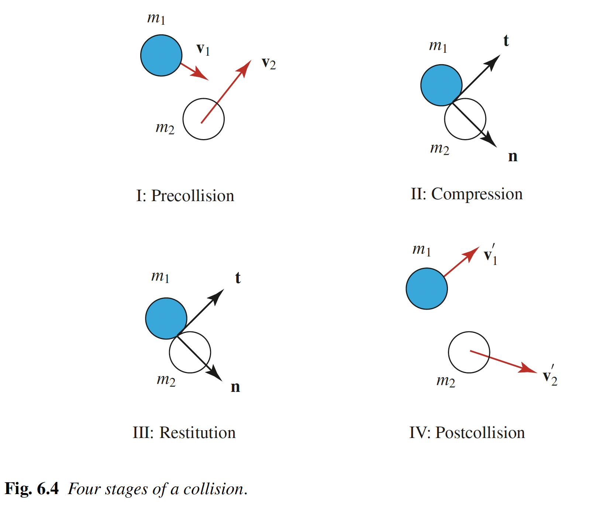

## Collision of Two Bodies

::: {.callout-tip title="Think!"}
**Question:** What happens in reality when two cars collide?

::: {.callout-note title="Answer" collapse="true"}
In reality, colliding bodies deform — possibly permanently — and their rotational inertia may change.
:::
:::

Ignoring rotational motion, the simplest model uses a mass particle for each body. Since particles do not deform, we introduce the **coefficient of restitution** $e$.

## Frictionless, Oblique, Central Impact of Two Bodies

{width=50%}

### Assumptions

- Model each body as a mass particle.
- We ignore the rotational inertias of bodies (purely translational motion).
- All points on a body have the same velocity.
- The position vector of the mass particle is defined to coincide with the center of mass of the body it models.
- No friction between particles during collision — all impact forces are along ${\bf n}$.
- The duration of compression ($t_1-t_0$) and restitution ($t_2-t_1$) are very small.
- At time $t_1$, both particles have the same velocity along ${\bf n}$: $v_{II}$.
- ${\bf F}_{1C} = -{\bf F}_{2C}$, ${\bf F}_{1R} = -{\bf F}_{2R}$.

### Impact Stages

Let ${\bf n}$ be the common unit normal between the bodies when they collide. This vector is normal to the lateral surfaces of both bodies at the unique point of contact. Define a set of orthonormal vectors $\{{\bf n},{\bf t}_1,{\bf t}_2\}$ by selecting ${\bf t}_1$ and ${\bf t}_2$ to be unit tangent vectors to the lateral surface of both bodies at the point of contact. The impact is assumed to be such that these vectors are constant for the duration of the impact. At the end of stage II, the velocities of the bodies in the direction of ${\bf n}$ are assumed to be equal $(=v_{II})$.

### Linear Impulses During Impact

::: {.callout-tip title="Think!"}
**Question:** Draw the FBDs of $m_1$ and $m_2$ separately during compression and restitution.

::: {.callout-note title="Answer" collapse="true"}
- ${\bf F}_{1_d} = F_{1_d}{\bf n}$: force exerted by body 2 on body 1 during compression.
- ${\bf F}_{1_r} = F_{1_r}{\bf n}$: force exerted by body 2 on body 1 during restitution.
- ${\bf F}_{2_d}$, ${\bf F}_{2_r}$: reaction forces by body 1 on body 2.
- All other forces have resultants ${\bf R}_1$ and ${\bf R}_2$.
:::
:::

Since the collision duration is very small, the impulses of ${\bf R}_1$ and ${\bf R}_2$ vanish. Define the time instants:

- $t_0$: time just before collision
- $t_1$: time at the end of compression
- $t_2$: time at the end of restitution

Approximating:
\begin{align}
    \begin{split}
        & \int_{t_0}^{t_1}\lp{\bf F}_{1_d}(\tau)+{\bf R}_1(\tau)\rp d\tau \approx \int_{t_0}^{t_1}{\bf F}_{1_d}(\tau)\,d\tau,\\
        & \int_{t_1}^{t_2}\lp{\bf F}_{1_r}(\tau)+{\bf R}_1(\tau)\rp d\tau \approx \int_{t_1}^{t_2}{\bf F}_{1_r}(\tau)\,d\tau,\\
        & \int_{t_0}^{t_1}\lp{\bf F}_{2_d}(\tau)+{\bf R}_2(\tau)\rp d\tau \approx \int_{t_0}^{t_1}{\bf F}_{2_d}(\tau)\,d\tau,\\
        & \int_{t_1}^{t_2}\lp{\bf F}_{2_r}(\tau)+{\bf R}_2(\tau)\rp d\tau \approx \int_{t_1}^{t_2}{\bf F}_{2_r}(\tau)\,d\tau.
    \end{split}
\end{align}

We assume equal and opposite collisional forces:
\begin{align}
    \begin{split}
        & {\bf F}_{1_r} = -{\bf F}_{2_r},\\
        & {\bf F}_{1_d} = -{\bf F}_{2_d}.
    \end{split}
\end{align}

We now define the **coefficient of restitution**:
\begin{align}
    e = \frac{\int_{t_1}^{t_2}{\bf F}_{1_r}(\tau)\cdot{\bf n}\,d\tau}{\int_{t_0}^{t_1}{\bf F}_{1_d}(\tau)\cdot{\bf n}\,d\tau} = \frac{\int_{t_1}^{t_2}{\bf F}_{2_r}(\tau)\cdot{\bf n}\,d\tau}{\int_{t_0}^{t_1}{\bf F}_{2_d}(\tau)\cdot{\bf n}\,d\tau}.
\end{align}

::: {.callout-tip title="Think!"}
**Question:** What does $e=0$ and $e=1$ mean?

::: {.callout-note title="Answer" collapse="true"}
- $e=1$: perfectly **elastic** collision — compression impulse equals restitution impulse.
- $e=0$: perfectly **plastic** collision — no restitution impulse.
- In general $0\leq e\leq 1$, determined experimentally.
:::
:::

### The Coefficient of Restitution in Terms of Velocities

To write the coefficient of restitution in a more convenient form using velocities, we first write the linear impulse-linear momentum equations.

::: {.callout-tip title="Think!"}
**Question:** For the above impulses, complete the linear impulse-linear momentum equations.

::: {.callout-note title="Answer" collapse="true"}
\begin{align}
    \begin{split}
        & m_1 v_{II} - m_1{\bf v}_1\cdot{\bf n} = \int_{t_0}^{t_1}{\bf F}_{1_d}(\tau)\cdot{\bf n}\,d\tau,\\
        & m_2 v_{II} - m_2{\bf v}_2\cdot{\bf n} = \int_{t_0}^{t_1}{\bf F}_{2_d}(\tau)\cdot{\bf n}\,d\tau,\\
        & m_1{\bf v}_1'\cdot{\bf n}-m_1 v_{II} = \int_{t_1}^{t_2}{\bf F}_{1_r}(\tau)\cdot{\bf n}\,d\tau = e\int_{t_0}^{t_1}{\bf F}_{1_d}(\tau)\cdot{\bf n}\,d\tau,\\
        & m_2{\bf v}_2'\cdot{\bf n}-m_2 v_{II} = \int_{t_1}^{t_2}{\bf F}_{2_r}(\tau)\cdot{\bf n}\,d\tau = e\int_{t_0}^{t_1}{\bf F}_{2_d}(\tau)\cdot{\bf n}\,d\tau.
    \end{split}
\end{align}
:::
:::

From these 4 equations, we can isolate the common velocity $v_{II}$ of the particles along ${\bf n}$ at time $t_1$:
\begin{align}
    v_{II} = \frac{{\bf v}_1'\cdot{\bf n}+e{\bf v}_1\cdot{\bf n}}{1+e} = \frac{{\bf v}_2'\cdot{\bf n}+e{\bf v}_2\cdot{\bf n}}{1+e}.
\end{align}

From this, we get the familiar expression for the coefficient of restitution:
\begin{align}
    e = \frac{{\bf v}_2'\cdot{\bf n}-{\bf v}_1'\cdot{\bf n}}{{\bf v}_1\cdot{\bf n}-{\bf v}_2\cdot{\bf n}}.
\end{align}



::: {.callout-important title="Note!"}
When one object impacts a massive constrained object (e.g. a wall), the velocity of the massive object is unaffected by the collision.
:::

## Example: The Most General Planar Impact Problem

::: {.callout-warning title="Example"}
**Question:** Given particles $m_1$ and $m_2$ with pre-impact velocities ${\bf v}_1$ and ${\bf v}_2$, find the post-impact velocities. The coefficient of restitution $e$ is given.

::: {.callout-note title="Answer" collapse="true"}
There are 4 unknowns (components of ${\bf v}_1'$ and ${\bf v}_2'$ along ${\bf n}$, ${\bf t}_1$, ${\bf t}_2$). Along the tangent directions: velocities are unchanged. Along ${\bf n}$: we have the conservation of linear momentum and the restitution equation.
:::
:::



## Energy Loss During Impact

Pre-impact and post-impact kinetic energies:
\begin{align}
    T &= \frac{1}{2}m_1{\bf v}_1\cdot{\bf v}_1+\frac{1}{2}m_2{\bf v}_2\cdot{\bf v}_2,\\
    T' &= \frac{1}{2}m_1{\bf v}_1'\cdot{\bf v}_1'+\frac{1}{2}m_2{\bf v}_2'\cdot{\bf v}_2'.
\end{align}

The energy lost:
\begin{align}
    \begin{split}
        T-T' &= \frac{1}{2}m_1\lp({\bf v}_1\cdot{\bf n})^2-({\bf v}_1'\cdot{\bf n})^2\rp+\frac{1}{2}m_2\lp({\bf v}_2\cdot{\bf n})^2-({\bf v}_2'\cdot{\bf n})^2\rp\\
        &= \frac{m_1 m_2}{2(m_1+m_2)}\lp{\bf v}_1\cdot{\bf n}-{\bf v}_2\cdot{\bf n}\rp^2(1-e^2).
    \end{split}
\end{align}

Hence, for $0\leq e\leq 1$, kinetic energy cannot increase as a result of impact.

## Negative Values of the Coefficient of Restitution

::: {.callout-tip title="Think!"}
**Question:** What does a negative $e$ mean for a ball impacting a wall?

::: {.callout-note title="Answer" collapse="true"}
When the coefficient of restitution is negative,
\begin{align}
    e = \frac{{\bf v}_2'\cdot{\bf n}-{\bf v}_1'\cdot{\bf n}}{{\bf v}_1\cdot{\bf n}-{\bf v}_2\cdot{\bf n}} \leq 0,
\end{align}
and hence ${\bf v}_1'\cdot{\bf n}-{\bf v}_2'\cdot{\bf n}$ and ${\bf v}_1\cdot{\bf n}-{\bf v}_2\cdot{\bf n}$ have the same sign. As a result, the colliding bodies pass through each other during the course of the impact. To eliminate this behavior, it is generally assumed that $e$ is positive.
:::
:::

