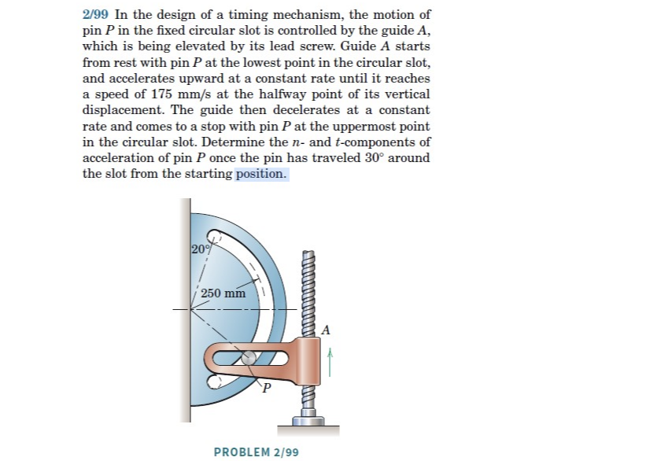
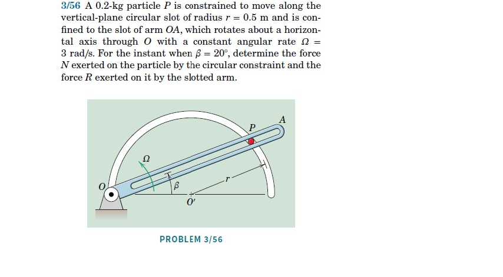
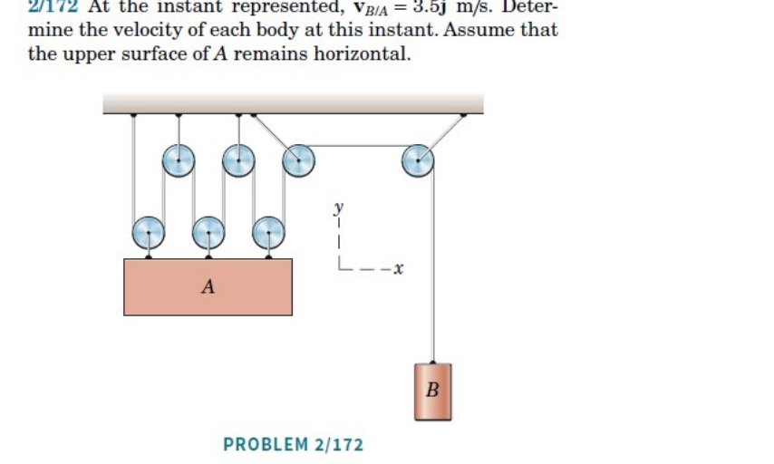
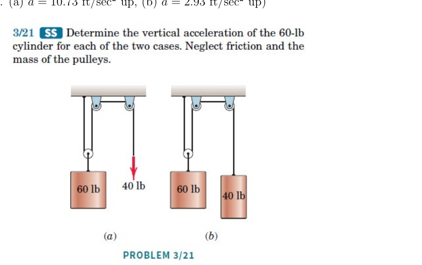
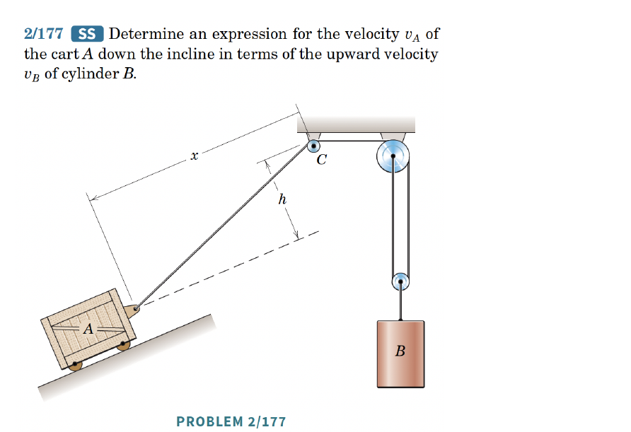
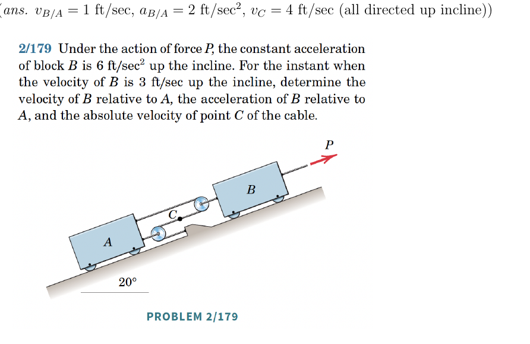

The **degree of freedom (DOF)** of a system is the number of independent coordinates needed to describe a configuration of the system.

Examples:

| System | DOFs | Constraints | Constraint equation(s) |
|---|:-:|:-:|---|
| A particle free to move in $\mathbb{E}^2$ | 2 | 0 | -- |
| A particle constrained to move on a curve in $\mathbb{E}^2$ | 1 | 1 | (curve equation, implicit) |
| Two particles free to move in $\mathbb{E}^2$ | 4 | 0 | -- |
| Two particles in $\mathbb{E}^2$ constrained to move on the same curve | 2 | 2 | (curve equation for each particle, implicit) |
| Two particles in $\mathbb{E}^2$ connected by a rigid rod | 3 | 1 | $\lnorm{\bf r}_{B/A}\rnorm = l\,\forall t$ |
| Two particles in $\mathbb{E}^2$ connected by a rigid rod *and* constrained to move on a curve | 1 | 3 | $\lnorm{\bf r}_{B/A}\rnorm = l\,\forall t$; curve equation for each particle (implicit) |

The **number of constraints** is the number of DOFs the unconstrained system would have (2 per free particle in $\mathbb{E}^2$) minus the actual number of DOFs; each independent constraint equation removes exactly one DOF.

---

**Example:** Consider two particles in smooth vertical slots. If $A$ and $B$ move independently, the system has 2 DOFs. If connected by an inextensible cable, the system has 1 DOF.

The inextensibility constraint $\ell = \text{const.}$ can be written as:
\begin{align}
    & \ell = s_A+c+s_B\\
    & \Delta \ell = 0 = \Delta_{t_1\rightarrow t_2} s_A+\Delta_{t_1\rightarrow t_2} s_B\\
    & \implies \Delta s_B = -\Delta s_A\\
    & \dot{\ell} = 0 = \dot{s}_A+\dot{s}_B\\
    & \implies \dot{s}_B=-\dot{s}_A.
\end{align}

```{r}
#| engine: tikz
#| echo: false
#| fig-align: center
#| fig-width: 3
\begin{tikzpicture}
    % Draw the pulley
    \draw (0,4) circle (1);
    \draw[dashed] (-1,4) -- (-2.5,4);
    \draw[dashed] (1,4) -- (2.5,4);

    % Draw the rope
    \draw[thick] (-1,4) -- (-1,1);
    \draw[thick] (1,4) -- (1,1.5);

    % Draw the boxes
    \draw[thick] (-1.5,0) rectangle (-0.5,1);
    \node at (-1,0.5) {A};
    \draw[thick] (0.5,0.5) rectangle (1.5,1.5);
    \node at (1,1) {B};

    % Draw the vertical slots
    \draw[dashed] (-1.5,-1) -- (-1.5,3);
    \draw[dashed] (1.5,-1) -- (1.5,3);
    \draw[dashed] (-0.5,-1) -- (-0.5,3);
    \draw[dashed] (0.5,-1) -- (0.5,3);

    % Pulley axle
    \draw[thick] (0,4.3) -- (0,5);
    \node at (0,4) {Pulley};

    \draw[->] (-2,4) -- (-2,1) node[midway,left] {$s_A$};
    \draw[->] (2,4) -- (2,1.5) node[midway,right] {$s_B$};

\end{tikzpicture}
```


## Summary

For **pulley–chord systems**: (1) choose a datum, (2) define distances from the datum, (3) write a chord equation per chord. Each chord equation and its derivatives give additional constraints.

## Exercises

*The following problems are from Set 06 – Constrained Motion.*

**1.** [MKB 2/099] Determine the $\mathbf{e}_r$ and $\mathbf{e}_\theta$ components of the acceleration of pin $P$; origin at the centre of the circular slot. *(ans. $a_n = 66.0$ mm/s$^2$, $a_t = 29.7$ mm/s$^2$)*

{width=50%}




**2.** [03-056] Set up two polar coordinate systems with origins $O$ and $O'$. Write position vectors of $P$ in each basis. *(ans. $N = 2.89$ N towards $O'$, $R = 1.599$ N)*

{width=50%}

**3.** [MKB 02-172] Use $\mathbf{v}_{B/A}=\mathbf{v}_B-\mathbf{v}_A=3.5\mathbf{E}_y$ m/s. *(ans. $\mathbf{v}_A=-0.5\mathbf{E}_y$ m/s, $\mathbf{v}_B=3\mathbf{E}_y$ m/s)*

{width=50%}

**4.** [MKB 03-021] Draw FBDs of the massless pulleys to find forces on the 60-lb cylinders. *(ans. (a) $a=10.73$ ft/sec$^2$ up; (b) $a=2.93$ ft/sec$^2$ up)*

{width=50%}

**5.** [MKB 2-177]

{width=50%}

**6.** [MKB 2-179]

{width=50%}
