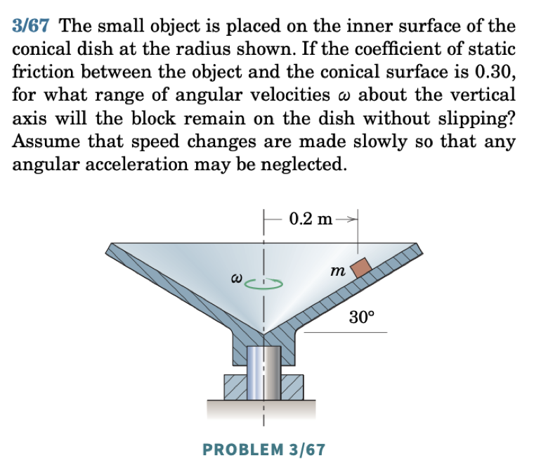
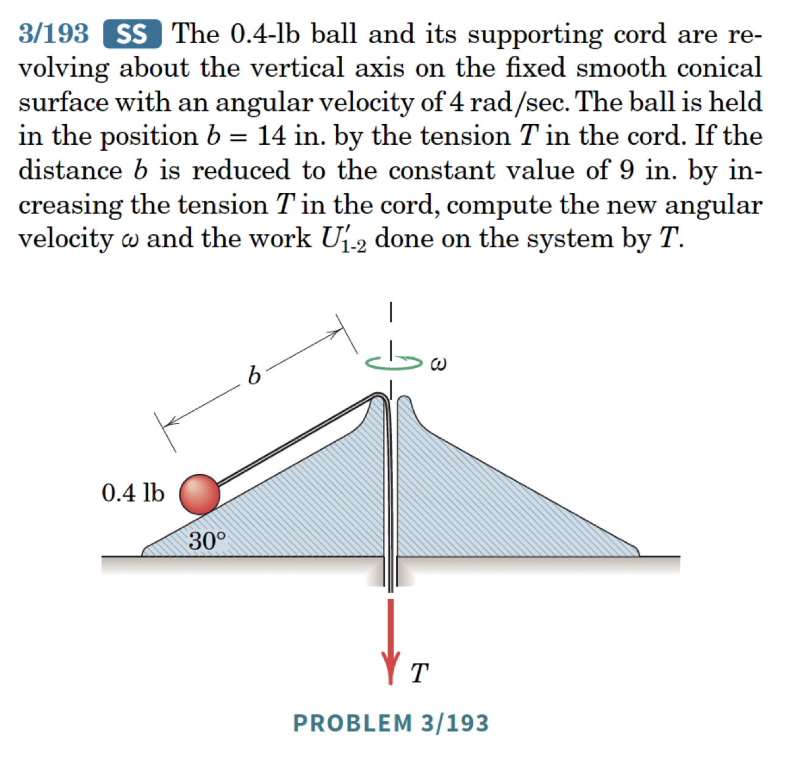

The cylindrical polar coordinate system is three-dimensional. We start by introducing the two-dimensional polar basis, then extend it to three dimensions.

## Polar Coordinates

```{r}
#| engine: tikz
#| echo: false
#| fig-align: center
\begin{tikzpicture}

    \draw[thick] plot[smooth, tension=1] coordinates {(-3,-1) (0,2) (2,-1) (4,1)};
    \node[circle, fill=red, inner sep=2pt, label=below:{$P$}] at (0,2) {};
    \node[circle, fill=black, inner sep=2pt, label=below:{$O$}] at (-2,-2) {};
    \draw[->, thick, blue] (-2,-2) -- (0,2) node[midway, above left] {${\bf r}$};

    \draw[thick, ->] (-2,-2) -- (-1,-2) node[right] {${\bf E}_x$};
    \draw[thick, ->] (-2,-2) -- (-2,-1) node[above] {${\bf E}_y$};

    \draw[thick, blue, ->] (0,2) -- (0.5, 2.87) node[right] {${\bf e}_r$};
    \draw[thick, blue, ->] (0,2) -- (-0.87, 2.5) node[above] {${\bf e}_\theta$};

    \draw[->, bend left=-45] (-1, -2) to node[midway, left] {$\theta$} (-1.5, -1);

\end{tikzpicture}
```

Consider $\mathbb{E}^2$. Define:
\begin{align}
    r = \sqrt{x^2+y^2}\geq 0, \qquad \theta = \tan^{-1}\lp\frac{y}{x}\rp.
\end{align}
So $x = r\cos(\theta)$ and $y = r\sin(\theta)$.

Define the basis $\{{\bf e}_r,{\bf e}_\theta\}$ as a rotation of $\{{\bf E}_x,{\bf E}_y\}$ by angle $\theta$ (positive CCW about ${\bf E}_z$):

```{r}
#| engine: tikz
#| echo: false
#| fig-align: center
\begin{tikzpicture}
    \draw[thick, ->] (0,0) -- (3,0) node[right] {${\bf E}_x$};
    \draw[thick, ->] (0,0) -- (0,3) node[above] {${\bf E}_y$};
    \draw[thick, blue, ->] (0,0) -- (2.6, 1.5) node[right] {${\bf e}_r$};
    \draw[thick, blue, ->] (0,0) -- (-1.5, 2.6) node[above] {${\bf e}_\theta$};
    \draw[dashed] (2.6,0) -- (2.6,1.5);
    \draw[dashed] (0,1.5) -- (2.6,1.5);
    \node at (3.2,0.8) {$\sin(\theta)$};
    \node at (1.5,-0.3) {$\cos(\theta)$};
\end{tikzpicture}
```

::: {.callout-tip title="Think!"}
**Question:** Express ${\bf e}_r$ and ${\bf e}_\theta$ in the Cartesian basis.

**Answer:**
\begin{align}
    {\bf e}_r &= \cos(\theta){\bf E}_x+\sin(\theta){\bf E}_y,\\
    {\bf e}_\theta &= -\sin(\theta){\bf E}_x+\cos(\theta){\bf E}_y.
\end{align}
:::

$\{{\bf e}_r,{\bf e}_\theta\}$ is an orthonormal basis: ${\bf e}_r\cdot{\bf e}_r = 1$, ${\bf e}_\theta\cdot{\bf e}_\theta = 1$, ${\bf e}_r\cdot{\bf e}_\theta=0$.

- ${\bf e}_r$ points in the direction of increasing $r$.
- ${\bf e}_\theta$ points in the direction of increasing $\theta$.

::: {.callout-tip title="Think!"}
**Question:** Calculate $\dot{\bf e}_r$ and $\dot{\bf e}_\theta$.

**Answer:**
\begin{align}
    \dot{\bf e}_r = \dot{\theta}{\bf e}_\theta, \qquad \dot{\bf e}_\theta = -\dot{\theta}{\bf e}_r.
\end{align}
:::

The position vector is ${\bf r} = r{\bf e}_r$ (with $r\geq 0$).

::: {.callout-tip title="Think!"}
**Question:** Calculate ${\bf v}$ and ${\bf a}$.

**Answer:**
\begin{align*}
    {\bf v} &= \dot{r}{\bf e}_r+r\dot{\theta}{\bf e}_\theta,\\
    {\bf a} &= \lp \ddot{r}-r\dot{\theta}^2\rp{\bf e}_r+\lp 2\dot{r}\dot{\theta}+r\ddot{\theta}\rp{\bf e}_\theta.
\end{align*}
:::

Note the components of acceleration:

- $r\ddot{\theta}$: tangential
- $\ddot{r}$: radial
- $r\dot{\theta}^2$: centripetal
- $2\dot{r}\dot{\theta}$: Coriolis

**Remark: $a_r \neq \dot{v}_r$.** Be careful: $v_r = \dot{r}$ so $\dot{v}_r = \ddot{r}$, but $a_r = \ddot{r} - r\dot{\theta}^2 \neq \dot{v}_r$ in general.

For rectilinear motions, Cartesian coordinates are usually easiest. For problems where $r$ is directly measured (e.g. radar tracking), polar coordinates are natural.

{width=40%}

### Example: Nonlinear Pendulum

Consider a particle of mass $m$ suspended from a rigid inextensible string of length $\ell$. Find the equation of motion.

```{r}
#| engine: tikz
#| echo: false
#| fig-align: center
\begin{tikzpicture}

\coordinate (O) at (0,0);
\coordinate (M) at (2.4,-3.2);

\draw[thick] (O) -- (M) node[midway,above right] {massless, inextensible wire};

\draw[blue,->, thick] (O) -- ++(0.6,0) node[right] {${\bf E}_y$};
\draw[blue,->, thick] (O) -- ++(0,-0.6) node[below] {${\bf E}_x$};

\node at (0.15,-0.4) {$\theta$};

\fill (M) circle (2pt);

\draw[blue,->, thick] (M) -- ++(0.6,-0.8) node[right] {${\bf e}_r$};
\draw[blue,->, thick] (M) -- ++(0.8,0.6) node[right] {${\bf e}_\theta$};

\draw[->, thick] (-2,-1.5) -- ++(0,-0.8) node[midway, right] {${\bf g}$};

\end{tikzpicture}
```

The constraint on the motion:
\begin{align}
    r = \ell = \text{const.} \implies \dot{r}=0,\ \ddot{r} = 0.
\end{align}

::: {.callout-tip title="Think!"}
**Question:** How many degrees of freedom does this system have?

**Answer:** One. A particle in the plane has 2 DOFs, but the constraint $r=\ell$ removes one. Knowing $\theta(t)$ completely describes the motion.
:::

Following the four steps:

1. Choose polar coordinates:
\begin{align*}
    {\bf r} &= \ell{\bf e}_r, \quad {\bf v} = \ell\dot{\theta}{\bf e}_\theta, \quad {\bf a} = \ell\ddot{\theta}{\bf e}_\theta-\ell\dot{\theta}^2{\bf e}_r.
\end{align*}

::: {.callout-note title="Orienting ${\bf e}_\theta$"}
${\bf e}_\theta$ points in the direction of increasing $\theta$, determined by the right-hand rule: point the thumb along ${\bf E}_z$; your fingers curl in the direction of increasing $\theta$.
:::

2. Forces:
\begin{align*}
    {\bf T} &= T\lp-{\bf e}_r\rp, \quad {\bf W} = mg\lp\cos(\theta){\bf e}_r-\sin(\theta){\bf e}_\theta\rp.
\end{align*}

::: {.callout-note title="Remark: Tension"}
${\bf T}$ is a constraint force keeping the particle on a circular path. If $T>0$, the wire is in tension. The tension is the same throughout because the wire is massless.
:::

3. Balance of linear momentum:
\begin{align*}
    mg{\bf E}_x-T{\bf e}_r &= m\ell\lp\ddot{\theta}{\bf e}_\theta-\dot{\theta}^2{\bf e}_r\rp.
\end{align*}
Projecting along ${\bf e}_\theta$ (hides unknown tension):
\begin{align*}
    -mg\sin(\theta) &= m\ell\ddot{\theta} \implies \ddot{\theta}+\frac{g}{\ell}\sin(\theta) = 0.
\end{align*}
For small $\theta$: $\ddot{\theta}+\frac{g}{\ell}\theta = 0$ (simple harmonic motion).

Projecting along ${\bf e}_r$ gives the tension: $T = m\lp\ell\dot{\theta}^2+g\cos(\theta)\rp$.

## Types of Accelerations Explained

Recall:
\begin{align*}
    {\bf a} = \lp\ddot{r}-r\dot{\theta}^2\rp{\bf e}_r+\lp2\dot{r}\dot{\theta}+r\ddot{\theta}\rp{\bf e}_\theta.
\end{align*}

- **Radial** $\ddot{r}$: particle on a spring in rectilinear motion.
- **Centripetal** $-r\dot{\theta}^2$: particle on a circle at constant speed — the normal force steers the particle.
- **Coriolis** $2\dot{r}\dot{\theta}$: particle in a tube rotating at constant angular velocity.
- **Tangential** $r\ddot{\theta}$: particle pushed along a circle.

### Example: Particle in a Rotating Tube

$\dot{\theta} = \omega = \text{const.}$, $\ddot{\theta} = 0$.

```{r}
#| engine: tikz
#| echo: false
#| fig-align: center
\usetikzlibrary{decorations.pathmorphing,patterns}
\begin{tikzpicture}

\draw[thick] (8,1) -- (0,1) -- (0,0) -- (8,0);
\draw[thick] (8,0.5) ellipse (0.2 and 0.5);

\fill[gray!30] (5,0.5) circle (0.45);
\draw[thick] (5,0.5) circle (0.45);

\draw[thick] (-0.2,-0.8) rectangle (0.2,1.8);
\fill[gray!90] (-0.2,-0.8) rectangle (0.2,1.8);

\draw[->,thick] (0,2) -- (0,3) node[midway,left] {${\bf E}_z$};
\fill (0,0.5) circle (0.1);
\node at (-0.5,0.5) {$O$};

\draw[->, thick] (-0.65,1.5) arc[start angle=-120, end angle=-60, radius=1.2];
\node at (0.8,1.5) {$\boldsymbol{\omega}$};

\draw[->,thick] (-2,1.5) -- (-2,0.5) node[midway,right] {${\bf g}$};

\end{tikzpicture}
```

1. Kinematics:
\begin{align*}
    {\bf r} = r{\bf e}_r, \quad {\bf v} = \dot{r}{\bf e}_r+r\omega{\bf e}_\theta, \quad {\bf a} = \lp\ddot{r}-r\omega^2\rp{\bf e}_r+2\dot{r}\omega{\bf e}_\theta.
\end{align*}

2. Assume no friction: ${\bf N} = N{\bf e}_\theta$.

3. Applying BoLM and projecting:
\begin{align*}
    \lp{\bf F} = \dot{\bf G}\rp\cdot{\bf e}_r &\implies \ddot{r}-\omega^2 r = 0 \quad (\text{EOM for } r(t)),\\
    \lp{\bf F} = \dot{\bf G}\rp\cdot{\bf e}_\theta &\implies N = 2m\dot{r}\omega \quad (\text{Coriolis reaction}).
\end{align*}

::: {.callout-note title="Coriolis acceleration"}
As the particle moves outward, $r\omega$ increases. The tube must supply the ${\bf e}_\theta$ acceleration $2\dot{r}\omega$ so the particle stays inside.
:::

### Example: Particle Pushed in a Circle

${\bf P} = P{\bf e}_\theta$, $r = R = \text{const.}$:
\begin{align*}
    \lp{\bf F}=\dot{G}\rp\cdot{\bf e}_\theta &\implies P=mR\ddot{\theta} \quad (\text{EOM for }\theta),\\
    \lp{\bf F}=\dot{G}\rp\cdot{\bf e}_r &\implies N_r=mR\dot{\theta}^2 \quad (\text{centripetal}),\\
    \lp{\bf F}=\dot{G}\rp\cdot{\bf E}_z &\implies N_z=mg \quad (\text{vertical equilibrium}).
\end{align*}

## Cylindrical-Polar Coordinates

In $\mathbb{E}^3$, the polar system extends by adding $z$:
\begin{align*}
    \begin{bmatrix}{\bf e}_r\\ {\bf e}_\theta\\ {\bf E}_z\end{bmatrix}
    =
    \begin{bmatrix}\cos(\theta) & \sin(\theta) & 0\\ -\sin(\theta) & \cos(\theta) & 0\\ 0 & 0 & 1\end{bmatrix}
    \begin{bmatrix}{\bf E}_x\\ {\bf E}_y\\ {\bf E}_z\end{bmatrix}.
\end{align*}

Position, velocity, acceleration:
\begin{align*}
    {\bf r} &= r{\bf e}_r+z{\bf E}_z,\\
    {\bf v} &= \dot{r}{\bf e}_r+r\dot{\theta}{\bf e}_\theta+\dot{z}{\bf E}_z,\\
    {\bf a} &= \lp\ddot{r}-r\dot{\theta}^2\rp{\bf e}_r+\lp2\dot{r}\dot{\theta}+r\ddot{\theta}\rp{\bf e}_\theta+\ddot{z}{\bf E}_z.
\end{align*}

### Example: Particle on a Cone

See animation for 03/067 [here](https://drive.google.com/file/d/1d8FJqs0GMQU0FxUE3R66rfcSTCCHFTOu/view?usp=sharing).

{width=50%}

{width=50%}
