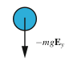
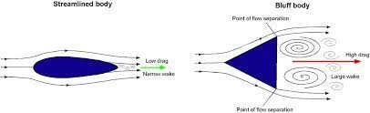
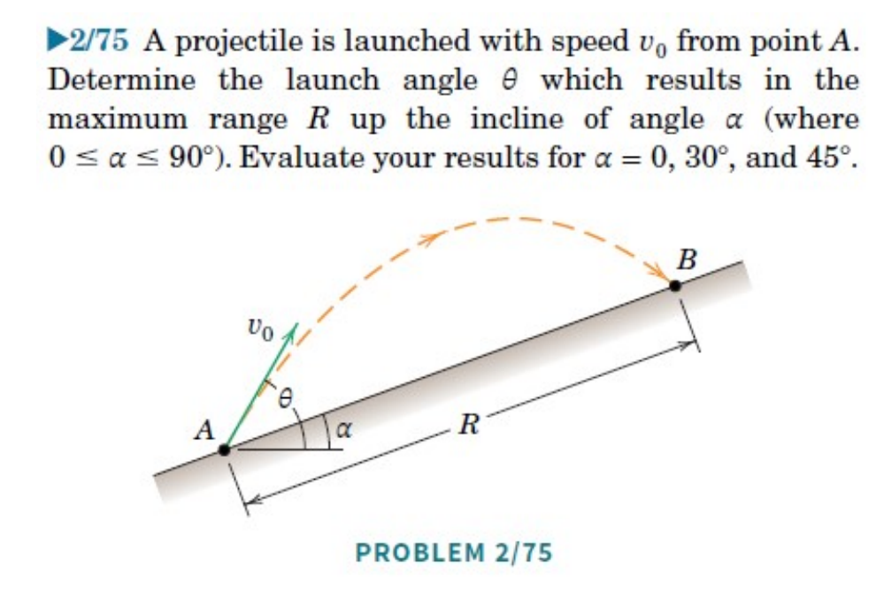
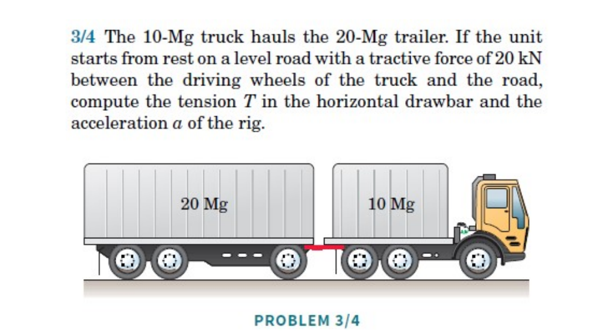
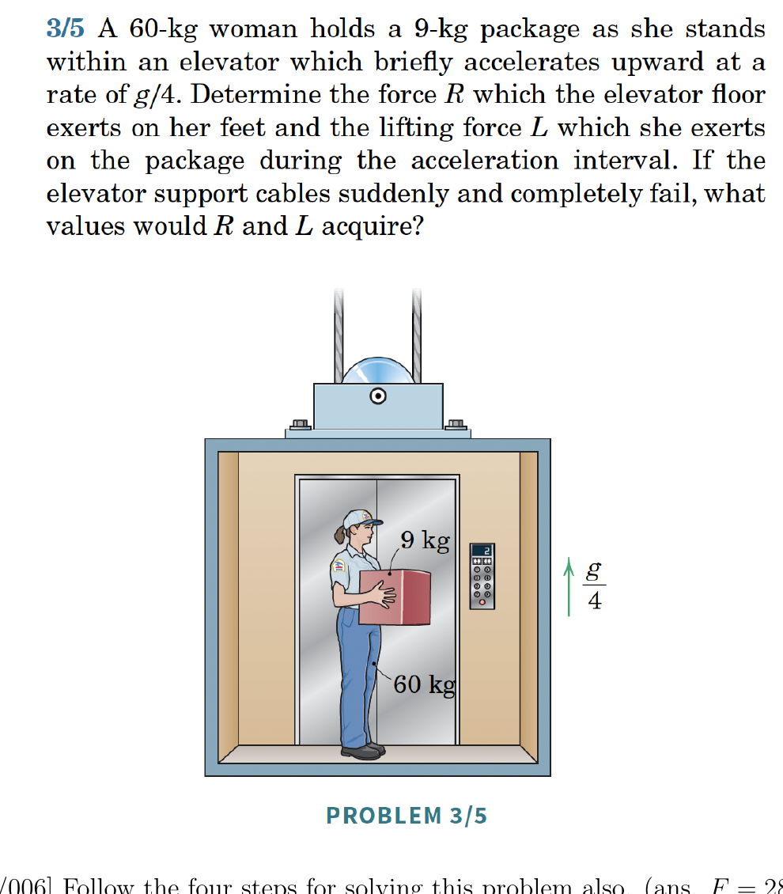
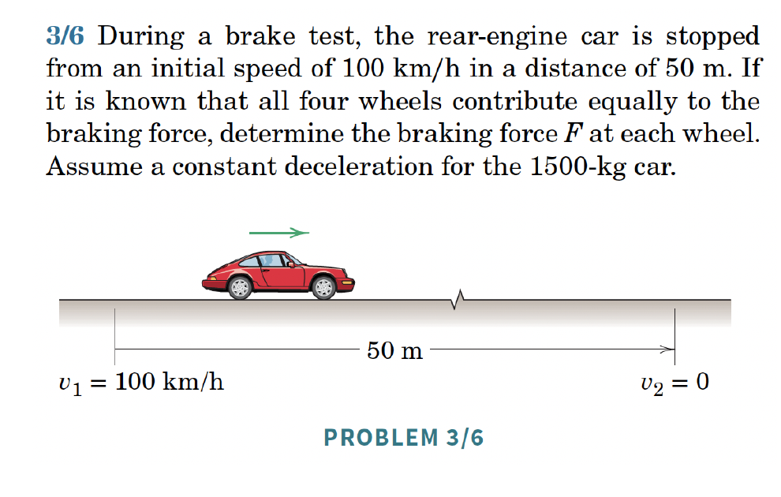

1. Specify the system you are considering. Pick a frame (choose an origin and a coordinate system), and express ${\bf r}$, ${\bf v}$ and ${\bf a}$ using that coordinate system.
2. Draw a Free Body Diagram (FBD), i.e. model of the forces.
3. Write the balance of linear momentum for the system: ${\bf F}=\dot{\bf G}$.
4. Do the analysis: project ${\bf F}=\dot{\bf G}$ to get useful equations.

## Example: Projectile Motion

Projectile motion is a curvilinear motion in the plane $\mathbb{E}^2$.

```{r}
#| engine: tikz
#| echo: false
#| fig-align: center
\begin{tikzpicture}

% --- Left Diagram ---
\begin{scope}
\draw[thick] (-0.5,0) -- (5,0);
\draw[dashed] (0,0) .. controls (1,1.2) and (3,1.2) .. (4,0);
\node[below] at (0,0) {$O$};
\end{scope}

% --- Right Diagram ---
\begin{scope}[xshift=7cm]
\draw[dashed] (0,0) .. controls (1,1.2) and (3,1.2) .. (4,0);
\draw[->,thick] (0,0) -- (0,1) node[above] {${\bf E}_y$};
\draw[->,thick] (0,0) -- (1,0) node[right] {${\bf E}_x$};
\coordinate (P) at (2,0.9);
\draw[->,thick] (0,0) -- (P) node[midway,above left] {${\bf r}$};
\node[above] at (P) {$(x,y)$};
\draw[->,thick] (4.5,1.5) -- (4.5,0.5);
\node[right] at (4.5,1.1) {${\bf g}$};
\end{scope}

\end{tikzpicture}
```

1. Choose $O$ at the launch point, ${\bf E}_x$ along the ground, ${\bf E}_y$ against gravity.
\begin{align}
    {\bf r} &= x{\bf E}_x+y{\bf E}_y, \quad {\bf v} = \dot{x}{\bf E}_x+\dot{y}{\bf E}_y, \quad {\bf a} = \ddot{x}{\bf E}_x+\ddot{y}{\bf E}_y.
\end{align}

2. Force model:

{width=50%}

\begin{align}
    {\bf W} = mg\lp-{\bf E}_y\rp.
\end{align}

3. Balance of linear momentum:
\begin{align}
    mg(-{\bf E}_y) = m\lp\ddot{x}{\bf E}_x+\ddot{y}{\bf E}_y\rp.
\end{align}
Projecting:
\begin{align}
    \lp{\bf F}=\dot{\bf G}\rp\cdot{\bf E}_x &\implies 0 = m\ddot{x} \implies \ddot{x} = 0,\\
    \lp{\bf F}=\dot{\bf G}\rp\cdot{\bf E}_y &\implies -mg = m\ddot{y} \implies \ddot{y} = -g.
\end{align}

4. Integrating:
\begin{align}
    \dot{x}(t) &= \dot{x}_0, \quad x(t) = \dot{x}_0 t,\\
    \dot{y}(t) &= -gt+\dot{y}_0, \quad y(t) = -\frac{g}{2}t^2+\dot{y}_0 t+y_0.
\end{align}

**Remark:** You can also project ${\bf F} = m{\bf a}$ in the ${\bf E}_z$ direction, but since there are no forces in that direction and the initial velocity in that direction is 0, you conclude that the motion is planar.

## Example: Projectile Motion with Viscous Drag

*(Primer Section 1.5.3)*

1. Same kinematics as above.

2. Force model — weight and Stokes drag:

```{r}
#| engine: tikz
#| echo: false
#| fig-align: center
\begin{tikzpicture}[scale=1.2, thick]
\fill (1.5,1.5) circle (2pt);
\draw[->] (1.5,1.5) -- (1.5,0.8) node[right] {$\mathbf{W}$};
\draw[->] (1.5,1.5) -- (0.8,1.1) node[left] {$\mathbf{F}_D$};
\end{tikzpicture}
```

\begin{align}
    {\bf W} &= mg(-{\bf E}_y),\\
    {\bf F}_D &= -c_s{\bf v}.
\end{align}
The Stokes drag (1851) applies at low speeds in viscous fluids.

3. Balance of linear momentum:
\begin{align}
    -mg{\bf E}_y -c_s\lp\dot{x}{\bf E}_x+\dot{y}{\bf E}_y\rp &= m\lp\ddot{x}{\bf E}_x+\ddot{y}{\bf E}_y\rp.
\end{align}
Projecting:
\begin{align}
    -c_s\dot{x} &= m\ddot{x},\\
    -mg-c_s\dot{y} &= m\ddot{y}.
\end{align}
Given initial conditions $x_0, \dot{x}_0, y_0, \dot{y}_0$, these are an initial value problem (IVP).

4. Solving the $x$-equation (let $v_x = \dot{x}$):
\begin{align}
    v_x = v_{x_0}e^{-c_s t/m}, \quad \lim_{t\rightarrow\infty} v_x = 0.
\end{align}
Thus, the terminal velocity is only along ${\bf E}_y$.

```{r}
#| engine: tikz
#| echo: false
#| fig-align: center
\usetikzlibrary{arrows}
\begin{tikzpicture}[x=1cm, y=1cm]
\draw[dashed, very thick, black, ->, >=stealth] (1, 4.5) .. controls (3, 6) and (5, 5.5) .. (5, 1);
\node[circle, fill=black, inner sep=1pt, draw] at (1, 4.5) {};
\node[circle, fill=black, inner sep=1pt, draw] at (5, 1) {};
\node[below, right, font=\large] at (1.5, 2.0) {No more $v_x$, only $v_y$};
\end{tikzpicture}
```

Solving the $y$-equation:
\begin{align}
    v_y = -\frac{mg}{c_s}+\frac{1}{c_s}\lp mg+c_s v_{y_0}\rp e^{-c_s t/m}.
\end{align}
The terminal velocity: ${\bf v}_{\text{term}} = \frac{mg}{c_s}\lp-{\bf E}_y\rp$.

## Example: Projectile Motion with Bluff Body Pressure Drag

{width=50%}

\begin{align}
    {\bf F}_D = \frac{1}{2}m C_D v^2\lp-\frac{\bf v}{\lnorm{\bf v}\rnorm}\rp,
\end{align}
where $C_D$ is the drag coefficient, $\rho$ is the density of the fluid, and $A$ is the projected area in the direction of motion.

See Section 1.6 in the book for a worked example.


## Summary

**Balance of linear momentum (BoLM / Newton's 2nd law / Euler's 1st law):**
\begin{align}
    \mathbf{F} = \dot{\mathbf{G}} = m\mathbf{a}.
\end{align}

**The four steps:**

1. Choose an origin; draw basis vectors; write and differentiate the position vector $\mathbf{r}$.
2. Draw the free body diagram; write expressions for all forces.
3. Write the vector BoLM equation $\sum\mathbf{F} = m\mathbf{a}$.
4. Project along chosen directions and analyse to answer the question.

## Lecture Videos




## Exercises

*The following problems are from Set 04 – Balance of Linear Momentum.*

**1.** [MKB 2/75] Take $\mathbf{E}_x$ along the incline and $\mathbf{E}_y$ perpendicular to it (upwards); origin at $A$. Follow the 4 steps. *(ans. $\theta = (90^\circ + \alpha)/2$)*

{width=50%}

**2.** [MKB 3/004] Consider the whole truck system; follow the 4 steps to find the truck's acceleration, then isolate a trailer to find the drawbar tension. *(ans. $T = 13.33$ kN, $a = 0.667$ m/s$^2$)*

{width=50%}




**3.** [MKB 3/005] For each part, determine your system and follow the 4 steps. *(ans. $R = 846$ N, $L = 110.4$ N)*

{width=50%}

**4.** [MKB 3/006] Follow the four steps. *(ans. $F = 2890$ N)*

{width=50%}

**5.** [OOR Exercise 1.3] *(See O'Reilly Primer for problem statement.)*

**6.** [OOR Exercise 1.5]

**7.** [OOR Exercise 1.8]
