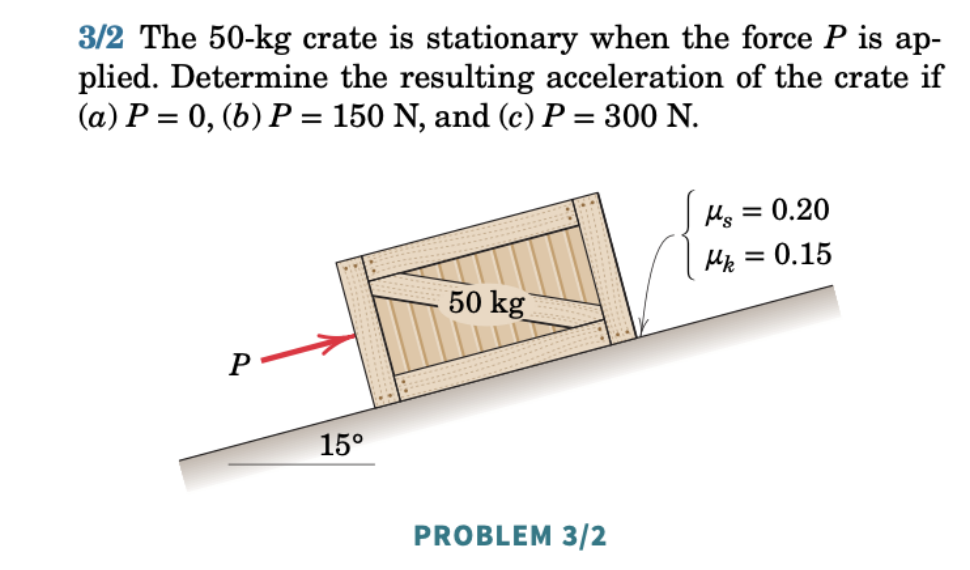
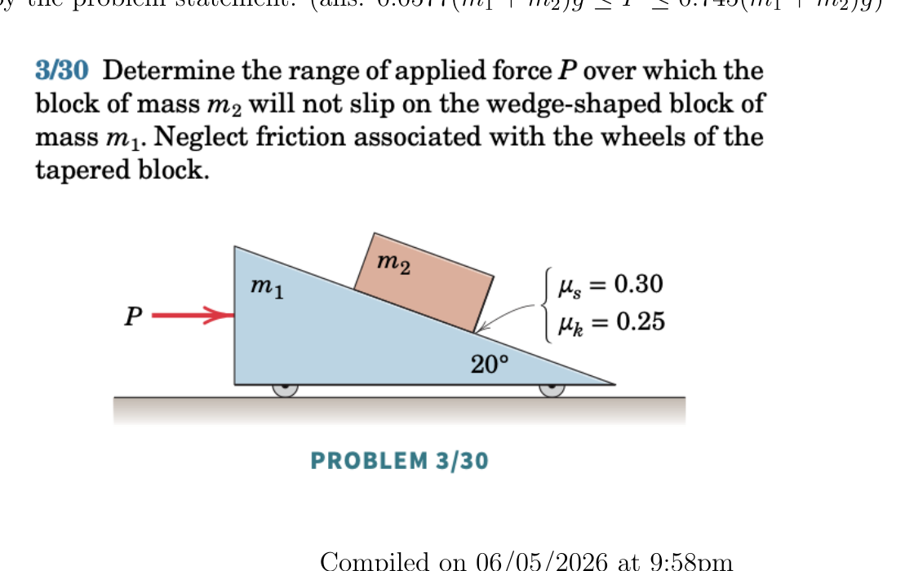
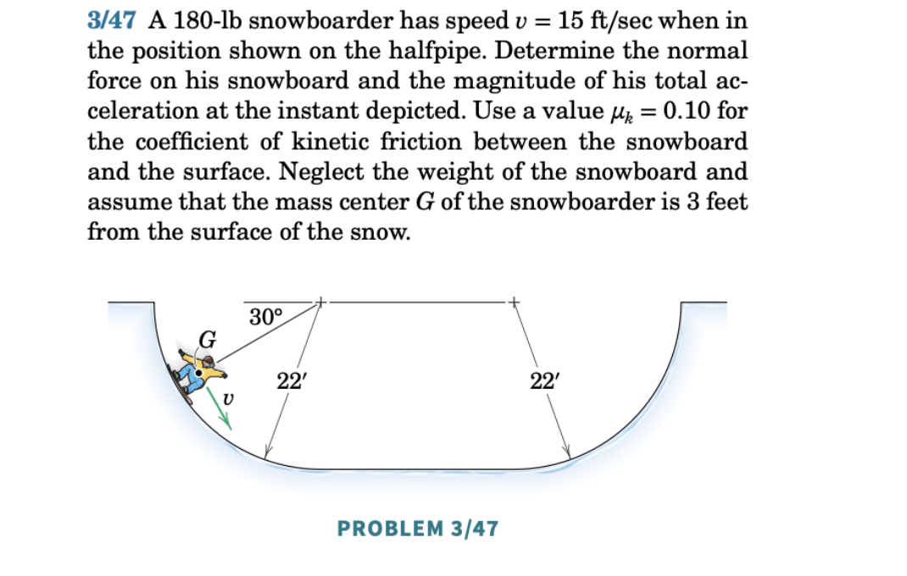
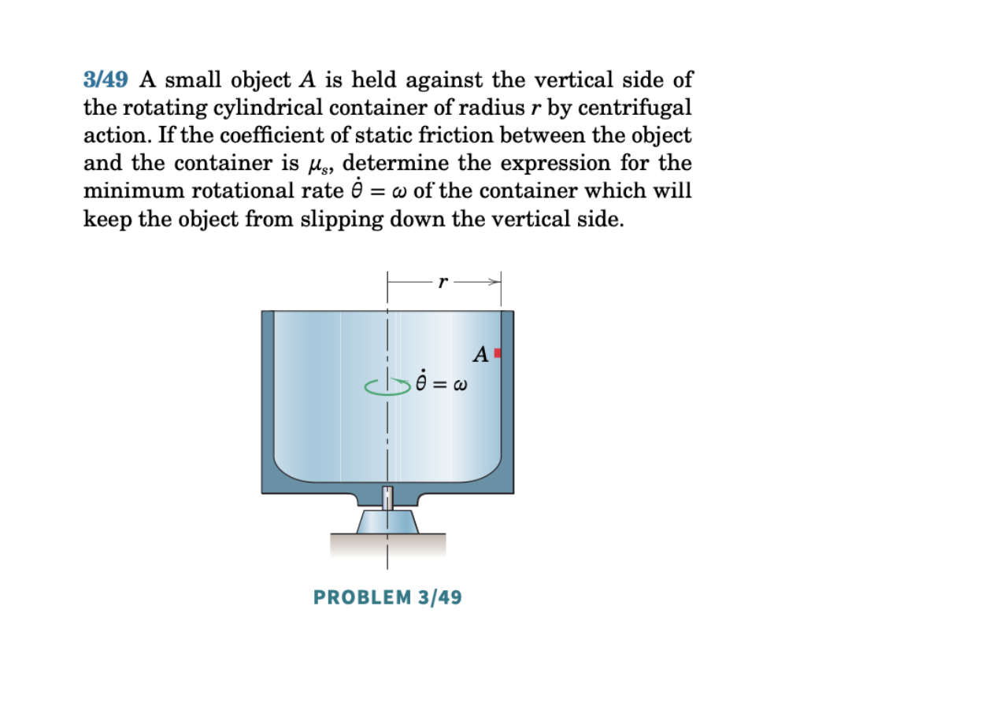
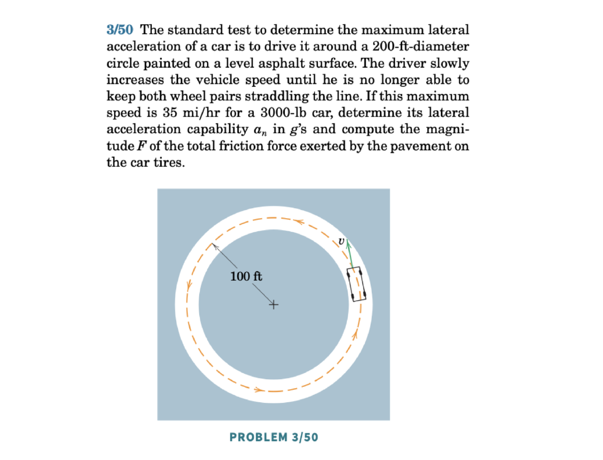
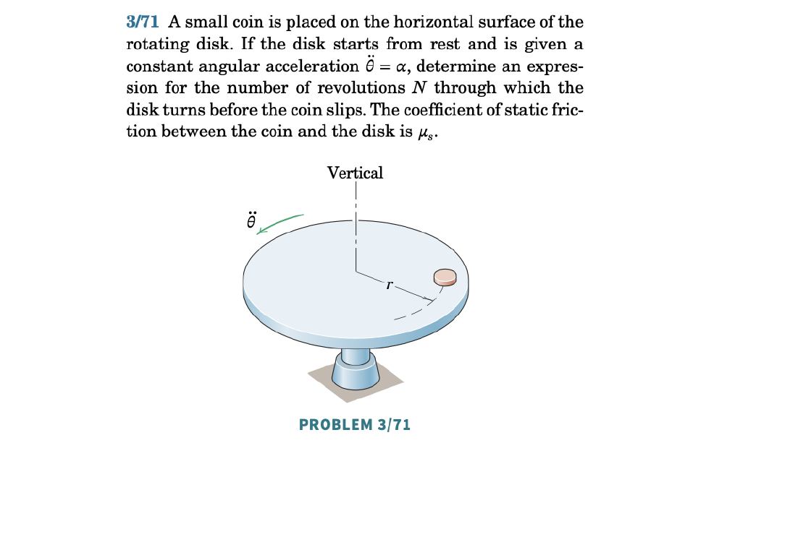

Most theories of friction arise from studies by the French scientist Charles Augustin de Coulomb (1736–1806).

## Introduction

Consider a block on a rough horizontal surface pushed with force ${\bf P} = P{\bf E}_x$.

```{r}
#| engine: tikz
#| echo: false
#| fig-align: center
#| fig-width: 4
\begin{tikzpicture}
    \draw[thick] (0,0) rectangle (3,1.5);
    \draw (-1,0) -- (6,0);
    \draw[->] (3,0.75) -- (5,0.75) node[right] {$\mathbf{P}$};
    \draw[->] (-2,0) -- (-1,0) node[right, above] {${\bf E}_x$};
    \draw[->] (-2,0) -- (-2,1) node[above] {${\bf E}_y$};
\end{tikzpicture}
```

Upon increasing $P$, we observe:

- For small $P$, the block remains at rest.
- Beyond a critical value $P = P^*$, the block starts to move.
- Once in motion, a constant value $P = P^{**}$ is required to maintain constant speed.
- Both $P^*$ and $P^{**}$ are proportional to the normal force $\lnorm{\bf N}\rnorm$.

## Formalism: Coulomb's Theory of Friction

We distinguish two types of friction: static and kinetic.

### Static Friction

When the relative velocity between two surfacesis zero (${\bf v}_{rel} = {\bf 0}$), the friction force ${\bf F}_f$ is **unknown** and lies along the contact surface. We must solve for both its magnitude and direction. We say the static friction force points in the direction that **impedes motion**.

::: {.callout-tip title="Think!"}
**Question:** Consider a block on a rough inclined surface that is not moving. Draw the FBD and write the equation of motion. Do you have as many equations as unknowns?

::: {.callout-note title="Answer" collapse="true"}
Yes. The friction and normal forces have unknown magnitudes, but the block's acceleration is known (it matches the surface acceleration). There are as many equations as unknowns.
:::
:::

The magnitude of the static friction force satisfies the **static friction criterion**:
\begin{align}
    \lnorm{\bf F}_f\rnorm \leq \mu_s\lnorm{\bf N}\rnorm,
\end{align}
where $\mu_s$ is the static friction coefficient.

### Kinetic Friction

When two bodies are in relative motion (${\bf v}_{rel} \neq {\bf 0}$), the friction force is **known** (both in magnitude and direction):
\begin{align}
    {\bf F}_f = \mu_k\lnorm{\bf N}\rnorm\lp-\frac{{\bf v}_{rel}}{\lnorm{\bf v}_{rel}\rnorm}\rp,
\end{align}
where $\mu_k$ is the kinetic friction coefficient. This prescription is used to solve for the motion of the system.

Remarks:

- $\mu_k$ is also written $\mu_d$ (dynamic friction coefficient).
- Kinetic friction is a prescription, not a constraint force.
- The magnitude of kinetic friction does not depend on speed.



### Example: Crate Pushed with Incremental Force

Consider a block on a rough horizontal surface pushed with force ${\bf P} = P{\bf E}_x$. At $t=0$, the block is initially at rest and $P=0$, then $P$ is increased linearly.

```{r}
#| engine: tikz
#| echo: false
#| fig-align: center
#| fig-width: 4
\begin{tikzpicture}
    \draw[thick] (0,0) rectangle (3,1.5);
    \draw (-1,0) -- (6,0);
    \draw[->] (3,0.75) -- (5,0.75) node[right] {$\mathbf{P}$};
    \draw[->] (-2,0) -- (-1,0) node[right, above] {${\bf E}_x$};
    \draw[->] (-2,0) -- (-2,1) node[above] {${\bf E}_y$};
\end{tikzpicture}
```

1. Kinematics: ${\bf r} = x{\bf E}_x+y_0{\bf E}_y$, ${\bf v} = \dot{x}{\bf E}_x$, ${\bf a} = \ddot{x}{\bf E}_x$.

2. FBD with forces ${\bf P} = P{\bf E}_x$, ${\bf W} = -mg{\bf E}_y$, ${\bf N} = N{\bf E}_y$, ${\bf F}_f = F_f(-{\bf E}_x)$.

   When kinetic: ${\bf F}_f = -\mu_k\lnorm{\bf N}\rnorm\,\text{sgn}(\dot{x}){\bf E}_x$.

```{r}
#| engine: tikz
#| echo: false
#| fig-align: center
#| fig-width: 4
\begin{tikzpicture}
        \draw[thick] (0,0) rectangle (3,1.5);
        \draw[->] (1.5,-1.5) -- (1.5,0) node[midway, right] {${\bf N}$};
        \draw[->] (1.5,2) -- (1.5,0.75) node[right] {${\bf W}$};
        \draw[->] (2.5,-0.2) -- (0.5,-0.2) node[left, below] {${\bf F}_f$};
        \draw[->] (3,0.75) -- (5,0.75) node[right] {$\mathbf{P}$};
        \draw[->] (-2,0) -- (-1,0) node[right, above] {${\bf E}_x$};
        \draw[->] (-2,0) -- (-2,1) node[above] {${\bf E}_y$};
\end{tikzpicture}
```


3. BoLM:
\begin{align}
    P{\bf E}_x-mg{\bf E}_y+N{\bf E}_y-F_f{\bf E}_x = m\ddot{x}{\bf E}_x.
\end{align}

4. Let $P>0$.

Initially, when the block is at rest, static friction is acting on it. Setting $\ddot{x}=0$:
\begin{align}
    P = F_f, \quad N = mg.
\end{align}
The block stays at rest while $P \leq \mu_s mg$. The maximum static value is $P^* = \mu_s mg$.

If $P$ exeeds this value $P^*$, then sliding begins, and the friction force becomes kinetic ${\bf F}_f = -\mu_k mg{\bf E}_x$ and:
\begin{align}
    \ddot{x} = \frac{P}{m}-\mu_k g.
\end{align}
Here, we assumed that $\text{sgn}(\dot{x})\geq 0$ because ${\bf P}$ always points to the right.
The acceleration vector of the box is:
\begin{align}
    {\bf a} = \ddot{x}{\bf E}_x = \lp\frac{P}{m}-\mu_k g\rp{\bf E}_x.
\end{align}

If the block moves at constant speed, then $\ddot{x}=0$ and $P^{**} = \mu_k mg$.

### Example: A Box on a Ramp

*(MKB problem 03/002.)*

When it is unknown whether the block is in motion:

1. Assume sticking: ${\bf v}_{rel} = {\bf 0}$.
2. Calculate the static friction force ${\bf F}_{trial}$.
3. Check the static friction criterion.
   - If satisfied: the block sticks. Analysis complete.
   - If not satisfied: the block slides. Apply kinetic friction and resolve.

::: {.callout-tip title="Think!"}
If the block is initially placed with zero velocity on the ramp, and the static friction criterion is found to be violated, then ${\bf v}_{rel}=0$ and we have an issue prescribing the kinetic friction force. At this transitional case, we take the kinetic friction force to point in the same direction as the static friction force had the static friction criterion not been violated.

In summary, if we

\begin{align}
    {\bf F}_f =
    \begin{cases}
        {\bf F}_{trial}, \text{ solved by BoLM and satisfying } ||{\bf F}_{trial}||\leq \mu_s{\bf N} & {\bf v}_{rel} = 0 \text{ (friction is static)},\\
        -\mu_k||{\bf N}||\frac{{\bf F}_{trial}}{||{\bf F}_{trial}||} & {\bf v}_{rel} = 0 \text{ but } ||{\bf F}_{trial}||\geq \mu_s{\bf N} \text{ (friction is kinetic)},\\
        -\mu_k||{\bf N}||\frac{{\bf v}_{rel}}{||{\bf v}_{rel}||} & {\bf v}_{rel} \neq 0 \text{ (friction is kinetic)}
    \end{cases}
\end{align}

:::   

## Relative Velocity

A common misconception: if an object is moving, the friction acting on it must be kinetic. Counter-example: a crate on a moving truck. If the crate moves with the truck (same velocity), the friction between them is **static**. Only if the crate slides on the truck bed is the friction kinetic.


Other examples:

- **Box held fixed on a moving conveyor belt:** The belt moves, so ${\bf v}_{rel} = -{\bf v}_c \neq {\bf 0}$ — friction is kinetic. The box is stationary in space but moving relative to the belt.

```{r}
#| engine: tikz
#| echo: false
#| fig-align: center
#| fig-width: 3
\begin{tikzpicture}
    \draw[thick] (0,0) rectangle (3,1.5);
    \draw (-1,0) -- (6,0);
    \draw[->] (0,0.75) -- (-2,0.75) node[left] {$\mathbf{P}$};
    \draw[->] (6.2,0) -- (7.5,0) node[right] {${\bf v}_c$};
    \draw[->] (-5,0) -- (-4,0) node[right, above] {${\bf E}_x$};
    \draw[->] (-5,0) -- (-5,1) node[above] {${\bf E}_y$};
\end{tikzpicture}
```

- **Person standing in an accelerating bus:** Friction is static. The impending motion of the person (relative to the bus) is toward the rear, so the static friction force points toward the front.

- **Car rolling without slipping:** Friction is static and points in the direction of motion, opposing the tendency of the tire to slip backward.

## Normal and Friction Force Prescription

- For a particle moving on a **space curve**: ${\bf N} = N_n{\bf e}_n+N_b{\bf e}_b$ and ${\bf F}_f = F_f{\bf e}_t$.
- For a particle moving on a **surface** with normal ${\bf n}$ and tangent directions ${\bf t}_1$, ${\bf t}_2$: ${\bf N} = N{\bf n}$ and ${\bf F}_f = F_{f1}{\bf t}_1+F_{f2}{\bf t}_2$.




## Summary

- **Static friction**: $\|\mathbf{F}_f\|\le\mu_s\|\mathbf{N}\|$.
- **Kinetic (Coulomb) friction**: $\mathbf{F}_f = -\mu_k\|\mathbf{N}\|\dfrac{\mathbf{v}_{\mathrm{rel}}}{\|\mathbf{v}_{\mathrm{rel}}\|}$.

Strategy: assume sticking; check the static criterion. If violated, resolve with kinetic friction.


## Exercises

*The following problems are from Set 10 – Friction.*

**1.** [MKB 03-002] Consider taking $\mathbf{E}_x$ along and $\mathbf{E}_y$ perpendicular to the incline. Assume sticking first; check the static criterion. *(ans. (a) $a=1.118$ m/s$^2$ down incline; (b) $a=0$; (c) $a=2.04$ m/s$^2$ up incline)*

{width=50%}

**2.** [MKB 03-030] Apply the 4 steps twice: first for the combined system, then for mass $m_2$ alone. *(ans. $0.0577(m_1+m_2)g \le P \le 0.745(m_1+m_2)g$)*

{width=50%}

**3.** [MKB 03-047] Compare the Serret–Frenet basis here with Problem 03-043 from Set 07. *(ans. $N=156.2$ lb, $a=27.7$ ft/sec$^2$)*

{width=50%}

**4.** [03-049] Set up a cylindrical polar coordinate system with origin at the base of the cylinder axis; apply the 4 steps to the small object $A$. *(ans. $\omega=\sqrt{\mu_s g/r}$)*

{width=50%}

**5.** [03-050] This determines the maximum lateral acceleration before slipping. *(ans. $a_n=0.818g$, $F=2460$ lb)*

{width=50%}

**6.** [03-071] Polar coordinate system with origin at the centre of the disk. *(ans. $N=\frac{\mu_s g}{4\pi^2}\left(\frac{1}{r\alpha}-1\right)$)*

{width=50%}



