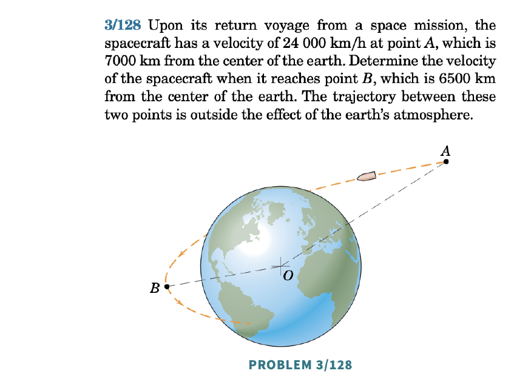
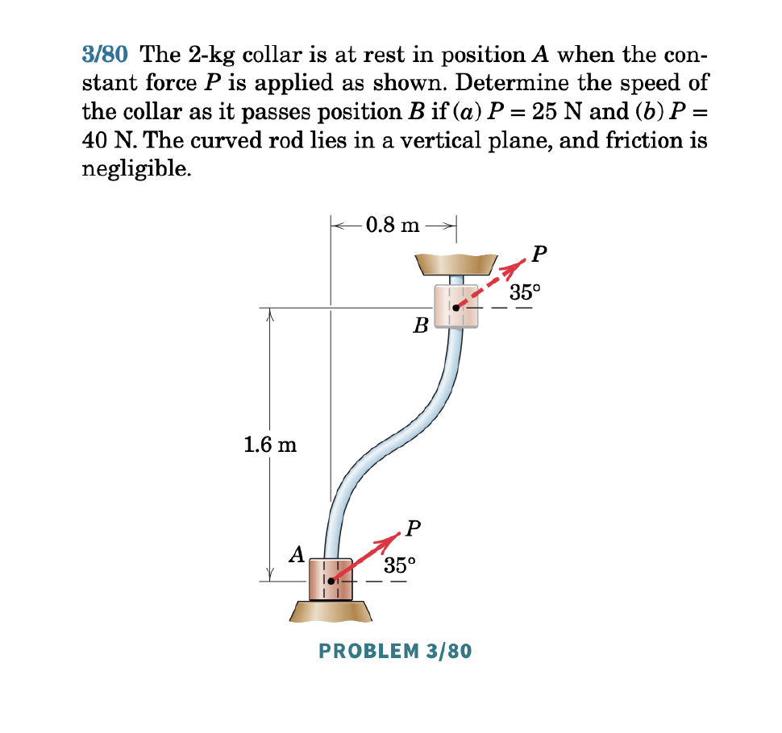
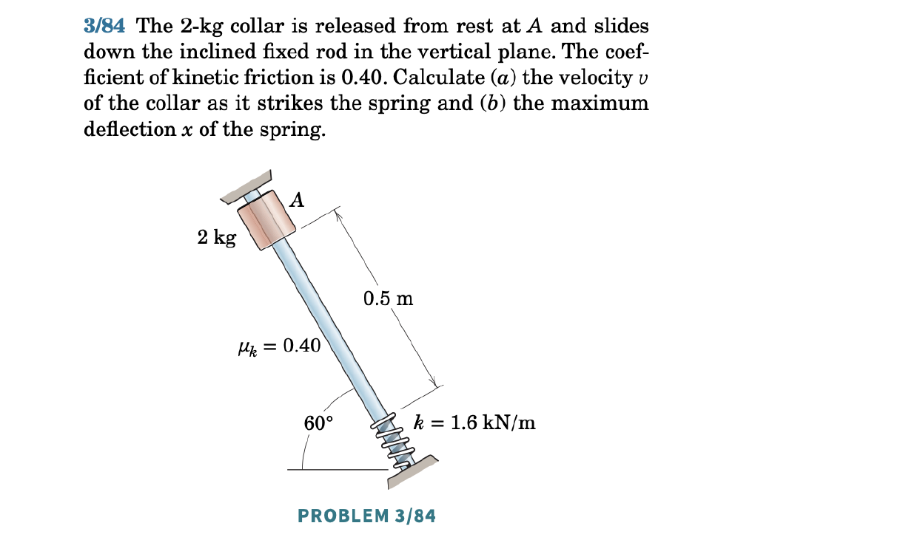
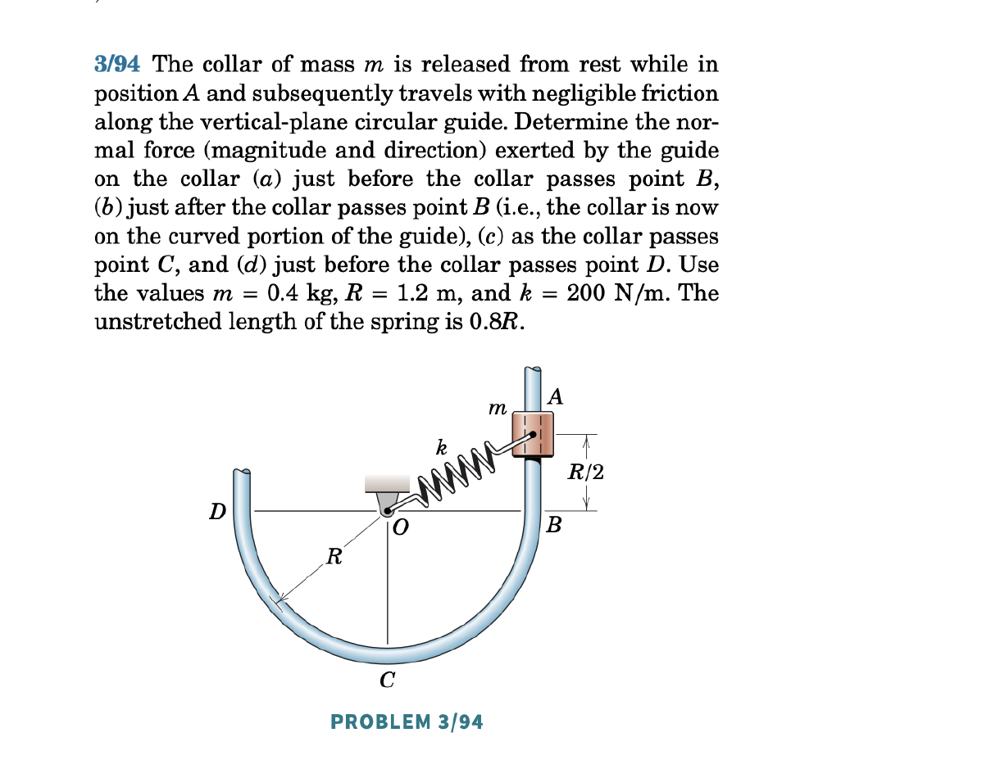
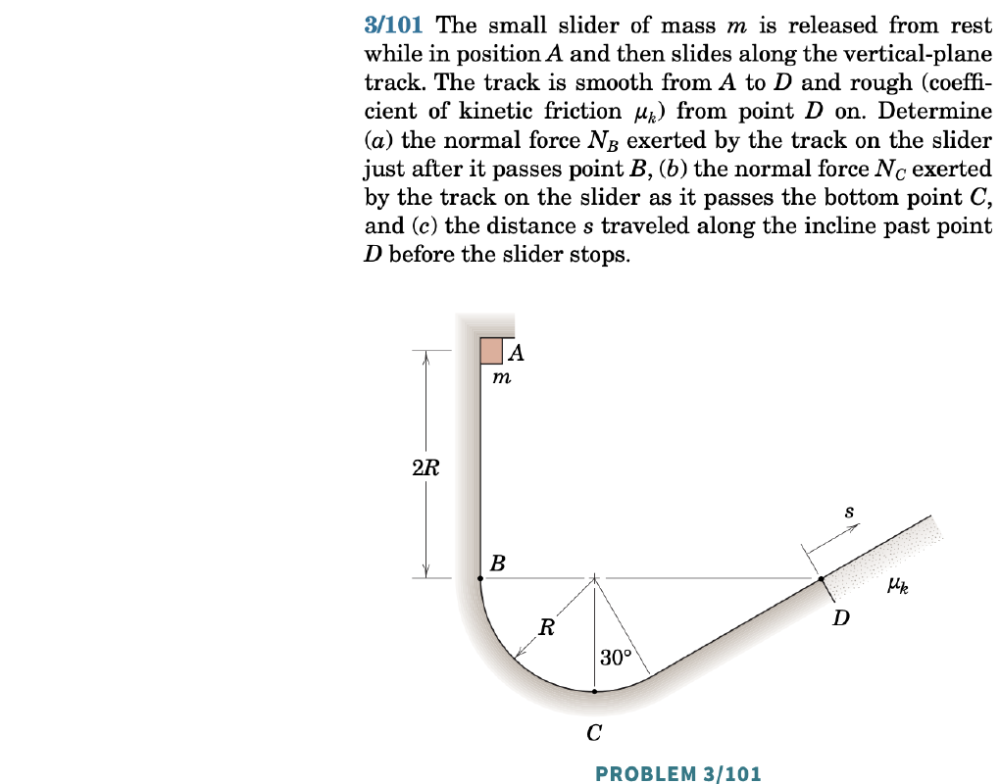
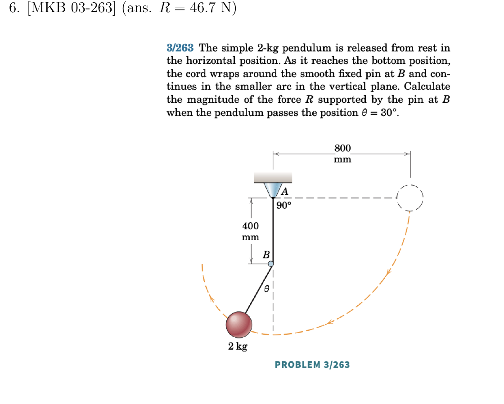

## Power and Work

The **mechanical power** of a force ${\bf F}$ acting on a particle with absolute velocity ${\bf v}$ is:
\begin{align}
    \mathcal{P} = {\bf F}\cdot{\bf v}.
\end{align}

The **work** done by ${\bf F}$ over the interval $[t_1,t_2]$ is:
\begin{align}
    W_{{\bf F},12} = \int_{t_1}^{t_2} {\bf F}\cdot{\bf v}\,dt = \int_{t_1}^{t_2}{\bf F}\cdot d{\bf r},
\end{align}
since $d{\bf r} = {\bf v}\,dt$. So power is the derivative of work: $\mathcal{P} = \dot{W}$.

In SI units: work is in Newton meters (Joules) and power in Watts.

Notes:

- There are many representations of this integral depending on the coordinate system:
  - Cartesian: $d{\bf r} = dx{\bf E}_x+dy{\bf E}_y+dz{\bf E}_z$
  - Polar: $d{\bf r} = dr{\bf e}_r+r\,d\theta{\bf e}_\theta$
  - Serret-Frenet: $d{\bf r} = ds\,{\bf e}_t$
- This integral is **path dependent** — we need to know the particle's path to compute it.

::: {.callout-tip title="Think!"}
**Question:** In what case would the work of a force be zero?

::: {.callout-note title="Answer" collapse="true"}
The work is zero if the force is perpendicular to the displacement/velocity, or if the force is applied at a fixed point.
:::
:::

::: {.callout-tip title="Think!"}
**Question:** When is the work of a force positive? When is it negative?

::: {.callout-note title="Answer" collapse="true"}
...
:::
:::

### Example: Particle on a Rail

Consider two points $A$ and $B$ in the vertical plane connected by a smooth rail. A particle slides along the rail from $B$ to $A$.

```{r}
#| engine: tikz
#| echo: false
#| fig-align: center
#| fig-width: 5
\begin{tikzpicture}

\draw[thick] (0,0) -- (3,5);
\node at (-0.5,0) {$A$};
\node at (3.5,5) {$B$};

\draw[thick] plot [smooth, tension=2] coordinates { (5,0) (9,3) (8,5)};
\node at (4.5,0) {$A$};
\node at (7.5,5) {$B$};

\draw[thick,->] (-2,5) -- (-2,4) node[midway,left] {${\bf g}$};

\end{tikzpicture}
```

::: {.callout-tip title="Think!"}
**Question:** What is the work done by forces on an object traveling from $A$ to $B$ on (a) a straight rail or (b) a curved path?

::: {.callout-note title="Answer" collapse="true"}
In both cases ${\bf F} = {\bf W}+{\bf N}$. Since ${\bf N}\perp d{\bf r}$, the normal force does no work. The work of weight is:
\begin{align*}
    W_{{\bf W},1-2} = \int_{{\bf r}_1}^{{\bf r}_2} mg{\bf E}_y\cdot d{\bf r} = mg {\bf E}_y\cdot \int_{{\bf r}_1}^{{\bf r}_2} d{\bf r} = mg{\bf E}_y\cdot\Delta {\bf r}_{1-2}.
\end{align*}
$\Delta{\bf r}_{1-2}$ is the same for both rails, so weight does the same work regardless of path.
:::
:::

::: {.callout-tip title="Think!"}
**Question:** What changes if the rail is rough?

::: {.callout-note title="Answer" collapse="true"}
With friction:
\begin{align*}
    W_{1-2} = W_{{\bf W},1-2}+\int_{s_1}^{s_2}\mu_k||{\bf N}||(-{\bf e}_t)\cdot ds\,{\bf e}_t = W_{{\bf W},1-2}-\mu_k\int_{s_1}^{s_2}||{\bf N}||ds.
\end{align*}
Friction work is path dependent and dissipative ($W_{{\bf F}_f,1-2}<0$). On the other hand, the work of the weight is positive.
:::
:::

::: {.callout-tip title="Think!"}
**Question:** Can you think of a situation where the normal force is not workless?

::: {.callout-note title="Answer" collapse="true"}
A particle in an elevator is a common example. In this case, the normal force is not perpendicular to the motion, and it does work.
:::
:::

## Kinetic Energy

The **kinetic energy** of a particle:
\begin{align}
    T = \frac{m}{2}{\bf v}\cdot{\bf v}.
\end{align}

In different bases:
\begin{align*}
    T = \frac{1}{2}m(v_x^2+v_y^2+v_z^2) = \frac{1}{2}m(\dot{r}^2+r^2\dot{\theta}^2+\dot{z}^2) = \frac{1}{2}mv^2.
\end{align*}

## Energy

Energy is defined as the ability to perform work.

## The Work-Energy Theorem

The rate of change of kinetic energy equals the mechanical power of the resultant force ${\bf F}$ acting on the particle:
\begin{align}
    \frac{dT}{dt} = {\bf F}\cdot{\bf v} = \mathcal{P}.
\end{align}

Proof:
\begin{align*}
    \frac{d}{dt}T = \frac{d}{dt}\lp\frac{1}{2}m{\bf v}\cdot{\bf v}\rp = m{\bf a}\cdot{\bf v} = {\bf F}\cdot{\bf v}.
\end{align*}

Integral form (with respect to time):
\begin{align}
    T_2 - T_1 = W_{{\bf F},12} = \int_{{\bf r}_1}^{{\bf r}_2}{\bf F}\cdot d{\bf r}.
\end{align}



## Implications of $\dot{T} = {\bf F}\cdot{\bf v}$ through examples

- Consider a free falling particle. The weight is the only force acting on it. If the particle is going up (opposite to the weight), $\dot{T}<0$. If the particle is going down (same direction of the weight), $\dot{T}>0$.

- Consider a person standing on a train while the train is accelerating:
$$\begin{align}
& {\bf F} = {\bf W}+{\bf F}_f+{\bf N}\\
& {\bf F}\cdot{\bf v} = {\bf F}_f\cdot{\bf v} \geq 0 \implies \dot{T}>0.
\end{align}$$
The kinetic energy of the person is increasing.

- Consider a box sliding on a rough surface:
$$\begin{align}
& {\bf F} = {\bf F}_f+{\bf W}+{\bf N}\\
& {\bf F}\cdot{\bf v} = {\bf F}_f\cdot{\bf v} < 0 \implies \dot{T}<0.
\end{align}$$
The kinetic energy of the box is decreasing until it stops.

- Consider a particle on a smooth rail in the horizontal plane:
$$\begin{align}
& {\bf F} = {\bf W}+{\bf N}\\
& {\bf F}\cdot{\bf v} = 0\implies\dot{T}=0.
\end{align}$$
The kinetic energy of the particle is conserved.

The same analysis/conclusions can be achieved using the work-energy theorem.

## Another way to derive the Work-Energy theorem

Starting with the balance of linear momentum we can derive the work-energy theorem:
$$\begin{align}
{\bf F} &= m{\bf a}\\
{\bf F}\cdot d{\bf r} &= m{\bf a}\cdot d{\bf r}\\
\int_{r_1}^{r_2} {\bf F}\cdot d{\bf r} &= \int_{r_1}^{r_2} m{\bf a}\cdot d{\bf r}\\
W_{1-2} &= \int_{t_1}^{t_2} m{\bf a}\cdot {\bf v}\, dt = \int_{t_1}^{t_2}\dot{T}\, dt = T_2-T_1,
\end{align}$$
where the work of a force is
$$W_{1-2} = \int_{r_1}^{r_2} {\bf F}\cdot d{\bf r}.$$

## Conservative Forces

Forces whose work depends only on the endpoints of a path are **conservative**. From the previous examples, weight (constant force) is conservative; friction is not.

A force ${\bf F}_c$ is conservative if there exists a scalar **potential energy** function $U = U({\bf r})$ such that:
\begin{align}
    {\bf F}_c = -\frac{\partial U}{\partial {\bf r}} = -\text{grad}_{\bf r}U.
\end{align}

Then:
\begin{align}
    W_{1-2} = \int_{{\bf r}(t_1)}^{{\bf r}(t_2)}{\bf F}_c\cdot d{\bf r} = -\int_{{\bf r}(t_1)}^{{\bf r}(t_2)}\frac{\partial U}{\partial {\bf r}}\cdot d{\bf r} = -U_2+U_1 = -\Delta_{1-2}U.
\end{align}

If potential energy decreases ($U_2 \leq U_1$), the work is positive and kinetic energy increases.

::: {.callout-tip title="Think!"}
**Question:** Consider a particle thrown from the top of a building. Describe the changes in kinetic and potential energy of the particle during its motion.

::: {.callout-note title="Answer" collapse="true"}
When the particle is still high, its potential energy is high and its kinetic energy is low. When the particle has traveled downward, its potential energy is low and its kinetic energy is high.
:::
:::

### Constant Forces

Constant force ${\bf C}$ is conservative with potential $U = -{\bf C}\cdot{\bf r}$.

Proof: Propose $U = -{\bf C}\cdot{\bf r} = U({\bf r}) = -C_x x-C_y y-C_z z$.
\begin{align}
    -\text{grad}_r{U} = C_x{\bf E}_x+C_y{\bf E}_y+C_z{\bf E}_z = {\bf C}.
\end{align}
We found a $U$ from which ${\bf C}$ is derivable.

The weight near Earth's surface: $U_{\bf W} = mgy$.

### Spring Force

The spring force is conservative with potential:
\begin{align*}
    U_s = \frac{1}{2}K\varepsilon^2.
\end{align*}
$U_s > 0$ in both compression and tension — it represents the spring's capacity to do work.

Proof: 
\begin{align*}
    & -\frac{\partial U_s}{\partial {\bf r}} = K\varepsilon\frac{{\bf r}_A-{\bf r}}{||{\bf r}_A-{\bf r}||} = {\bf F}_s.
\end{align*}

### Gravitational Force

The gravitational force ${\bf F}_G = G\frac{M_e m}{\lp R_e+h\rp^2}\lp-{\bf e}_r\rp$ is conservative with:
\begin{align*}
    U = -\frac{GM_e m}{r}.
\end{align*}

Drag, friction, tension in inextensible cables, and normal forces are nonconservative.

## Energy and Its Conservation

If only conservative forces act, define total mechanical energy $E = T + U$. Then:
\begin{align*}
    & \dot{T} = {\bf F}_c\cdot{\bf V} = -\frac{\partial U}{\partial {\bf r}}\cdot\dot{\bf r} = -\dot{U}\\
    & \dot{T} = -\dot{U} \implies \dot{E} = \dot{T}+\dot{U} = 0.
\end{align*}
$E$ is conserved when all work-doing forces are conservative, ie. ${\bf F}\cdot{\bf v}={\bf F}_c\cdot{\bf v}$.

If nonconservative forces also act:
\begin{align}
    E_B - E_A = W_{{\bf F}_{nc},AB}.
\end{align}

### Example: Smooth vs. Rough Rail

*Smooth rail:* ${\bf F}\cdot{\bf v} = {\bf W}\cdot{\bf v}+{\bf N}\cdot{\bf v} = {\bf W}\cdot{\bf v} = -\dot{U}$, so $\dot{E} = 0$.

*Rough rail:* $\dot{E} = {\bf F}_f\cdot{\bf v} < 0$, so energy bleeds off over time. Integrating:
\begin{align*}
    E(t_2) = E(t_1) + W_{{\bf F}_f,1-2} < E(t_1).
\end{align*}


## Summary

**Power** of force $\mathbf{F}$ on particle with velocity $\mathbf{v}$: $P = \mathbf{F}\cdot\mathbf{v}$.

**Work–energy theorem**: $T_B - T_A = W_{\mathbf{F},AB}$, where $T=\tfrac{1}{2}m\mathbf{v}\cdot\mathbf{v}$.

**Conservative forces** satisfy $W_{F_c,AB}=-(U_B-U_A)$. Including non-conservative work:
\begin{align}
    (T_B+U_B)-(T_A+U_A) = W_{\mathbf{F}_{nc},AB}.
\end{align}
If all work-doing forces are conservative, **energy is conserved**: $E=T+U=\text{const}$.


## Exercises

*The following problems are from Set 11 – Power, Work and Energy.*

**1.** [MKB 03-128] Only the gravitational force acts on the spacecraft, so energy is conserved. Use conservation of energy. *(ans. $v_B = 26\,300$ km/h)*

{width=50%}

**2.** [MKB 03-080] *(ans. (a) no motion; (b) $v_B = 5.62$ m/s)*

{width=50%}

**3.** [MKB 03-084] *(ans. (a) $v=2.56$ m/s; (b) $x=98.9$ mm)*

{width=50%}

**4.** [MKB 03-094] *(ans. (a) $N_B=48$ N right; (b) $N_B'=29.4$ N right; (c) $N_C=17.63$ N down; (d) $N_D=29.4$ N left)*

{width=50%}

**5.** [MKB 03-101] *(ans. (a) $N_B=4mg$; (b) $N_C=7mg$; (c) $s=\frac{4R}{\sqrt{3}(1+\mu_k)}$)*

{width=50%}

**6.** [MKB 03-263] *(ans. $R=46.7$ N)*

{width=50%}

**7.** [OOR Exercise 5-1] *(See O'Reilly Primer.)*

**8.** [OOR Exercise 5-4]

**9.** [OOR Exercises 5-6 & 5-7]

**10.** [OOR Exercises 5-8 & 5-9]
