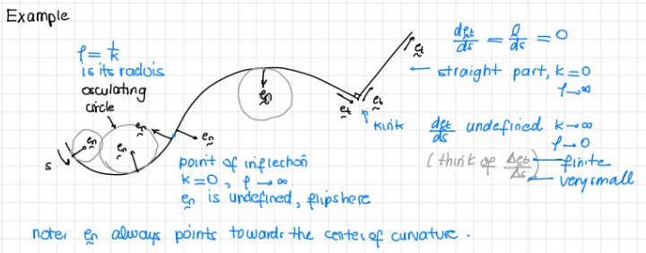
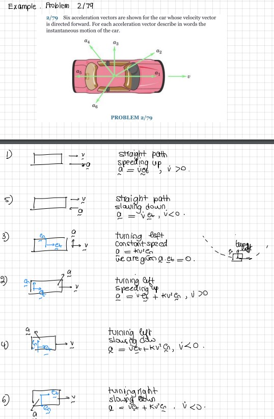
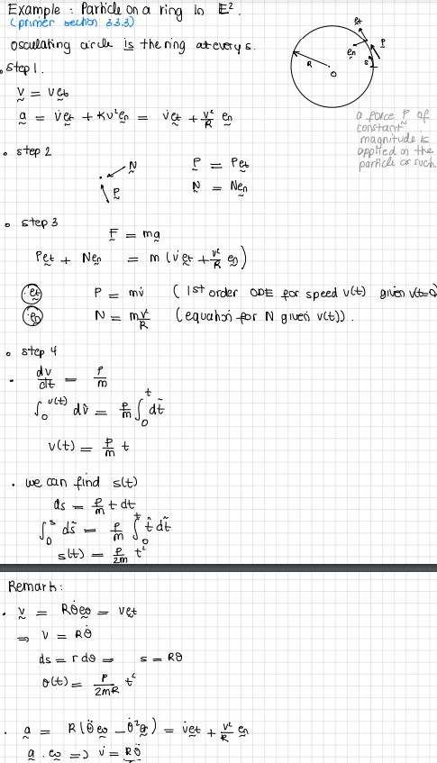

In general, the path of a particle is a curve in space — we refer to such curves as *space curves*.

Consider a fixed curve $\mathcal{C}$ embedded in $\mathbb{E}^3$. Let the position vector of a point $P\in\mathcal{C}$ be ${\bf r}$. In Cartesian coordinates, ${\bf r} = x{\bf E}_x+y{\bf E}_y+z{\bf E}_z$.

Recall the arc-length parameter $s$ associated with $\mathcal{C}$:
\begin{align*}
    \lp\frac{ds}{dt}\rp^2 = \frac{d{\bf r}}{dt}\cdot\frac{d{\bf r}}{dt} = \frac{dx}{dt}\frac{dx}{dt}+\frac{dy}{dt}\frac{dy}{dt}+\frac{dz}{dt}\frac{dz}{dt}.
\end{align*}
This parameter uniquely identifies a point $P$ on $\mathcal{C}$, giving the representation ${\bf r} = \hat{\bf r}(s)$.

## The Serret-Frenet Triad

```{r}
#| engine: tikz
#| echo: false
#| fig-align: center
#| fig-width: 5
\begin{tikzpicture}

    \draw[thick] plot[smooth, tension=1] coordinates {(-2,-1) (0,0) (2,-0.5) (4,1) (7,0.8)};

    \node[circle, fill=red, inner sep=2pt, label=above:{$P$}] at (2,-0.5) {};
    \node[circle, fill=black, inner sep=2pt, label=below:{$O$}] at (1,-2) {};

    \draw[->, thick, blue] (1,-2) -- (2,-0.5) node[midway, above left] {${\bf r}$};

    \draw[->] (1,-2) -- (2,-2) node[right] {${\bf E}_y$};
    \draw[->] (1,-2) -- (1,-1) node[above] {${\bf E}_z$};
    \draw[->] (1,-2) -- (0.5,-2.5) node[below left] {${\bf E}_x$};

    \draw[->] (2,-0.5) -- (2.8,-0.3) node[right] {${\bf e}_t$};
    \draw[->] (2,-0.5) -- (1.7,0.1) node[above] {${\bf e}_n$};
    \draw[->] (2,-0.5) -- (1.8,-1) node[below] {${\bf e}_b$};

    \draw[->] (4,1) -- (4.1,1.01) node[above left] {Inc. $s$};

\end{tikzpicture}
```

The Serret-Frenet basis $\{{\bf e}_t,{\bf e}_n,{\bf e}_b\}$ is defined at the point $P$; it depends on the curve and the particle's location on it.

::: {.callout-tip title="Think!"}
**Question:** How do we define the unit tangent vector?

::: {.callout-note title="Answer" collapse="true"}
Recall the unit tangent vector:
\begin{align}
    {\bf e}_t = \hat{\bf e}_t(s) = \frac{d{\bf r}}{ds} = \lim_{\Delta s\rightarrow 0}\frac{\hat{\bf r}(s+\Delta s)-\hat{\bf r}(s)}{\Delta s}.
\end{align}

The hat ($\hat{.}$) indicates that this function is now expressed in terms of another variable, $s$. ${\bf e}_t$ is known as the unit tangent vector to $\mathcal{C}$ at the point $P$.
:::
:::

For general motion, $||\Delta{\bf r}||\neq ds$ except in the infinitesimal sense: $\hat{\bf r}(s+\Delta s)-\hat{\bf r}(s) \rightarrow \Delta s{\bf e}_t$ as $\Delta s\rightarrow 0$ and $d{\bf r}$ is tangent to the curve.

```{r}
#| engine: tikz
#| echo: false
#| fig-align: center
#| fig-width: 2
\begin{tikzpicture}
\draw[thick] plot[smooth, tension=0.5] coordinates {(-2,-1) (0,0) (3,-1) (4,-2)};
\draw[->] (-1,-3) -- (0,0) node[midway, above left] {$\hat{\bf r}(s)$};
\draw[->] (-1,-3) -- (3,-1) node[midway, below right] {$\hat{\bf r}(s+\Delta s)$};
\draw[->] (0,0) -- (3,-1) node[midway, above right] {$\hat{\bf r}(s+\Delta s)-\hat{\bf r}(s)$};
\end{tikzpicture}
```


We need to determine the expression for the acceleration in the Serret-Frenet basis.
\begin{align}
    {\bf a} = \dot{\bf v} = \dot{v}{\bf e}_t+v\dot{\bf e}_t
\end{align}
where
\begin{align}
    \dot{\bf e}_t = \frac{d\hat{\bf e}_t}{ds}\frac{ds}{dt} = v\frac{d{\bf e}_t}{ds}.
\end{align}
The derivative $\frac{d\hat{\bf e}_t}{ds}$ only depends on the curve that the particle is tracing.

::: {.callout-tip title="Think!"}
**Question:** What do we know about the direction of $\frac{d\hat{\bf e}_t}{ds}$?

::: {.callout-note title="Answer" collapse="true"}
We can show that ${\bf e}_t$ and $\frac{d\hat{\bf e}_t}{ds}$ are perpendicular by differentiating ${\bf e}_t\cdot{\bf e}_t = 1$:
\begin{align}
    \frac{d}{ds}\lp{\bf e}_t\cdot{\bf e}_t \rp = {\bf e}_t\cdot\frac{d{\bf e}_t}{ds} = 0.
\end{align}
:::
:::

::: {.callout-tip title="Think!"}
**Question:** What do we know about the magnitude of $\frac{d\hat{\bf e}_t}{ds}$?

::: {.callout-note title="Answer" collapse="true"}

Consider two curves. Draw the unit tangent vectors at the same distance along the curve, $ds$, apart and draw their difference, $\Delta {\bf e}_t$. 

```{r}
#| engine: tikz
#| echo: false
#| fig-align: center
#| fig-width: 5
\begin{tikzpicture}
\draw[thick] plot [smooth] coordinates {(0,1) (4,2) (8,1)}; % curve with low curvature
\draw[thick] plot [smooth] coordinates {(10,0) (12,3) (14,0)}; % curve with high curvature
\end{tikzpicture}
```

For which of these two curves is the magnitude of $\frac{\Delta \hat{\bf e}_t}{\Delta s}$ higher?

As the curve begins to resemble a line, the magnitude of $\frac{d\hat{\bf e}_t}{ds}$ becomes smaller. As the *curvature* of a curve increases, so does the magnitude of $\frac{d\hat{\bf e}_t}{ds}$.
:::
:::


::: {.callout-important title="Note! Derivatives of a unit vector"}
It is a common mistake to assume that the derivative of a unit vector is necessarily a unit vector. Recall: $\dot{\bf e}_r = \dot{\theta}{\bf e}_\theta$ is not generally a unit vector.
:::

Hence, we define:
\begin{align}
    \kappa{\bf e}_n = \frac{d{\bf e}_t}{ds},
\end{align}
where $\kappa = \lnorm \frac{d{\bf e}_t}{ds}\rnorm \geq 0$ and $\lnorm{\bf e}_n\rnorm=1$.

- ${\bf e}_n$ is the unit **principal normal** vector.
- $\kappa$ is the **curvature** of $\mathcal{C}$ at $P$.
- The **radius of curvature** is $\rho = 1/\kappa$.

For any point on a curve, three nearby non-collinear points define the **osculating circle** (radius $\rho$, center of curvature).



::: {.callout-tip title="Think!"}
**Question:** When is ${\bf e}_n$ not uniquely defined?

::: {.callout-note title="Answer" collapse="true"}
When $d{\bf e}_t/ds = {\bf 0}$ (i.e. $\kappa = 0$), such as on a straight line, at an inflection point, or at a corner. In this case, ${\bf e}_n$ is defined as any unit vector perpendicular to ${\bf e}_t$.

Example: In problem 03/040, we choose the Serret-Frenet basis on the straight portion of the curve to be such that it transitions smoothly to the curved portion of the curve.
:::
:::

The unit **binormal** vector:
\begin{align*}
    {\bf e}_b = {\bf e}_t\times{\bf e}_n.
\end{align*}

Concluding remarks:

- $\{{\bf e}_t,{\bf e}_n,{\bf e}_b\}$ is orthonormal and right-handed.
- The **osculating plane** is spanned by ${\bf e}_t$ and ${\bf e}_n$; it contains the osculating circle.
- The **rectifying plane** is spanned by ${\bf e}_t$ and ${\bf e}_b$.
- The **normal plane** is spanned by ${\bf e}_n$ and ${\bf e}_b$.

A vector can be expressed in the Serret-Frenet basis as in any other basis. The Serret-Frenet basis is not a fixed basis.
\begin{align}
    {\bf b} = b_t{\bf e}_t+b_n{\bf e}_n = b_x{\bf E}_x+b_y{\bf E}_y+b_z{\bf E}_z.
\end{align}

Check out the following animation showing the osculating circle and video placing the Serret-Frenet basis on a bobsled.










## Kinematics

Position, velocity, and acceleration in the Serret-Frenet basis:
\begin{align*}
    & {\bf r} = x{\bf E}_x+y{\bf E}_y+z{\bf E}_z = {\bf r}(t) = \hat{{\bf r}(s(t))}.\\
    & {\bf v} = \dot{x}{\bf E}_x+\dot{y}{\bf E}_y+\dot{z}{\bf E}_z = \frac{d{\bf r}}{ds}\frac{ds}{dt} = \frac{ds}{dt}{\bf e}_t = v{\bf e}_t.\\
    & {\bf a} = \dot{\bf v} = \frac{d}{dt}\lp\frac{ds}{dt}{\bf e}_t\rp = \frac{d^2}{dt^2}{\bf e}_t+\frac{ds}{dt}\frac{d{\bf e}_s}{ds} = \frac{d^2}{dt^2}{\bf e}_t+\frac{ds}{dt}\frac{d{\bf e}_t}{ds}\frac{ds}{dt} = \dot{v}{\bf e}_t+\kappa v^2{\bf e}_n.
\end{align*}

## Kinetics

\begin{align}
    {\bf F} &= m{\bf a}\\
    F_t{\bf e}_t+F_n{\bf e}_n+F_b{\bf e}_b &= m\lp\dot{v}{\bf e}_t+\kappa v^2{\bf e}_n\rp.
\end{align}
Note that forces in the binormal direction should always balance.

### Example: Problem 03/040 and Roller Coaster Design

::: {.callout-tip title="Think!"}
**Question:** Consider the design of a roller coaster that is a circular ring. Comment on its safety.

::: {.callout-note title="Answer" collapse="true"}
At the transition between the circular and straight portions, there is a jump in curvature, hence a jump in acceleration, hence a jump in the normal force — producing a jerk. For a circular loop, the normal force goes from 0 to a finite value instantaneously. This could snap the rider's neck. Instead, we use two connected **clothoids** (Euler spirals), whose curvature is proportional to arc length.
:::
:::

## The Serret-Frenet Formulae

We want the derivatives of the Serret-Frenet basis vectors with respect to $s$.

We already have:
\begin{align}
    \frac{d{\bf e}_t}{ds} = \kappa{\bf e}_n.
\end{align}

Since ${\bf e}_b\cdot{\bf e}_b = 1$, we have $\frac{d{\bf e}_b}{ds}\cdot{\bf e}_b = 0$. 

Also from ${\bf e}_t\cdot{\bf e}_b = 0$, we get $\frac{d{\bf e}_b}{ds}\cdot{\bf e}_t=0$. So $\frac{d{\bf e}_b}{ds}$ is parallel to ${\bf e}_n$:
\begin{align}
    & {\bf e}_t\cdot{\bf e}_b = 0\\
    & \frac{d{\bf e}_t}{ds}\cdot{\bf e}_b+\frac{d{\bf e}_b}{ds}\cdot{\bf e}_t = 0\\
    & \kappa{\bf e}_n\cdot{\bf e}_b+\frac{d{\bf e}_b}{ds}\cdot{\bf e}_t = 0\\
    & \frac{d{\bf e}_b}{ds}\cdot{\bf e}_t=0.
\end{align}
Consequently, we define
\begin{align}
    \frac{d{\bf e}_b}{ds} = -\tau{\bf e}_n,
\end{align}
where $\tau$ is the **torsion** of $\mathcal{C}$ at $P$. The negative sign in the above formula is a convention.

Then:
\begin{align}
    \frac{d{\bf e}_n}{ds} &= \frac{d}{ds}\lp{\bf e}_b\times{\bf e}_t\rp\\
    &= \frac{d{\bf e}_b}{ds}\times{\bf e}_t+{\bf e}_b\times\frac{d{\bf e}_t}{ds}\\
    &= (-\tau{\bf e}_n)\times{\bf e}_t+{\bf e}_b\times\kappa{\bf e}_n\\
    &= -\kappa{\bf e}_t+\tau{\bf e}_b.
\end{align}

In summary (the Serret-Frenet formulae):
\begin{align}
    \begin{bmatrix}
        \frac{d{\bf e}_t}{ds}\\
        \frac{d{\bf e}_n}{ds}\\
        \frac{d{\bf e}_b}{ds}
    \end{bmatrix}
    =
    \begin{bmatrix}
        0 & \kappa & 0\\
        -\kappa & 0 & \tau\\
        0 & -\tau & 0
    \end{bmatrix}
    \begin{bmatrix}
        {\bf e}_t\\
        {\bf e}_n\\
        {\bf e}_b
    \end{bmatrix}.
\end{align}

Define the **Darboux vector** $\bomega_{SF} = \kappa{\bf e}_b+\tau{\bf e}_t$ so that:
\begin{align}
    \frac{d{\bf e}_i}{ds} = \bomega_{SF}\times{\bf e}_i, \quad i = t, n, b.
\end{align}



### Example: A Particle on a Helix

For a helix $x=R\cos(\theta)$, $y=R\sin(\theta)$, $z=\alpha R\theta$:
\begin{align}
    {\bf r} = R{\bf e}_r+\alpha R\theta{\bf E}_z = x{\bf E}_x+y{\bf E}_y+z{\bf E}_z.
\end{align}
\begin{align}
    \kappa = \frac{1}{R(1+\alpha^2)}, \qquad \tau = \frac{\alpha}{(1+\alpha^2)R}.
\end{align}

## The Curvature Formula for a Plane Curve

Consider a point $P$ tracing a plane curve with $y = f(x)$, $z = z_0$, so that
\begin{align}
    {\bf r} = x{\bf E}_x+f(x){\bf E}_y+z_0{\bf E}_z.
\end{align}

Determining the arc-length parameter $s$:
\begin{align}
    \begin{split}
        & \frac{d{\bf r}}{dt} = \frac{dx}{dt}{\bf E}_x+\frac{df}{dx}\frac{dx}{dt}{\bf E}_y,\\
        & \lp\frac{ds}{dt}\rp^2 = \lp 1+\lp\frac{df}{dx}\rp^2\rp\lp\frac{dx}{dt}\rp^2,\\
        & \frac{ds}{dt} = \frac{dx}{dt}\sqrt{1+\lp\frac{df}{dx}\rp^2},\\
        & s = s(x) = \int_{x_0}^x\sqrt{1+\lp\frac{df}{du}\rp^2}\,du+s(x_0).
    \end{split}
\end{align}

The tangent vector:
\begin{align}
    {\bf e}_t = \frac{d{\bf r}}{ds} = \frac{d{\bf r}}{dx}\frac{dx}{ds} = \frac{1}{\sqrt{1+\lp\frac{df}{dx}\rp^2}}\lp{\bf E}_x+\frac{df}{dx}{\bf E}_y\rp.
\end{align}

The $\kappa{\bf e}_n$ expression:
\begin{align}
    \kappa{\bf e}_n = \frac{d{\bf e}_t}{ds} = \frac{d{\bf e}_t}{dx}\frac{dx}{ds} = \frac{\frac{d^2 f}{dx^2}}{\lp1+\lp \frac{df}{dx}\rp^2\rp^2}\lp{\bf E}_y-\frac{df}{dx}{\bf E}_x\rp.
\end{align}

Recalling that ${\bf e}_n$ is a unit vector and $\kappa \geq 0$:
\begin{align}
    \begin{split}
        & \kappa = \kappa(x) = \frac{\left|\frac{d^2 f}{dx^2}\right|}{\lp\sqrt{1+\lp\frac{df}{dx}\rp^2}\rp^3},\\
        & {\bf e}_n = \frac{\text{sgn}\lp\frac{d^2 f}{dx^2}\rp}{\sqrt{1+\lp\frac{df}{dx}\rp^2}}\lp{\bf E}_y-\frac{df}{dx}{\bf E}_x\rp,
    \end{split}
\end{align}
where $\text{sgn}(a)=1$ if $a>0$ and $-1$ if $a<0$.

The binormal vector and torsion:
\begin{align}
    {\bf e}_b = {\bf e}_t\times{\bf e}_n = \text{sgn}\lp\frac{d^2 f}{dx^2}\rp{\bf E}_z,
\end{align}
and because this vector is piecewise constant, the torsion of the plane curve is $\tau = 0$.

## Alternative Notation for Plane Curves

*This section is not usually covered.*

For plane curves, some texts define the angle $\beta = \beta(s)$ such that:
\begin{align}
    {\bf e}_t = \cos(\beta){\bf E}_x+\sin(\beta){\bf E}_y, \qquad \bar{\bf e}_n = \cos(\beta){\bf E}_y-\sin(\beta){\bf E}_x.
\end{align}
Then $\kappa = \left|\frac{d\beta}{ds}\right|$ and $\frac{d\beta}{ds}$ is the rate of rotation of the triad about ${\bf E}_z$.


## Summary

**Serret–Frenet basis** $\{\mathbf{e}_t,\mathbf{e}_n,\mathbf{e}_b\}$:
\begin{align}
    \mathbf{v} &= v\,\mathbf{e}_t, \qquad
    \mathbf{a} = \dot v\,\mathbf{e}_t + \kappa v^2\,\mathbf{e}_n, \qquad
    \mathbf{e}_b = \mathbf{e}_t\times\mathbf{e}_n.
\end{align}
The curvature is $\kappa=1/\rho$ (radius of curvature $\rho$). The BoLM gives $F_t = m\dot v$ and $F_n = m\kappa v^2$.


## Exercises

*The following problems are from Set 07 – The Serret–Frenet Basis.*

**1.** [MKB 2/079] Analyse the acceleration vector in the Serret–Frenet basis.

{width=50%}

**2.** [MKB 02-090] Note that $\dot v \neq \|\mathbf{a}\|$; acceleration has both tangential and normal components. *(ans. $v = 20$ m/s)*

**3.** [MKB 02-091] *(ans. $\rho = 1709$ m)*

**4.** [02-097] Follow the 4 steps; express $\mathbf{e}_t$ and $\mathbf{e}_n$ in the Cartesian basis. *(ans. at $t=1$ s: $\dot v=-6.58$ ft/s$^2$, $\rho=142.2$ ft; at $t=2$ s: $\dot v=8.75$ ft/s$^2$, $\rho=149.7$ ft)*

**5.** [02-103] *(ans. $(x_C,y_C)=(22.5,-22.9)$ m)*

**6.** [02-199] Draw $\mathbf{e}_t$ and $\mathbf{e}_n$ first. *(ans. $\dot r=15$ m/s, $\dot\theta=0.325$ rad/s, $\rho=129.9$ m)*

**7.** [03-040] Note the jump in normal force at the transition from straight to curved path. *(ans. (a) $R=1.177$ N; (b) $R=1.664$ N)*

**8.** [03-041] What does "weightless" mean? *(ans. $\rho=24\,000$ ft)*

**9.** [03-043] Draw the Serret–Frenet basis carefully; the figure hints at the direction of $\mathbf{e}_n$. *(ans. $v=29.1$ m/s, $N=12.36$ kN)*

{width=50%}

**10.** [OOR 3.1] *(See O'Reilly Primer.)*

**11.** [OOR 3.2]
