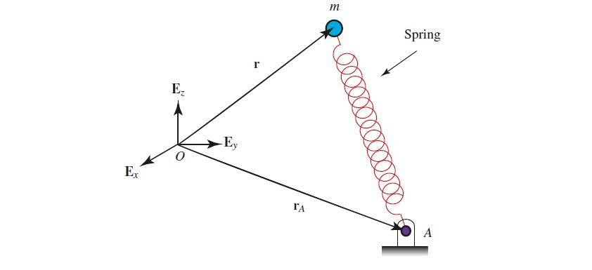

## Introduction

::: {.callout-tip title="Think!"}
**Question:** What does it mean for a spring to be linear?

::: {.callout-note title="Answer" collapse="true"}
Consider a mass $m$ suspended by a spring causing an extension $\delta$. Suspending a mass $2m$ causes double the extension, $2\delta$.
:::
:::

**Hooke's Law:** The force generated by a spring is assumed to be linearly proportional to its extension/compression.

## The Simple Harmonic Oscillator

Consider a block of mass $m$ attached to a linear spring of stiffness $k$ and unstretched length $\ell_0$. Denote the current length by $\ell$ and the stretch by $\varepsilon = \ell-\ell_0$.

```{r}
#| engine: tikz
#| echo: false
#| fig-align: center
#| fig-width: 5
\usetikzlibrary{decorations.pathmorphing,patterns}
\begin{tikzpicture}

    %%%% UNSTRETCHED
    \draw[thick] (-3, -0.5) -- (-3, 1);
    \foreach \y in {-0.5,-0.3,...,1} {
        \draw[thick] (-3,\y) -- (-3.2,\y+0.2);
    }
    \draw[thick] (-3,0) -- (2,0);
    \draw[thick,decorate,decoration={coil,aspect=0.7,segment length=5mm,amplitude=2mm}]
        (-3,0.25) -- (0,0.25);
    \node at (-5,0.25) {\large (a)};

    %%%% EXTENDED
    \draw[thick] (-3, -2.5) -- (-3, -1);
    \foreach \y in {-2.5,-2.3,...,-1} {
        \draw[thick] (-3,\y) -- (-3.2,\y+0.2);
    }
    \draw[thick] (-3,-2) -- (2,-2);
    \draw[thick,decorate,decoration={coil,aspect=0.7,segment length=5mm,amplitude=2mm}]
        (-3,-1.75) -- (1,-1.75);
    \draw[thick, fill=gray!30] (1,-2) rectangle (2,-1.5);
    \node at (-5,-1.75) {\large (b)};

    %%%% COMPRESSED
    \draw[thick] (-3, -4.5) -- (-3, -3);
    \foreach \y in {-4.5,-4.3,...,-3} {
        \draw[thick] (-3,\y) -- (-3.2,\y+0.2);
    }
    \draw[thick] (-3,-4) -- (2,-4);
    \draw[thick,decorate,decoration={coil,aspect=0.7,segment length=5mm,amplitude=2mm}]
        (-3,-3.75) -- (-1,-3.75);
    \draw[thick, fill=gray!30] (-1,-4) rectangle (0,-3.5);
    \node at (-5,-3.75) {\large (c)};

    \draw[dashed] (0,1) -- (0,-5);
    \draw[dashed] (1,1) -- (1,-5);
    \draw[dashed] (-1,1) -- (-1,-5);

    \draw[thick,->] (-3,1.5) -- (-2,1.5) node[right] {${\bf E}_x$};

\end{tikzpicture}
```

::: {.callout-tip title="Think!"}
**Question:** What is the stretch in each case? What is the spring force?

::: {.callout-note title="Answer" collapse="true"}
(a) Unstretched: Its current length is $\ell_0$ and its stretch is $\varepsilon =0$.

(b) Extended: Its current length is $\ell$ and its stretch is $\varepsilon = \ell-\ell_0>0$. The spring force is ${\bf F}_s = -k\varepsilon{\bf E}_x$ pointing to the left.

(c) Compressed: Its current length is $\ell$ and its stretch is $\varepsilon = \ell-\ell_0<0$. The spring force is ${\bf F}_s = -k\varepsilon{\bf E}_x$ pointing to the right.
:::
:::

::: {.callout-important title="Note! Prescribing the spring force"}
The spring force always seeks to return the particle to the unstretched state. The same expression applies whether the spring is extended or compressed.
:::



## Formalism

In general:

{width=50%}

::: {.callout-tip title="Think!"}
**Question:** What is the prescription of the spring force in this general case?

::: {.callout-note title="Answer" collapse="true"}
…
:::
:::

The stretch is:
\begin{align}
    \varepsilon = \lnorm{\bf r}-{\bf r}_A\rnorm-\ell_0,
\end{align}
where $\ell_0$ is the unstretched length. 
The magnitude the friction force ${\bf F}_s$ is a statement of Hooke's law.
\begin{align}
    \lnorm{\bf F}_s\rnorm = |K\lp\lnorm{\bf r}-{\bf r}_A\rnorm-\ell_0\rp|.
\end{align}
The spring force is:
\begin{align}
    {\bf F}_s = -K\lp\lnorm{\bf r}-{\bf r}_A\rnorm-\ell_0\rp\frac{{\bf r}-{\bf r}_A}{\lnorm{\bf r}-{\bf r}_A\rnorm}.
\end{align}
This direction is correct in both tension and compression.



## Choosing the Origin


### Horizontal Simple Harmonic Oscillator

::: {.callout-tip title="Think!"}
**Question:** Derive the equations of motion of the harmonic oscillator with the origin at the free end of the spring when it is unstretched.

::: {.callout-note title="Answer" collapse="true"}
The equation of motion is
\begin{align}
    \ddot{x}+\frac{k}{m}x = 0,
\end{align}
where $x$ is measured from the undeformed position.
:::
:::

::: {.callout-tip title="Think!"}
**Question:** Derive the equations of motion with the origin at the fixed end of the spring.

::: {.callout-note title="Answer" collapse="true"}
...
:::
:::

### Vertical Simple Harmonic Oscillator

By analogy, the equation of motion of a vertical harmonic oscillator is:
\begin{align}
    \ddot{x}+\frac{k}{m}x = 0,
\end{align}
where $x$ is measured from the **static equilibrium** position.




## Summary

The spring force on a mass $m$ at position $\mathbf{r}$, attached to a spring (stiffness $K$, unstretched length $\ell_0$) with base at $\mathbf{r}_A$:
\begin{align}
    \mathbf{F}_s = -K(\|\mathbf{r}-\mathbf{r}_A\|-\ell_0)\,\frac{\mathbf{r}-\mathbf{r}_A}{\|\mathbf{r}-\mathbf{r}_A\|}.
\end{align}


## Exercises

Complete [this](https://colab.research.google.com/drive/1zIuB6Ovq1QWNSRoEht7LhWr2APq-lmqb?usp=sharing) introduction to vibrations.

*The following problems are from Set 09 – Spring Force (Chapter 8 of MKB). In each problem, find the equation of motion of the block.*

**1.** [08-002] *(ans. $\omega_n = 12$ rad/s, $f_n = 1.910$ Hz)*

**2.** [08-004] First determine the static deflection of the spring; take the origin at the statically deflected position. *(ans. $\delta_{st} = 0.200$ m, $\tau = 0.898$ s, $v_{\max} = 0.7$ m/s)*




**3.** [08-019] *(ans. $\ddot y + \frac{3k}{mL^2}y = 0$)*
