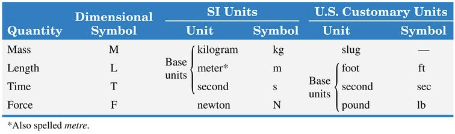

{width=50%}

In this class, we will use both SI and US customary units.

In the US customary units, the pound is used both as a unit of force (lbf) and as a unit of mass (lbm). The lbm is the amount of mass which weighs 1 lbf under standard conditions (at latitude 45° and sea level). In MKB, almost exclusively the unit of slug is used for mass. In addition, they use the symbol lb to mean pound force.

Notice that seconds is abbreviated as s in SI units and sec in US customary units.

For the gravitational acceleration use the values $g = 9.81$ m s$^{-2}$ in SI units and $g = 32.2$ ft sec$^{-2}$ in US customary units.

::: {.callout-important title="Note!"}
When solving a problem, keep all variables in the unit system they are given. For example, you may convert g to kg, but don't convert g to slugs!
:::

## Summary

In U.S. customary units, the **slug** is the unit of mass: $1$ slug $= 1$ lb$\cdot$sec$^2$/ft. Use $g = 32.2$ ft/sec$^2$ in U.S. customary units and $g = 9.81$ m/s$^2$ in SI. Keep all variables in the unit system they are given.

## Exercises

*The following problems are from Set 02 – Units.*

**1.** [MKB 1/2] Familiarise yourself with the U.S. unit of mass (slugs). Note that $1$ kg $\approx 0.0685$ slugs. *(ans. $W = 14\,720$ N or $3310$ lb; $m = 102.8$ slugs)*

**2.** Read [this article](https://archive.nytimes.com/www.nytimes.com/library/national/science/100199sci-nasa-mars.html) about the Mars Climate Orbiter loss and reflect on the importance of consistent units.
