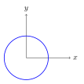

$$
\mathbf{r}_{P/O} = \mathbf{r}_{G/O} + \mathbf{r}_{P/G}
$$ {#eq-relative-pos}

The relative position vector is defined in @eq-relative-pos.

<iframe width="560" height="315"
src="https://www.youtube.com/embed/yxvqLBHZfXk?si=wg9cNWnssxdNyC0G"
title="YouTube video"
frameborder="0"
allowfullscreen>
</iframe>

