## Balance Laws for a Rigid Body

The balance laws for a rigid body are **Euler's first law** (Balance of Linear Momentum, BoLM) 
\begin{align}
    {\bf F} &= m{\bf a}_C,
\end{align}
and **Euler's second law** (Balance of Angular Momentum, BoAM), which can be expressed in three equivalent forms:
\begin{align}
    {\bf M}^O &= \dot{\bf H}^O \quad\text{about a fixed point }O,\\
    {\bf M}^C &= \dot{\bf H}^C \quad\text{about the center of mass }C,\\
    {\bf M}^P &= \dot{\bf H}^P+({\bf v}_P-{\bf v}_C)\times{\bf G} \quad\text{about any material point }P.
\end{align}
The BoAM is an **independent postulate**, not derivable from the BoLM.

## Resultant Forces and Moments

The resultant force ${\bf F}$ is the sum of all external forces. The resultant moment about a point includes the moment due to forces plus any applied pure moments ${\bf M}_e$ not due to forces.

```{r}
#| engine: tikz
#| echo: false
#| fig-align: center
#| fig-width: 4
\begin{tikzpicture}[scale=1]
    \draw[thick] plot [smooth cycle, tension=1] coordinates {
        (0,0) (2,3) (5,2.5) (7,1) (4,-2) (1,-3)};
    \fill[blue] (1,0.5) circle (1.5pt) node[anchor=north west] {$X_1$};
    \fill[blue] (6,0) circle (1.5pt) node[anchor=south] {$X_2$};
    \fill[blue] (2,-2) circle (1.5pt) node[anchor=north east] {$X_3$};
    \fill[black] (-2,-2) circle (1.5pt) node[anchor=north east] {$O$};
    \draw[thick,->] (-2,-2) -- (1,0.5) node[midway,above] {${\bf r}_1$};
    \draw[thick,->] (-2,-2) -- (6,0) node[midway,above] {${\bf r}_2$};
    \draw[thick,->] (-2,-2) -- (2,-2) node[midway,below] {${\bf r}_3$};
    \node[anchor=south east] at (1,2.2) {$\mathcal{B}$};
    \draw[->, thick, blue] (1,0.5) -- ++(0.8,1.2) node[anchor=west] {$\mathbf{F}_1$};
    \draw[->, thick, blue] (6,0) -- ++(-0.8,0.4) node[anchor=south] {$\mathbf{F}_2$};
    \draw[->, thick, blue] (2,-2) -- ++(0.8,-1.2) node[anchor=north] {$\mathbf{F}_3$};
    \draw[->, thick, blue] (4,2) arc[start angle=0, end angle=260, radius=0.4]
        node[right] {$\mathbf{M}_e$};
    \fill[red] (3,0) circle (1.5pt) node[anchor = south east] {$C$};
\end{tikzpicture}
```

For $K$ forces ${\bf F}_i$ acting at positions ${\bf r}_i$ plus a pure moment ${\bf M}_e$:
\begin{align}
    {\bf F} &= \sum_{i=1}^K{\bf F}_i,\\
    {\bf M}^O &= {\bf M}_e+\sum_{i=1}^K{\bf r}_i\times{\bf F}_i,\\
    {\bf M}^C &= {\bf M}_e+\sum_{i=1}^K({\bf r}_i-{\bf r}_C)\times{\bf F}_i.
\end{align}

Examples of pure moments: reaction moments ${\bf M}_R$ at joints; torsional spring moments $-K_T(\theta-\theta_0){\bf E}_z$.



### Does Weight Result in a Moment About the Center of Mass?

The total weight is ${\bf W} = \int_{\mathcal{B}}{\bf g}\,dm = m{\bf g}$, and its moment about $C$ is:
\begin{align}
    {\bf M}^C = \int_{\mathcal{B}}\bpi\times{\bf g}\,dm = \lp\int_{\mathcal{B}}\bpi\,dm\rp\times{\bf g} = {\bf 0},
\end{align}
since $\int_{\mathcal{B}}\bpi\,dm = {\bf 0}$ by definition of the center of mass.

## Equivalence of the BoAM Forms

The following devepments are true for rigid bodies where the inertia matrix is constant in the body frame.

### BoAM About Any Point $P$

Starting from ${\bf M}^C = \dot{\bf H}^C$ and replacing ${\bf M}^P = {\bf M}^C+({\bf r}_C-{\bf r}_P)\times{\bf F}$:
\begin{align}
    {\bf M}^P = \dot{\bf H}^C+({\bf r}_C-{\bf r}_P)\times{\bf F}.
\end{align}
Substituting $\dot{\bf H}^C = \dot{\bf H}^P+({\bf v}_P-{\bf v}_C)\times{\bf G}+({\bf r}_P-{\bf r}_C)\times m{\bf a}_C$ and simplifying:
\begin{align}
    {\bf M}^P = \dot{\bf H}^P+({\bf v}_P-{\bf v}_C)\times{\bf G},
\end{align}
recovering the BoAM about a general material point $P$.

### BoAM About a Fixed Point $O$

If $P$ is a fixed point $O$ (so ${\bf v}_O = {\bf 0}$), the above simplifies to ${\bf M}^O = \dot{\bf H}^O$.

::: {.callout-tip title="Think!"}
**Question:** When is the angular momentum of a rigid body about a fixed point $O$ or about its center of mass $C$ conserved? Under what conditions are these anguar momenta conserved in a certain direction (eg. along ${\bf E}_z$)?

::: {.callout-note title="Answer" collapse="true"}





:::
:::

## Calculating the Derivative of Angular Momentum

Recall that
\begin{align}
    \begin{split}
        {\bf H}^P = {\bf I}^P\bomega+({\bf r}_C-{\bf r}_P)\times m{\bf v}_P
    \end{split}
\end{align}
if $P$ is taken to be the center of mass $C$ or a fixed point $O$ respectively, we get
\begin{align}
    \begin{split}
        {\bf H}^C = {\bf I}^C\bomega,\\
        {\bf H}^P = {\bf I}^P\bomega.
    \end{split}
\end{align}
In component form,
\begin{align}
    {\bf H}^C = (I_{xx}^C\omega_x+I_{xy}^C\omega_y+I_{xz}^C\omega_z){\bf e}_x+(I_{xy}^C\omega_x+I_{yy}^C\omega_y+I_{yz}^C\omega_z){\bf e}_y+(I_{xz}^C\omega_x+I_{yz}^C\omega_y+I_{zz}^C\omega_z){\bf e}_z.
\end{align}
where
\begin{align}
    \bomega = \omega_x{\bf e}_x+\omega_y{\bf e}_y+\omega_z{\bf e}_z.
\end{align}
We need to calculate $\dot{\bf H}^C$.
\begin{align}
    \dot{\bf H}^C=\overset{\circ}{{\bf H}^C}+\bomega\times{\bf H}^C.
\end{align}
where $\overset{\circ}{{\bf H}^C}$ is the corotational rate of ${\bf H}$, that is the time derivative of ${\bf H}$ that is obtained while keeping ${\bf e}_x$, ${\bf e}_y$, and ${\bf e}_z$ fixed:
\begin{align}
    \overset{\circ}{{\bf H}^C} = (I_{xx}^C\dot{\omega}_x+I_{xy}^C\dot{\omega}_y+I_{xz}^C\dot{\omega}_z){\bf e}_x+(I_{xy}^C\dot{\omega}_x+I_{yy}^C\dot{\omega}_y+I_{yz}^C\dot{\omega}_z){\bf e}_y+(I_{xz}^C\dot{\omega}_x+I_{yz}^C\dot{\omega}_y+I_{zz}^C\dot{\omega}_z){\bf e}_z.
\end{align}
For the case where $\bomega=\omega{\bf E}_z$ considered exclusively in this class, the previous expressions simplify to
\begin{align}
    \begin{split}
        {\bf H}^C &= I_{xz}^C\omega_z{\bf e}_x+I_{yz}^C\omega_z{\bf e}_y+I_{zz}^C\omega_z{\bf e}_z,\\
        \dot{\bf H}^C &= (I_{xz}^C\dot{\omega}-I_{yz}^C\omega^2){\bf e}_x+(I_{yz}^C\dot{\omega}+I_{xz}^C\omega^2){\bf e}_y+I_{zz}^C\dot{\omega}{\bf E}_z.
    \end{split}
\end{align}
Analogous developments yield
\begin{align}
    \begin{split}
        & \dot{\bf H}^O = (I_{xz}^O\dot{\omega}-I_{yz}^O\omega^2){\bf e}_x+(I_{yz}^O\dot{\omega}+I_{xz}^O\omega^2){\bf e}_y+I_{zz}^O\dot{\omega}{\bf E}_z,\\
        & \dot{\bf H}^C = (I_{xz}^C\dot{\omega}-I_{yz}^C\omega^2){\bf e}_x+(I_{yz}^C\dot{\omega}+I_{xz}^C\omega^2){\bf e}_y+I_{zz}^C\dot{\omega}{\bf E}_z,\\
        & \dot{\bf H}^P = (I_{xz}^P\dot{\omega}-I_{yz}^P\omega^2){\bf e}_x+(I_{yz}^P\dot{\omega}+I_{xz}^P\omega^2){\bf e}_y+I_{zz}^P\dot{\omega}{\bf E}_z+\frac{d}{dt}\left(({\bf r}_C-{\bf r}_P)\times m{\bf v}_P\right).
    \end{split}
\end{align}
For fixed axis rotation, it is generally better to sum the moments about a fixed point passing through the axis of rotation. For general plane motion, there is no fixed point, so the BoAM is either summed about the center of mass or about a general material point $P$ on the body.

::: {.callout-important title="Note!"}
Remember, the BoAM about a general point has additional terms to ${\bf I}^P\bomega$:
\begin{align}
    \begin{split}
        {\bf M}^P &= (I_{xz}^P\dot{\omega}-I_{yz}^P\omega^2){\bf e}_x+(I_{yz}^P\dot{\omega}+I_{xz}^P\omega^2){\bf e}_y+I_{zz}^P\dot{\omega}{\bf E}_z+({\bf v}_P-{\bf v}_C)\times{\bf G},\\
        &= (I_{xz}^C\dot{\omega}-I_{yz}^C\omega^2){\bf e}_x+(I_{yz}^C\dot{\omega}+I_{xz}^C\omega^2){\bf e}_y+I_{zz}^C\dot{\omega}{\bf E}_z + ({\bf r}_C-{\bf r}_P)\times m{\bf a}_C.
    \end{split}
\end{align}
:::


## Impact Problems and Center of Percussion

For rigid bodies, impact ideas are the same as in systems of particles.

*Example:* Consider a projectile fired horizontally at a pendulum (in the horizontal plane, no gravity). Find position $x$ along the pendulum such that the reaction force at the pin is nearly zero during impact. If $x$ is large, the horizontal reaction at $O$ points left; if $x$ is small, it points right. The optimal $x$ that minimizes the reaction is called the **center of percussion**.

```{r}
#| engine: tikz
#| echo: false
#| fig-align: center
#| fig-width: 3
\begin{tikzpicture}
    \draw[thick] (0,0) -- (0,-4);
    \fill (0,0) circle (0.1);
    \fill (-2,-3) circle (0.25);
    \draw[thick,->] (-2,-3) -- (-1,-3) node[above] {${\bf v}_0$};
    \draw[->] (1,0) -- (1,-3) node[midway, right] {$x$};
\end{tikzpicture}
```


## Summary

For $K$ forces and a moment ${\bf M}_e$ acting on a rigid body, the balance laws are:
\begin{align}
    {\bf F} = m\frac{d{\bf v}_C}{dt}, \qquad {\bf M}^O = \dot{\bf H}^O \quad (\text{or equivalently } {\bf M}^C = \dot{\bf H}^C).
\end{align}

For fixed-axis rotation with $\bomega = \omega{\bf E}_z$ and $I_{xz}=I_{yz}=0$:
\begin{align}
    {\bf F} = m\dot{\bf v}_C, \qquad {\bf M} = I_{zz}\dot{\omega}{\bf E}_z.
\end{align}

Four classes of applications: (1) purely translational motion ($\bomega=\balpha={\bf 0}$), (2) rigid body with a fixed point, (3) rolling and sliding rigid bodies, (4) imbalanced rotors.


## Exercises

### Set 19 – Rigid Body Translation

**1.** [MKB 06-006] *(ans. $a=5.66$ m/s$^2$)*

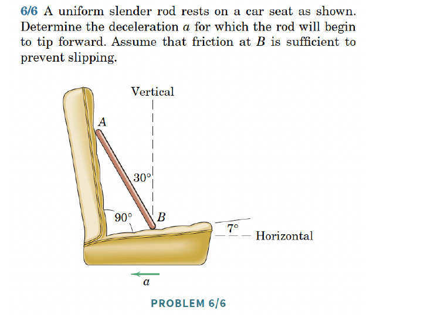{width=50%}

**2.** [06-012] *(ans. $a=16.43$ ft/sec$^2$)*

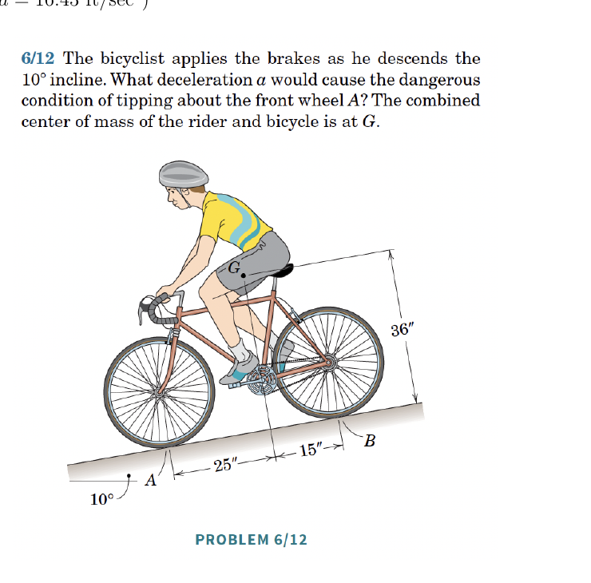{width=50%}

**3.** [06-013] *(ans. $N_A=6.85$ kN up, $N_B=9.34$ kN up)*

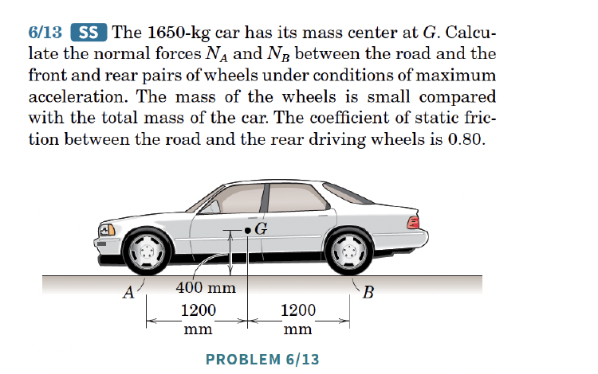{width=50%}

**4.** [06-022] *(ans. $N=257$ kN up)*

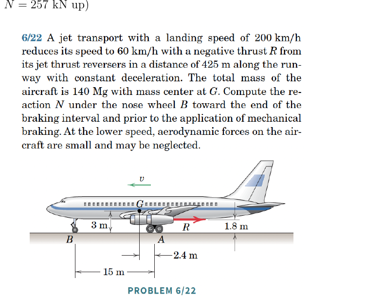{width=50%}

### Set 20 – Fixed Point Rotation

**1.** [06-051]

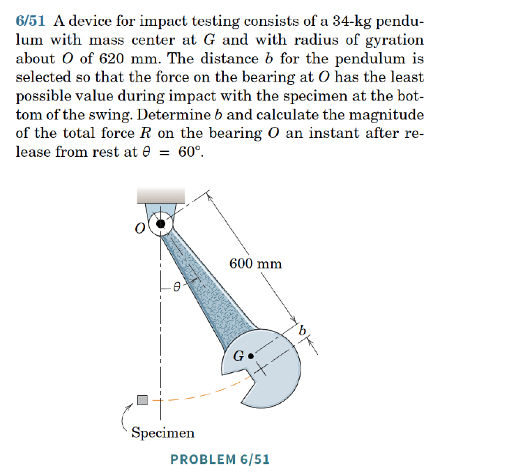{width=50%}




### Set 21 – General Plane Motion

**1.** [MKB 06-061] *(ans. $\alpha=48.8$ rad/s$^2$ CW, $\bar a_x=0$, $\bar a_y=5$ m/s$^2$)*

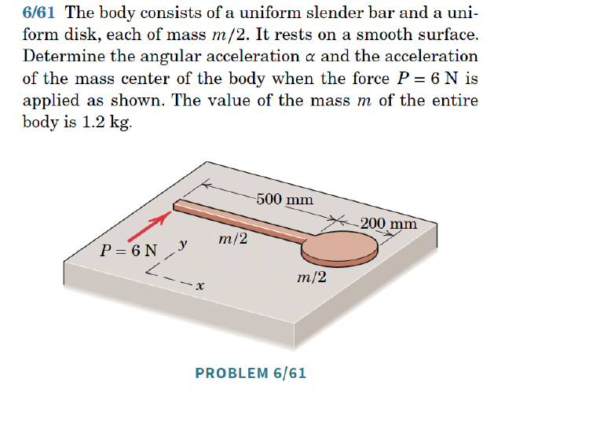{width=50%}

**2.** [MKB 06-062] *(ans. A: $\alpha_A=\frac{g}{r}\sin\theta$, $\mu_s=0$; B: $\alpha_B=\frac{g}{2r}\sin\theta$, $\mu_s=\frac{1}{2}\tan\theta$)*

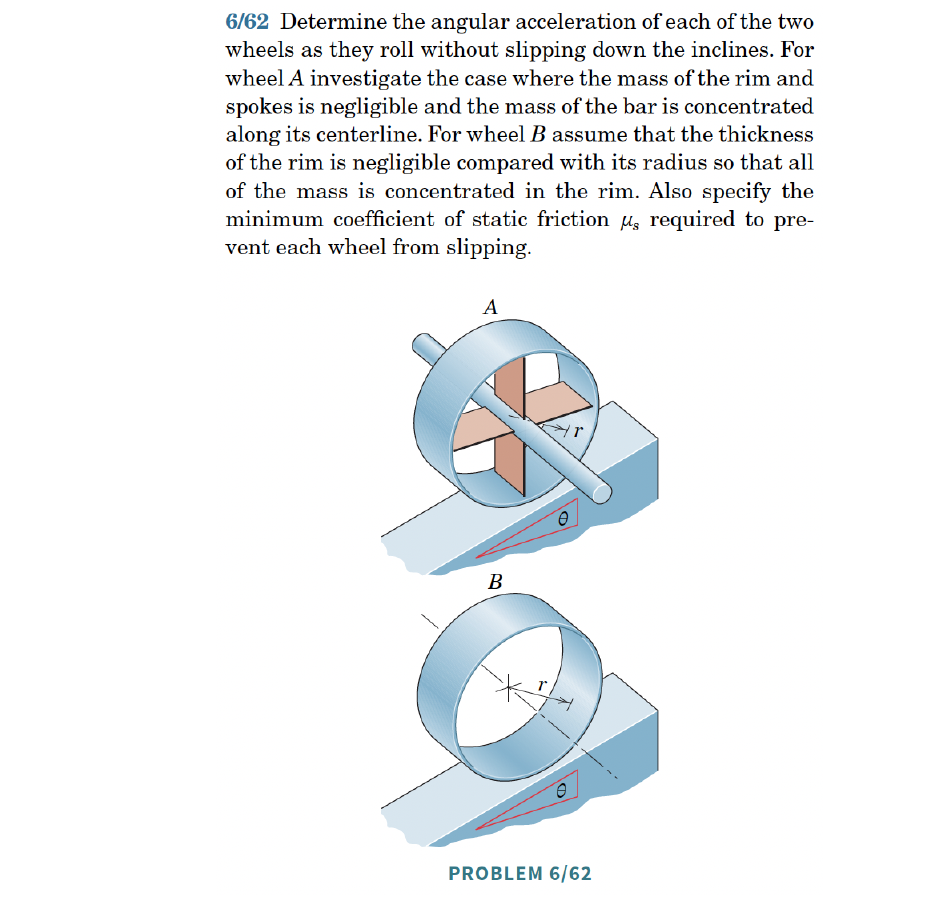{width=50%}

**3.** [06-063] *(ans. $\bar a=13.80$ ft/sec$^2$ down incline, $F=1.714$ lb up incline)*

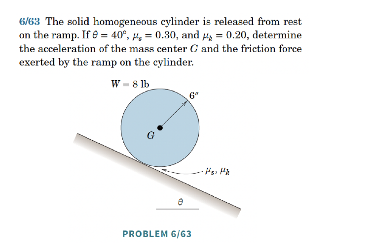{width=50%}

**4.** [06-070] *(ans. $a=\frac{8(m+M)g}{3\pi(m+3M)}$ left, $\alpha=\frac{8mg}{3\pi r(m+3M)}$ CW)*

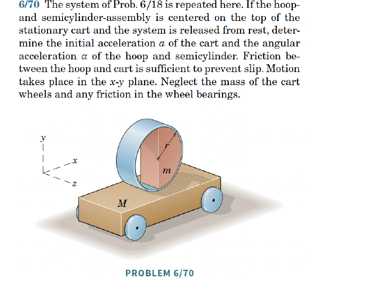{width=50%}




**5.** [06-076] *(ans. $s=\frac{3d}{2}$)*

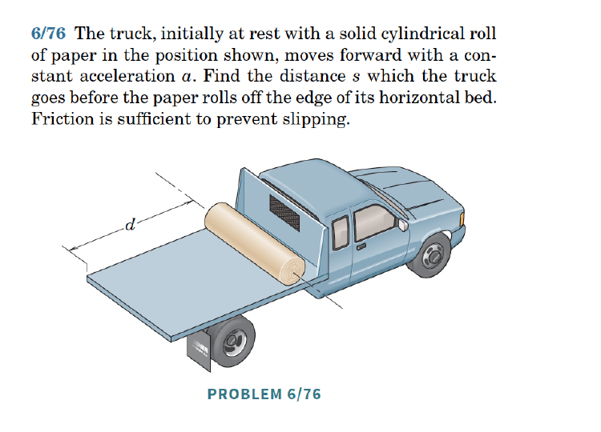{width=50%}

**6.** [06-077] *(ans. $N_B=36.4$ N up)*

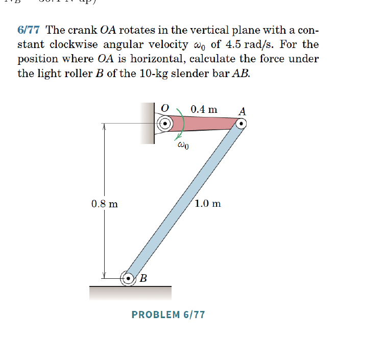{width=50%}

### Set 22 – Impulse and Momentum for Rigid Bodies

**1.** [MKB 06-136] *(ans. $\omega=1.811$ rad/s CCW)*

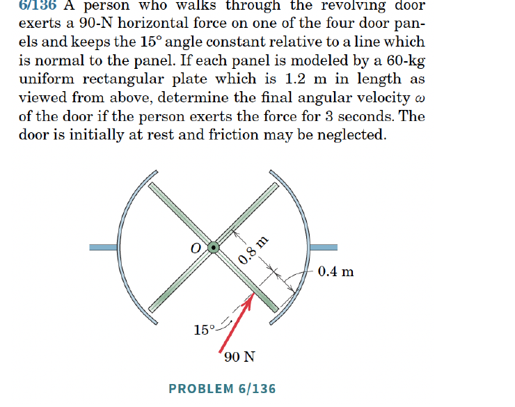{width=50%}

**2.** [MKB 06-142] *(ans. $\mathbf{v}=\frac{Mu_M\mathbf{E}_x+m\mathbf{v}_m}{M+m}$, $\omega=\frac{12vm}{L(4M+7m)}$ CCW)*

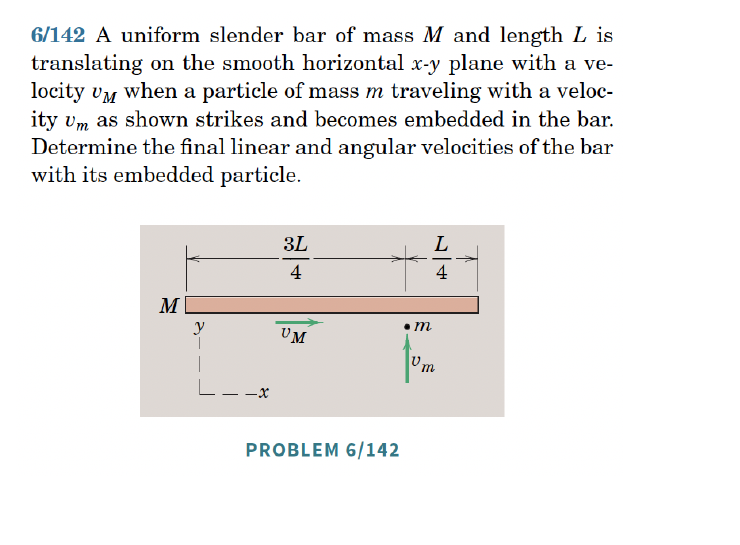{width=50%}

**3.** [06-145] *(ans. $\omega=\frac{3mv_1}{(M+m)L}$ CW)*

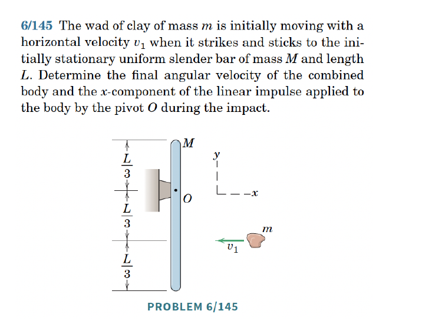{width=50%}

**4.** [06-146] *(ans. $N=2.04$ rev/s)*

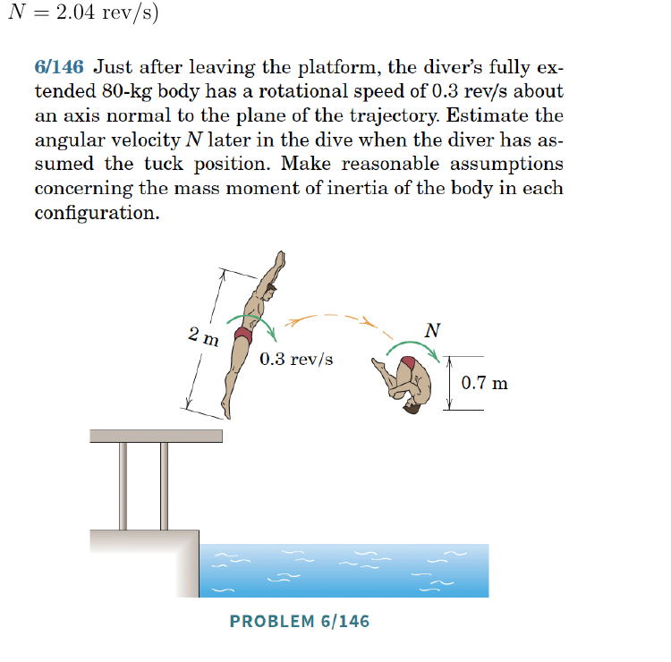{width=50%}

**5.** [06-148] *(ans. $\omega=1.593$ rad/s CCW, $n=91.7\%$)*

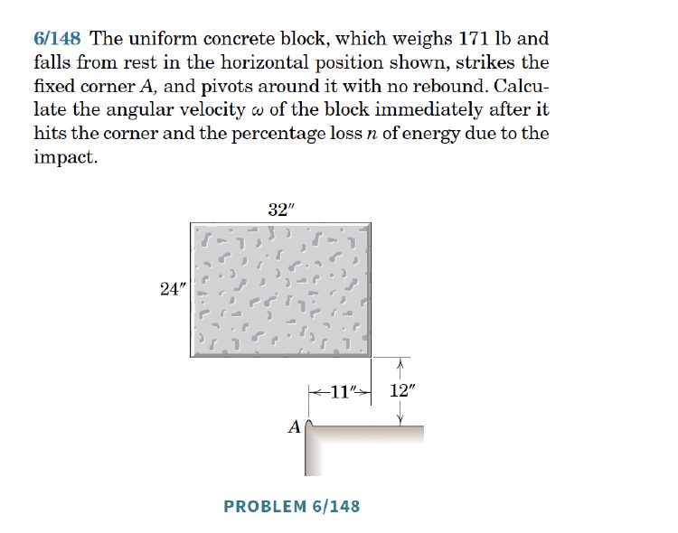{width=50%}

**6.** [06-155] *(ans. $t=\frac{2v_0}{g(7\mu_k\cos\theta-2\sin\theta)}$)*

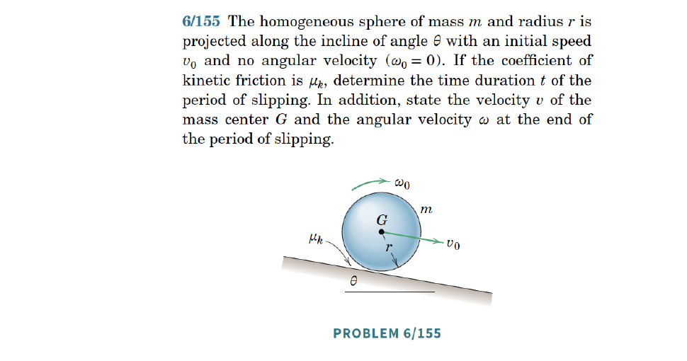{width=50%}



### Other





