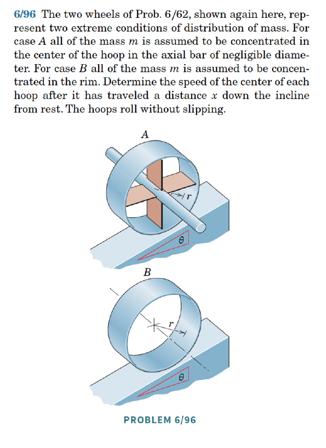
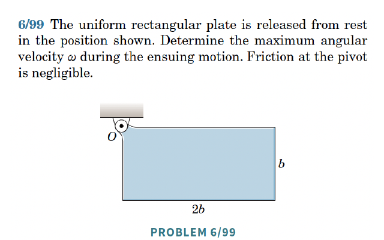
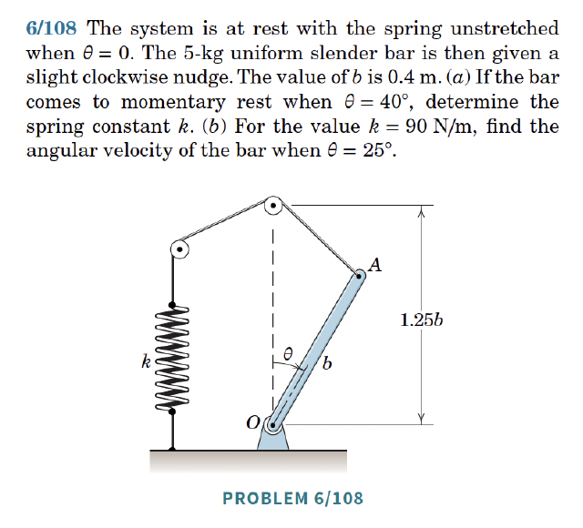
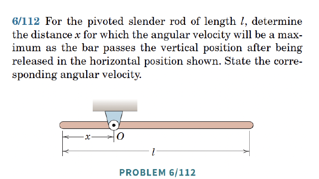
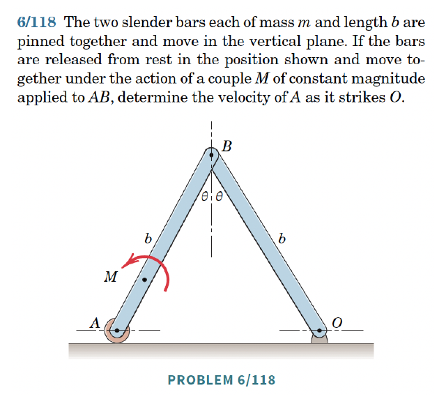

The **Koenig decomposition** for the kinetic energy of a rigid body is:
\begin{align}
    T = \frac{1}{2}m{\bf v}_C\cdot{\bf v}_C+\frac{1}{2}{\bf H}^C\cdot\bomega.
\end{align}
In this class, $\bomega = \omega{\bf E}_z$, so $\frac{1}{2}{\bf H}^C\cdot\bomega = \frac{1}{2}I_{zz}\omega^2$.

For fixed point rotation about $O$, the kinetic energy simplifies to:
\begin{align}
    T = \frac{1}{2}{\bf H}^O\cdot\bomega
\end{align}
which further simplifies to $T = \frac{1}{2}I^O_{zz}\omega^2$ if $\bomega = \omega{\bf E}_z$.

The **work-energy theorem** for a rigid body has two equivalent forms:
\begin{align}
    \frac{dT}{dt} = {\bf F}\cdot{\bf v}_C+{\bf M}^C\cdot\bomega = \sum_{i=1}^N{\bf F}_i\cdot{\bf v}_i+{\bf M}_e\cdot\bomega.
\end{align}
Integrating from $t_A$ to $t_B$:
\begin{align}
    T_B-T_A = W_{{\bf F},AB}+W_{{\bf M},AB} = \sum_{i=1}^N W_{{\bf F}_i,AB}+W_{{\bf M}_e,AB},
\end{align}
where
\begin{align}
    W_{{\bf F},AB} &= \int_{t_A}^{t_B}{\bf F}\cdot{\bf v}_C\,dt, &
    W_{{\bf M},AB} &= \int_{t_A}^{t_B}{\bf M}^C\cdot\bomega\,dt,\\
    W_{{\bf F}_i,AB} &= \int_{t_A}^{t_B}{\bf F}_i\cdot{\bf v}_i\,dt, &
    W_{{\bf M}_e,AB} &= \int_{t_A}^{t_B}{\bf M}_e\cdot\bomega\,dt.
\end{align}
Notice: the work of a force uses the velocity of its **point of application**.



## Koenig's Decomposition

By definition, the kinetic energy $T$ of a rigid body is the (continuous) sum of the kinetic energies of the differential masses composing it:
\begin{align}
    T = \frac{1}{2}\int_{\mathcal{B}}{\bf v}\cdot{\bf v}\,\rho\,dv.
\end{align}
We can introduce the ${\bf v}_C$ term through
\begin{align}
    \begin{split}
        & {\bf v} = {\bf v}_C+\bomega\times\bpi,\\
        & \bpi = {\bf r}-{\bf r}_C,\\
        & \bomega = \omega_x{\bf e}_x+\omega_y{\bf e}_y+\omega_z{\bf e}_z.
    \end{split}
\end{align}
Since
\begin{align}
    {\bf v}\cdot{\bf v} = ({\bf v}_C+\bomega\times\bpi)\cdot({\bf v}_C+\bomega\times\bpi) = {\bf v}_C\cdot{\bf v}_C+{\bf v}_C\cdot(\bomega\times\bpi)+(\bomega\times\bpi)\cdot{\bf v}_C+(\bomega\times\bpi)\cdot(\bomega\times\bpi),
\end{align}
and the two middle terms are equal by commutativity of the dot product, substituting the above expressions in the kinetic energy integral, we get
\begin{align}
    T = \frac{1}{2}\int_{\mathcal{B}}\lp{\bf v}_C\cdot{\bf v}_C+2{\bf v}_C\cdot(\bomega\times\bpi)+(\bomega\times\bpi)\cdot(\bomega\times\bpi)\rp dm.
\end{align}
For the first two terms in the above integral,
\begin{align}
    \begin{split}
        & \frac{1}{2}\int_{\mathcal{B}}{\bf v}_C\cdot{\bf v}_C\,dm = \frac{{\bf v}_C\cdot{\bf v}_C}{2}\int dm = \frac{1}{2}m{\bf v}_C\cdot{\bf v}_C,\\
        & \int_{\mathcal{B}}{\bf v}_C\cdot(\bomega\times\bpi)\,dm = {\bf v}_C\cdot\lp\bomega\times\int\bpi\,dm\rp = 0.
    \end{split}
\end{align}
Thus,
\begin{align}
    T = \frac{1}{2}m{\bf v}_C\cdot{\bf v}_C+\frac{1}{2}\int_{\mathcal{B}}(\bomega\times\bpi)\cdot(\bomega\times\bpi)\,dm.
\end{align}
We can simplify $(\bomega\times\bpi)\cdot(\bomega\times\bpi)$ using the scalar triple product identity $({\bf A}\times{\bf B})\cdot{\bf C}={\bf A}\cdot({\bf B}\times{\bf C})$ with ${\bf A}=\bomega$, ${\bf B}=\bpi$, ${\bf C}=\bomega\times\bpi$:
\begin{align}
    (\bomega\times\bpi)\cdot(\bomega\times\bpi) = \bomega\cdot\lp\bpi\times(\bomega\times\bpi)\rp.
\end{align}
The inner cross product expands via the BAC-CAB identity, ${\bf a}\times({\bf b}\times{\bf c}) = {\bf b}({\bf a}\cdot{\bf c})-{\bf c}({\bf a}\cdot{\bf b})$, with ${\bf a}=\bpi,{\bf b}=\bomega,{\bf c}=\bpi$:
\begin{align}
    \bpi\times(\bomega\times\bpi) = (\bpi\cdot\bpi)\bomega-(\bpi\cdot\bomega)\bpi.
\end{align}
Recall that
\begin{align}
    {\bf H}^C = \int_{\mathcal{B}}\bpi\times(\bomega\times\bpi)\,dm = \int_{\mathcal{B}}\lp(\bpi\cdot\bpi)\bomega-(\bpi\cdot\bomega)\bpi\rp dm.
\end{align}
Putting the last two results together, and pulling $\bomega$ out of the integral since it is the same for every material point of the rigid body:
\begin{align}
    \frac{1}{2}\int_{\mathcal{B}}(\bomega\times\bpi)\cdot(\bomega\times\bpi)\,dm = \frac{1}{2}\bomega\cdot\int_{\mathcal{B}}\bpi\times(\bomega\times\bpi)\,dm = \frac{1}{2}\bomega\cdot{\bf H}^C = \frac{1}{2}{\bf H}^C\cdot\bomega.
\end{align}
Hence, we obtain the Koenig decomposition:
\begin{align}
    T = \frac{1}{2}m{\bf v}_C\cdot{\bf v}_C+\frac{1}{2}{\bf H}^C\cdot\bomega.
\end{align}



### Fixed Point Rotation

In the case of fixed point rotation, ${\bf v}_C = \bomega\times({\bf r}_C-{\bf r}_O)$ and ${\bf v}_O = {\bf 0}$. Since ${\bf G}=m{\bf v}_C$ is the linear momentum,
\begin{align}
    \frac{1}{2}m{\bf v}_C\cdot{\bf v}_C = \frac{1}{2}(m{\bf v}_C)\cdot{\bf v}_C = \frac{1}{2}{\bf G}\cdot{\bf v}_C = \frac{1}{2}{\bf G}\cdot(\bomega\times{\bf r}_{C/O}),
\end{align}
so, using the cyclical property of the scalar triple product, ${\bf a}\cdot({\bf b}\times{\bf c}) = {\bf b}\cdot({\bf c}\times{\bf a}) = {\bf c}\cdot({\bf a}\times{\bf b})$:
\begin{align}
    \begin{split}
        T &= \frac{1}{2}{\bf G}\cdot(\bomega\times{\bf r}_{C/O})+\frac{1}{2}{\bf H}^C\cdot\bomega\\
        &= \frac{1}{2}\bomega\cdot({\bf r}_{C/O}\times{\bf G})+\frac{1}{2}{\bf H}^C\cdot\bomega\\
        &= \frac{1}{2}({\bf r}_{C/O}\times{\bf G}+{\bf H}^C)\cdot\bomega\\
        &= \frac{1}{2}{\bf H}^O\cdot\bomega,
    \end{split}
\end{align}
where the second line follows from the cyclical identity, the third line factors $\bomega$ out of the sum of two dot products, and the last line uses the identity
\begin{align}
    {\bf H}^O = {\bf H}^C+{\bf r}_{C/O}\times{\bf G},
\end{align}
obtained by writing
\begin{align}
    {\bf H}^O=\int_{\mathcal{B}}({\bf r}-{\bf r}_O)\times{\bf v}\,dm=\int_{\mathcal{B}}(\bpi+{\bf r}_{C/O})\times{\bf v}\,dm=\int_{\mathcal{B}}\bpi\times{\bf v}\,dm+{\bf r}_{C/O}\times\int_{\mathcal{B}}{\bf v}\,dm,
\end{align}
and noting that $\int_{\mathcal{B}}\bpi\times{\bf v}\,dm={\bf H}^C$ (by the same steps used above, since $\int\bpi\,dm={\bf 0}$) while $\int_{\mathcal{B}}{\bf v}\,dm=m{\bf v}_C={\bf G}$.



## Derivation of the Work-Energy Theorem

Taking the time derivative of $T = \frac{1}{2}m{\bf v}_C\cdot{\bf v}_C+\frac{1}{2}{\bf H}^C\cdot\bomega$:
\begin{align}
    \dot{T} = \frac{1}{2}m\dot{\bf v}_C\cdot{\bf v}_C+\frac{1}{2}m{\bf v}_C\cdot\dot{\bf v}_C+\frac{1}{2}\dot{\bf H}^C\cdot\bomega+\frac{1}{2}{\bf H}^C\cdot\dot{\bomega}.
\end{align}
We need to show that $\dot{\bf H}^C\cdot\bomega = {\bf H}^C\cdot\dot{\bomega}$.
\begin{align}
    \begin{split}
        \balpha = \dot{\bomega} &= \frac{d}{dt}(\omega_x{\bf e}_x+\omega_y{\bf e}_y+\omega_z{\bf e}_z)\\
        &= \dot{\omega}_x{\bf e}_x+\dot{\omega}_y{\bf e}_y+\dot{\omega}_z{\bf e}_z+\omega_x\dot{\bf e}_x+\omega_y\dot{\bf e}_y+\omega_z\dot{\bf e}_z\\
        &= \dot{\omega}_x{\bf e}_x+\dot{\omega}_y{\bf e}_y+\dot{\omega}_z{\bf e}_z+\bomega\times(\omega_x{\bf e}_x+\omega_y{\bf e}_y+\omega_z{\bf e}_z)\\
        &= \dot{\omega}_x{\bf e}_x+\dot{\omega}_y{\bf e}_y+\dot{\omega}_z{\bf e}_z.
    \end{split}
\end{align}
A direct calculation using this expression for $\balpha$ shows that
\begin{align}
    {\bf H}^C\cdot\dot{\bomega} = (I_{xx}\omega_x+I_{xy}\omega_y+I_{xz}\omega_z)\dot{\omega}_x+(I_{xy}\omega_x+I_{yy}\omega_y+I_{yz}\omega_z)\dot{\omega}_y+(I_{xz}\omega_x+I_{yz}\omega_y+I_{zz}\omega_z)\dot{\omega}_z.
\end{align}
To compute the corresponding expression for $\dot{\bf H}^C\cdot\bomega$, recall $\dot{\bf H}^C=\overset{\circ}{{\bf H}^C}+\bomega\times{\bf H}^C$, so
\begin{align}
    \dot{\bf H}^C\cdot\bomega = \overset{\circ}{{\bf H}^C}\cdot\bomega+(\bomega\times{\bf H}^C)\cdot\bomega = \overset{\circ}{{\bf H}^C}\cdot\bomega,
\end{align}
since $(\bomega\times{\bf H}^C)\cdot\bomega=0$ (the vector $\bomega\times{\bf H}^C$ is perpendicular to $\bomega$). Using the component expression for $\overset{\circ}{{\bf H}^C}$ and dotting with $\bomega$:
\begin{align}
    \overset{\circ}{{\bf H}^C}\cdot\bomega = (I_{xx}\dot{\omega}_x+I_{xy}\dot{\omega}_y+I_{xz}\dot{\omega}_z)\omega_x+(I_{xy}\dot{\omega}_x+I_{yy}\dot{\omega}_y+I_{yz}\dot{\omega}_z)\omega_y+(I_{xz}\dot{\omega}_x+I_{yz}\dot{\omega}_y+I_{zz}\dot{\omega}_z)\omega_z.
\end{align}
Comparing this term by term with the expression for ${\bf H}^C\cdot\dot{\bomega}$ above, and using the symmetry of the inertia tensor ($I_{xy}=I_{yx}$, $I_{xz}=I_{zx}$, $I_{yz}=I_{zy}$), every term matches (e.g. $I_{xy}\dot{\omega}_x\omega_y = I_{xy}\omega_x\dot{\omega}_y$). Hence $\dot{\bf H}^C\cdot\bomega = {\bf H}^C\cdot\dot{\bomega}$. Consequently,
\begin{align}
    \dot{T} = \frac{1}{2}m\dot{\bf v}_C\cdot{\bf v}_C+\frac{1}{2}m{\bf v}_C\cdot\dot{\bf v}_C+\frac{1}{2}\dot{\bf H}^C\cdot\bomega+\frac{1}{2}\dot{\bf H}^C\cdot\bomega,
\end{align}
which implies that
\begin{align}
    \dot{T} = m\dot{\bf v}_C\cdot{\bf v}_C+\dot{\bf H}^C\cdot\bomega.
\end{align}
Invoking the balance of linear momentum and the balance of angular momentum, we obtain the work-energy theorem:
\begin{align}
    \dot{T} = {\bf F}\cdot{\bf v}_C+{\bf M}^C\cdot\bomega.
\end{align}
This is a natural extension of the work-energy theorem for a single particle.



## Alternative Form

Recall,
\begin{align}
    \begin{split}
        & {\bf F} = \sum_{i=1}^K{\bf F}_i\\
        & {\bf M}^C = {\bf M}_e+\sum_{i=1}^K({\bf r}_i-{\bf r}_C)\times{\bf F}_i
    \end{split}
\end{align}
Hence, the mechanical power of the resultant forces and moments can be written as
\begin{align}
    {\bf F}\cdot{\bf v}_C+{\bf M}^C\cdot\bomega = \lp\sum_{i=1}^K{\bf F}_i\rp\cdot{\bf v}_C+{\bf M}_e\cdot\bomega+\lp\sum_{i=1}^K({\bf r}_i-{\bf r}_C)\times{\bf F}_i\rp\cdot\bomega.
\end{align}
With ${\bf a}=\bomega$, ${\bf b}={\bf r}_i-{\bf r}_C$, ${\bf c}={\bf F}_i$, the identity ${\bf a}\cdot({\bf b}\times{\bf c}) = {\bf c}\cdot({\bf a}\times{\bf b})$ gives
\begin{align}
    \lp({\bf r}_i-{\bf r}_C)\times{\bf F}_i\rp\cdot\bomega = \bomega\cdot\lp({\bf r}_i-{\bf r}_C)\times{\bf F}_i\rp = {\bf F}_i\cdot\lp\bomega\times({\bf r}_i-{\bf r}_C)\rp.
\end{align}
Substituting this into the expression for ${\bf F}\cdot{\bf v}_C+{\bf M}^C\cdot\bomega$ above:
\begin{align}
    {\bf F}\cdot{\bf v}_C+{\bf M}^C\cdot\bomega = \sum_{i=1}^K{\bf F}_i\cdot{\bf v}_C+{\bf M}_e\cdot\bomega+\sum_{i=1}^K{\bf F}_i\cdot\lp\bomega\times({\bf r}_i-{\bf r}_C)\rp = \sum_{i=1}^K{\bf F}_i\cdot\lp{\bf v}_C+\bomega\times({\bf r}_i-{\bf r}_C)\rp+{\bf M}_e\cdot\bomega.
\end{align}
Noting that ${\bf v}_i = {\bf v}_C+\bomega\times({\bf r}_i-{\bf r}_C)$, we find that
\begin{align}
    {\bf F}\cdot{\bf v}_C+{\bf M}^C\cdot\bomega = \sum_{i=1}^K{\bf F}_i\cdot{\bf v}_i+{\bf M}_e\cdot\bomega.
\end{align}
In conclusion, we have an alternative form of the work-energy theorem that proves to be far easier to use in applications:
\begin{align}
    \dot{T} = \sum_{i=1}^K{\bf F}_i\cdot{\bf v}_i+{\bf M}_e\cdot\bomega.
\end{align}
Each force is dotted with the velocity of its point of application.

## Conservative Moments

### Torsional Spring

A torsional spring with stiffness $K$ creates a couple ${\bf M}_S = -K\theta{\bf E}_z$. Its power is:
\begin{align}
    {\bf M}_S\cdot\bomega = -K\theta\dot{\theta} = -\frac{d}{dt}\lp\frac{K\theta^2}{2}\rp.
\end{align}
Hence $U = \frac{1}{2}K\theta^2$ for the torsional spring.

### Constant Couple

A constant couple ${\bf M}_e = M_e{\bf E}_z$ has power ${\bf M}_e\cdot\bomega = M_e\dot{\theta} = -\frac{d}{dt}(-M_e\theta)$. Hence $U = -M_e\theta$.

::: {.callout-important title="Note!"}
These results apply only for $\bomega = \omega{\bf E}_z$. Constant couples are not conservative in general.
:::

## Examples

### Bar Pendulum Fixed at Its End

```{r}
#| engine: tikz
#| echo: false
#| fig-align: center
#| fig-width: 3
\begin{tikzpicture}
    \draw[thick] (0,0) -- (3,-4);
    \fill[black] (0,0) circle (0.1);
    \draw[thick,->] (0,0) -- (0,-1) node[below] {${\bf E}_x$};
    \draw[thick,->] (0,0) -- (1,0) node[right] {${\bf E}_y$};
    \draw[thick,->,blue] (0,0) -- (0.6,-0.8) node[below] {${\bf e}_x$};
    \draw[thick,->,blue] (0,0) -- (0.8,0.6) node[above] {${\bf e}_y$};
\end{tikzpicture}
```

A bar of length $\ell$ and mass $m$ pinned at its end. The energy is conserved:
\begin{align}
    U &= -\frac{mg\ell}{2}\cos\theta,\\
    E &= \frac{m\ell^2}{6}\dot{\theta}^2-\frac{mg\ell}{2}\cos\theta = \text{const}.
\end{align}

### Bar Pendulum With End Mass

```{r}
#| engine: tikz
#| echo: false
#| fig-align: center
#| fig-width: 3
\begin{tikzpicture}
    \draw[thick] (0,0) -- (3,-4);
    \fill[black] (0,0) circle (0.1);
    \draw[thick,->] (0,0) -- (0,-1) node[below] {${\bf E}_x$};
    \draw[thick,->] (0,0) -- (1,0) node[right] {${\bf E}_y$};
    \draw[thick,->,blue] (0,0) -- (0.6,-0.8) node[below] {${\bf e}_x$};
    \draw[thick,->,blue] (0,0) -- (0.8,0.6) node[above] {${\bf e}_y$};
    \fill[black] (3,-4) circle (0.4);
\end{tikzpicture}
```

Adding a dead mass $m_e$ at the end:
\begin{align}
    U = -\frac{mg\ell}{2}\cos\theta-m_e g\ell\cos\theta.
\end{align}

### Follower Force

If instead a follower force ${\bf P}$ is applied perpendicular to the bar at its end, this force is **nonconservative** (its direction actively changes with configuration). Energy is not conserved.

## Energy Conservation

As with particles and systems of particles, this theorem can be used to establish conservation of the total mechanical energy of a rigid body, $E = T + U$, when all work-doing forces and moments are conservative.


## Summary

**Koenig decomposition** of kinetic energy:
\begin{align}
    T = \tfrac{1}{2}m\mathbf{v}_C\cdot\mathbf{v}_C + \tfrac{1}{2}\mathbf{H}^C\cdot\boldsymbol{\omega}.
\end{align}
If a point $O$ has zero velocity: $T = \tfrac{1}{2}\mathbf{H}^O\cdot\boldsymbol{\omega}$.

**Work–energy theorem for a rigid body**:
\begin{align}
    \frac{dT}{dt} = \mathbf{F}\cdot\mathbf{v}_C + \mathbf{M}\cdot\boldsymbol{\omega} = \sum_i \mathbf{F}_i\cdot\mathbf{v}_i + M_e\omega.
\end{align}

## Exercises

*The following problems are from Set 23 – Work–Energy Theorem for Rigid Bodies.*

**1.** [MKB 06-096] *(ans. $v_A=\sqrt{2gx\sin\theta}$, $v_B=\sqrt{gx\sin\theta}$)*

{width=50%}

**2.** [MKB 06-099] *(ans. $\omega_{\max}=0.861\sqrt{g/b}$)*

{width=50%}

**3.** [06-108] *(ans. (a) $k=93.3$ N/m; (b) $\omega=1.484$ rad/s CW)*

{width=50%}

**4.** [06-112] *(ans. $x=0.211l$, $\omega_{\max}=1.861\sqrt{g/l}$ CW)*

{width=50%}

**5.** [06-118] *(ans. $v_A=\sqrt{3}\sqrt{\frac{M\theta}{m}-gb(1-\cos\theta)}$ right)*

{width=50%}



