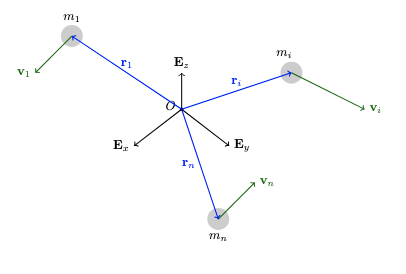
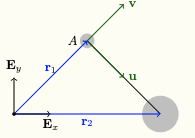

 
Consider a system of $n$ particles. A typical particle has
\begin{itemize}
    \item mass $m_i$.
    \item position vector with respect to $O$, ${\bf r}_i$.
    \item velocity vector, ${\bf v}_i = \frac{d{\bf r}_i}{dt}$.
    \item acceleration vector, ${\bf a}_i = \frac{d^2{\bf r}_i}{dt} = \frac{d{\bf v}_i}{dt}$.
    \item linear momentum, ${\bf G}_i = m_i{\bf v}_i$.
    \item angular momentum relative to some point $P$, ${\bf H}^{p_i} = ({\bf r}_i-{\bf r}_p)\times{\bf G}_i$.
    \item kinetic energy, $T_i = \frac{1}{2}m_i{\bf v}_i\cdot{\bf v}_i$.
\end{itemize}
In this chapter, we will define analogous quantities for the system. Also, starting the balance law for each individual particle, we'll write the balance law for the system.

## Center of Mass 

::: {.callout-note appearance="simple"}
## Think!

**Question:** What is the position vector of the center of mass of a system of multiple particles?

**Answer:**

The center of mass $C$ of a system of particles is defined to have position vector

\begin{align}
    \mathbf{r}_C = \frac{1}{m}\sum_{k=1}^n m_k\mathbf{r}_k,
\end{align}

where

\begin{align}
    m = \sum_{k=1}^n m_k
\end{align}

is the total mass of the system of particles.
:::

::: {.callout-warning appearance="simple"}
## Example

**Question:** Consider the unsymmetrical dumbbell depicted in the figure below. Particle 1 of mass $m$ and particle 2 of mass $3m$ are connected by a massless rigid rod.

{width=30%}

where

\begin{align*}
    \mathbf{r}_1 &= \mathbf{E}_x+\mathbf{E}_y,\\
    \mathbf{r}_2 &= 2\mathbf{E}_x.
\end{align*}

Calculate $\mathbf{r}_C$, the position vector of the center of mass $C$ of $m_1$ and $m_2$. Is $C$ located on the dumbbell?

**Answer:**

\begin{align*}
    \mathbf{r}_C = \frac{m\mathbf{r}_1+3m\mathbf{r}_2}{m+3m} = \, ...
\end{align*}

We can check mathematically that $C$ lies on the line connecting $m_1$ and $m_2$ by calculating the equation of that line and checking whether $C$ belongs to it.

Alternatively, we can define a new basis, $\{\mathbf{u},\mathbf{v}\}$, and calculate the position of $C$ relative to $m_1$ on that basis. This should be along $\mathbf{u}$.
:::

In the previous exercise, we used
\begin{equation}
    \mathbf r_{C/A} = \frac{\sum m_i \mathbf r_{i/A}}{\sum m_i}. 
\end{equation}

:::{.callout-note appearance=simple}
## Think!
**Questions:** Starting from
$$ \mathbf r_C = \frac{1}{m}\sum_{k=1}^nm_k\mathbf r_k, $$ 
show that 
$$\mathbf r_{C/A} = \frac{\sum m_i \mathbf r_{i/A}}{\sum m_i}.$$
:::

Differentiating the expression for the position vector of the mass center, we get
\begin{align}
    {\bf v}_C = \frac{1}{m}\sum_{k=1}^nm_k{\bf v}_k = \frac{1}{m}\sum_{k=1}^n{\bf G}_k.
\end{align}
Notice that the velocity of the center of mass is the weighted sum of the velocities of the particles.

::: {.callout-note appearance=simple}
## Think!
**Question:** Show that the following identities are true.
\begin{align}
    \begin{split}
        \sum_{k=1}^nm_k({\bf r}_C-{\bf r}_k) = {\bf 0},\\
        \sum_{k=1}^nm_k({\bf v}_C-{\bf v}_k) = {\bf 0}.
    \end{split}
\end{align}
:::

## Linear Momentum 
The linear momentum ${\bf G}$ of the system of particles is the sum of the linear momenta of the individual particles.
\begin{align}
    {\bf G} = m\frac{d{\bf r}}{dt} = \sum_{k=1}^n m_k\frac{d{\bf r}_k}{dt} = \sum_{k=1}^n{\bf G}_k.
\end{align}
The linear momentum of the center of mass is the linear momentum of the system.

## Angular Momentum
The angular momentum ${\bf H}^P$ of the system of particles relative to a point $P$, whose position vector relative to $O$ is ${\bf r}_P$, is the sum of the individual angular momenta:
\begin{align}
    \begin{split}
        {\bf H}^P &= \sum_{k=1}^n{\bf H}^{P_K} = \sum_{k=1}^n({\bf r}_k-{\bf r}_P)\times m_k{\bf v}_k\\
        &= {\bf H}^C + ({\bf r}_C-{\bf r}_P)\times {\bf G}.
    \end{split}
\end{align}
where
\begin{align}
    \begin{split}
        {\bf H}^C &= \sum_{k=1}^n({\bf r}_k-{\bf r}_C)\times m_k{\bf v}_k\\
        &= \sum_{k=1}^n({\bf r}_k-{\bf r}_C)\times m_k({\bf v}_k-{\bf v}_C).
    \end{split}
\end{align}

::: {.callout-note appearance=simple}
## Think!
**Question:** Show that
\begin{align}
    \begin{split}
        \sum_{k=1}^n({\bf r}_k-{\bf r}_P)\times m_k{\bf v}_k = {\bf H}^C + ({\bf r}_C-{\bf r}_P)\times {\bf G}.
    \end{split}
\end{align}

Hint: Introduce ${\bf r}-{\bf r}$.
:::

::: {.callout-note appearance=simple}
## Think!
**Question:** Show that
\begin{align}
    \begin{split}
        \sum_{k=1}^n({\bf r}_k-{\bf r}_C)\times m_k{\bf v}_k = \sum_{k=1}^n({\bf r}_k-{\bf r}_C)\times m_k({\bf v}_k-{\bf v}_C).
    \end{split}
\end{align}

Hint: introduce ${\bf v}_C-{\bf v}_C$.
:::

## Kinetic Energy 
The kinetic energy $T$ of the system of particles is defined to be the sum of their individual kinetic energies:
\begin{align}
    T = \sum_{k=1}^nT_k = \sum_{k=1}^n\frac{1}{2}m_k{\bf v}_k\cdot{\bf v}_k.
\end{align}

In general, the kinetic energy of the system is not equal to the kinetic energy of the center of mass.

Using the center of mass,
\begin{align}
    T = \frac{1}{2}m{\bf v}_C\cdot{\bf v}_C + \frac{1}{2}\sum_{k=1}^nm_k({\bf v}_k-{\bf v}_C)\cdot({\bf v}_k-{\bf v}_C).
\end{align}

::: {.callout-note appearance=simple}
## Think!
**Question:** Show that
\begin{align}
    \begin{split}
        \sum_{k=1}^n\frac{1}{2}m_k{\bf v}_k\cdot{\bf v}_k = \frac{1}{2}m{\bf v}_C\cdot{\bf v}_C + \frac{1}{2}\sum_{k=1}^nm_k({\bf v}_k-{\bf v}_C)\cdot({\bf v}_k-{\bf v}_C).
    \end{split}
\end{align}

Hint: Add ${\bf v}_C-{\bf v}_C$ to the previous for both ${\bf v}_k$ terms.
:::

## Kinetics of a System of Particles: Linear Momentum
For each particle
\begin{align}
    {\bf F}_i = m_i{\bf a}_i.
\end{align}
Adding these $n$ equations together and using the definition of the center of mass
\begin{align}
    {\bf F} = m{\bf a}_c
\end{align}
\begin{align}
    {\bf F} = \sum_{k=1}^n{\bf F}_k.
\end{align}
:::

Example: Monkey problems from the problem set.

::: {.callout-important}
## Note!
The conditions for the conservation of linear momentum of a system of particles completely or along a certain direction are analogous to those of a single particle established earlier.
:::

## Kinetics of a System of Particles: Angular Momentum
Starting from
\begin{align}
    \begin{split}
        {\bf H}^P &= \sum_{k=1}^n{\bf H}^{P_K} = \sum_{k=1}^n({\bf r}_k-{\bf r}_P)\times m_k{\bf v}_k.
    \end{split}
\end{align}

The derivative $\dot{\bf H}^P$ simplifies to
\begin{align}
    \dot{\bf H}^P = \sum_{k=1}^n({\bf r}_k-{\bf r}_P)\times{\bf F}_k-{\bf v}_P\times{\bf G}.
\end{align}
The resultant moment of the system of forces relative to $P$ is
\begin{align}
    {\bf M}^P = \sum_{k=1}^n({\bf r}_k-{\bf r}_P)\times{\bf F}_k.
\end{align}
The angular momentum theorem becomes
\begin{align}
    \dot{\bf H}^P = {\bf M}^P-{\bf v}_P\times{\bf G}.
\end{align}
It is very important to notice that $\dot{\bf H}^P$ is not necessarily equal to ${\bf M}^P$.

Two important special cases of the angular momentum theorem:
\begin{enumerate}
    \item If $P$ is the fixed point that is taken to be the origin $O$, where ${\bf r}_O=0$, then
    \begin{align}
        \dot{\bf H}^O = {\bf M}^O\text{, where }{\bf M}^O = \sum_{k=1}^n{\bf r}_k\times{\bf F}_k
    \end{align}
    \item If $P$ is the center of mass $C$, then ${\bf v}\times{\bf G}={\bf 0}$ and
    \begin{align}
        \dot{\bf H}^C = {\bf M}^C\text{, where }{\bf M} = \sum_{k=1}^n({\bf r}_k-{\bf r})\times{\bf F}_k.
    \end{align}
\end{enumerate}

::: {.callout-important}
## Note!
The conditions for the conservations of angular momentum of a system of particles completely or along a certain direction are analogous to those of a single particle established earlier.
:::

## Work-Energy Theorem 
The work-energy theorem and the energy conservation for a system of particles are then
\begin{align}
    \dot{T} = \sum_{k=1}^n{\bf F}_k\cdot{\bf v}_k,
\end{align}
and
\begin{align}
    \dot{E} = \sum_{k=1}^n{\bf F}_{nc_k}\cdot{\bf v}_K
\end{align}
where ${\bf F}_{nc_k}$ is the nonconservative force acting on the $k$th particle and $E$ is the total energy of the system of particles.

Integrating with respect to time, we get
\begin{align}
    \begin{split}
        T(t_2)-T(t_1) = \sum_{k=1}^n W_{{\bf F}_k,12}
    \end{split}
\end{align}
where the work of force ${\bf F}_k$ is
\begin{align}
    \begin{split}
        W_{{\bf F}_k,12} = \int_{t_1}^{t_2} {\bf F}_k\cdot{\bf v}_kdt = \int_{{\bf r}(t_1)}^{{\bf r}(t_2)}{\bf F}_kd{\bf r}_k.
    \end{split}
\end{align}

::: {.callout-important}
## Note!
The work of the force is the integral of the force dotted with the velocity of displacement of the point of application of the force.
:::

::: {.callout-warning appearance=simple}
## Example
**Question:** Consider the unsymmetrical dumbbell depicted in the figure below. Particle 1 of mass $m$ and particle 2 of mass $3m$ are connected by a massless rigid rod. The dumbbell is in motion in the smooth $\{{\bf E}_x,{\bf E}_y\}$ plane at gravity acts along $-{\bf E}_z$.

{fig-align="center"}

where
\begin{align*}
    {\bf r}_1 &= {\bf E}_x+{\bf E}_y,\\
    {\bf r}_2 &= 2{\bf E}_x.
\end{align*}

Is the energy of the dumbbell conserved throughout its motion?

**Answer:**
Drawing the free body diagram of both masses, we get ...
:::