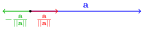
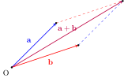
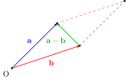

# Vector calculus - A quick review

## Scaling Vectors

We can scale the vector $\mathbf{a}$.

::: {.callout-tip title="Think!"}

Question: Consider a vector $\mathbf{a}$. Plot the vectors $2\mathbf{a}$, $-\mathbf{a}$, $\frac{1}{2}\mathbf{a}$

Answer: ...

:::

::: {.callout-tip title="Think!"}

Question: Give the expression for a unit vector in the direction of $\mathbf{a}$? Opposite to $\mathbf{a}$.

Answer:

- $\frac{\mathbf{a}}{\left\lVert\mathbf{a}\right\rVert}$ is a unit vector in the direction of $\mathbf{a}$.
- $-\frac{\mathbf{a}}{\left\lVert\mathbf{a}\right\rVert}$ is a unit vector in the direction opposite to that of $\mathbf{a}$.

:::

## Vector summation and subtraction

Vectors can be added using the parallelogram law or by placing vectors in a head to tail sequence.

The vector difference $\mathbf{a}-\mathbf{b}$ points from the tip of $\mathbf{b}$ to the tip of $\mathbf{a}$.

## The dot (scalar) product

Consider the three dimensional Euclidean space $\mathbb{E}^3 = (\mathbb{R}^3,\cdot) $ which is the three-dimensional space $\mathbb{R}^3$ and a dot product defined as follows.

Let $\mathbf{a}, \mathbf{b} \in  \mathbb{E}^3$.

\begin{align}
    \mathbf{a}\cdot\mathbf{b} &= \left\lVert\mathbf{a}\right\rVert \left\lVert \mathbf{b}\right\rVert \cos(\theta).
\end{align}

::: {.callout-tip title="Think!"}

Question: What is the result of $\mathbf{a}\cdot\mathbf{a}$?

Answer:
The magnitude of a vector $\mathbf{a}$ is given by
\begin{align}
    \mathbf{a}\cdot\mathbf{a} = \left\lVert\mathbf{a}\right\rVert^2 \implies \left\lVert\mathbf{a}\right\rVert = \sqrt{\mathbf{a}\cdot\mathbf{a}}.
\end{align}

:::

::: {.callout-tip title="Think!"}

Question: Is $\mathbf{a}\cdot\mathbf{b} = \mathbf{b}\cdot\mathbf{a}$? Why?

Answer: Yes, the dot product is commutative. This can be shown using the definition of the dot product.

:::

## Vector Projections

Suppose $\mathbf{u}$ is a unit vector: $\mathbf{u}\cdot\mathbf{u}=1$.

::: {.callout-tip title="Think!"}

Question: Calculate $\mathbf{b}\cdot\mathbf{u}$

Answer:
\begin{align}
    \mathbf{b}\cdot\mathbf{u} = \left\lVert\mathbf{b}\right\rVert \underbrace{\left\lVert\mathbf{u}\right\rVert}_{1}\cos(\theta) = \left\lVert\mathbf{b}\right\rVert\cos(\theta).
\end{align}

Notice the right triangle in the above figure. Verify that $\mathbf{b}\cdot\mathbf{u}$ is the orthogonal projection of $\mathbf{b}$ in the direction of $\mathbf{u}$.

:::

Suppose $\mathbf{v}\cdot\mathbf{v} = 1$ ($\mathbf{v}$ is a unit vector), and $\mathbf{v}\cdot\mathbf{u}=0$ ($\mathbf{v}$ and $\mathbf{u}$ are orthogonal/perpendicular).

\begin{align}
    \mathbf{b}\cdot\mathbf{v} = \left\lVert\mathbf{b}\right\rVert \cos\left(\frac{\pi}{2}-\theta\right) = \left\lVert\mathbf{b}\right\rVert \sin(\theta).
\end{align}

This is the projection of $\mathbf{b}$ in the direction perpendicular to $\mathbf{u}$. Hence, we can write

\begin{align}
    \mathbf{b} &= \left(\mathbf{b}\cdot\mathbf{u}\right)\mathbf{u}+\left(\mathbf{b}\cdot\mathbf{v}\right)\mathbf{v}\\
    &= \underbrace{\left\lVert\mathbf{b}\right\rVert}_{\text{magnitude}}\left(\underbrace{\cos(\theta)\mathbf{u}+\sin(\theta)\mathbf{v}}_{\text{direction}}\right).
\end{align}

Remember that $\cos^2(\theta)+\sin^2(\theta)=1$.

## Cross Product

We also define the cross product

\begin{align}
    \mathbf{a}\times\mathbf{b} &= \left\lVert\mathbf{a}\right\rVert \left\lVert\mathbf{b}\right\rVert |\sin(\theta)|\mathbf{n}
\end{align}

where $\mathbf{n}$ is a unit vector normal to the plane formed by $\mathbf{a}$ and $\mathbf{b}$. The direction of $\mathbf{n}$ is given by the right hand rule.

::: {.callout-tip title="Think!"}

Question: Is $\mathbf{a}\times\mathbf{b} = \mathbf{b}\times\mathbf{a}$?

Answer:
No, the cross product is not commutative. These vectors are opposite.

:::
