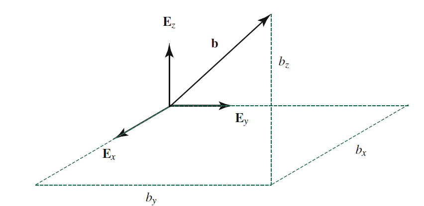

# Vector calculus - A quick review

## Scaling Vectors

We can scale the vector ${\bf a}$.

::: {.callout-tip title="Think!"}

Question: Consider a vector ${\bf a}$. Plot the vectors $2{\bf a}$, $-{\bf a}$, $\frac{1}{2}{\bf a}$

Answer: ...

:::

::: {.callout-tip title="Think!"}

Question: Give the expression for a unit vector in the direction of ${\bf a}$? Opposite to ${\bf a}$.

Answer:

- $\frac{\bf a}{\lnorm{\bf a}\rnorm}$ is a unit vector in the direction of ${\bf a}$.
- $-\frac{\bf a}{\lnorm{\bf a}\rnorm}$ is a unit vector in the direction opposite to that of ${\bf a}$.

:::

```{r}
#| engine: tikz
#| echo: false
#| fig-align: center
\begin{tikzpicture}
    \coordinate (O) at (0,0);
    \coordinate (V) at (4,0);
    \coordinate (U1) at (1,0);
    \coordinate (U2) at (-1,0);
    \draw[->, thick, blue] (O) -- (V) node[midway, above] {$\mathbf{a}$};
    \draw[->, thick, red] (O) -- (U1) node[midway, below] {$\frac{\mathbf{a}}{||\mathbf{a}||}$};
    \draw[->, thick, green!70!black] (O) -- (U2) node[midway, below] {$-\frac{\mathbf{a}}{||\mathbf{a}||}$};
    \filldraw (O) circle (1pt);
\end{tikzpicture}
```

## Vector summation and subtraction

Vectors can be added using the parallelogram law or by placing vectors in a head to tail sequence.

The vector difference ${\bf a}-{\bf b}$ points from the tip of ${\bf b}$ to the tip of ${\bf a}$.

```{r}
#| engine: tikz
#| echo: false
#| fig-align: center
\usetikzlibrary{arrows}
\begin{tikzpicture}[>=stealth, scale=1.0]
    \draw[->, thick, blue] (0,0) -- (2,2) node[midway, above left] {${\bf a}$};
    \draw[->, thick, red] (0,0) -- (3,1) node[midway, below right] {${\bf b}$};
    \draw[->, thick, purple] (0,0) -- (5,3) node[midway, above] {${\bf a}+{\bf b}$};
    \draw[dashed, red] (2,2) -- (5,3);
    \draw[dashed, blue] (3,1) -- (5,3);
    \filldraw (0,0) circle (1pt) node[below left] {O};
    \filldraw (2,2) circle (1pt);
    \filldraw (3,1) circle (1pt);
    \filldraw (5,3) circle (1pt);
\end{tikzpicture}
```

```{r}
#| engine: tikz
#| echo: false
#| fig-align: center
\usetikzlibrary{arrows}
\begin{tikzpicture}[>=stealth, scale=1.0]
    \draw[->, thick, blue] (0,0) -- (2,2) node[midway, above left] {${\bf a}$};
    \draw[->, thick, red] (0,0) -- (3,1) node[midway, below right] {${\bf b}$};
    \draw[dashed, red] (2,2) -- (5,3);
    \draw[dashed, blue] (3,1) -- (5,3);
    \draw[->, thick, green!70!black] (3,1) -- (2,2) node[midway, below left] {${\bf a}-{\bf b}$};
    \filldraw (0,0) circle (1pt) node[below left] {O};
    \filldraw (2,2) circle (1pt);
    \filldraw (3,1) circle (1pt);
    \filldraw (5,3) circle (1pt);
\end{tikzpicture}
```

## The dot (scalar) product

Consider the three dimensional Euclidean space $\mathbb{E}^3 = (\mathbb{R}^3,\cdot)$ which is the three-dimensional space $\mathbb{R}^3$ and a dot product defined as follows.

```{r}
#| engine: tikz
#| echo: false
#| fig-align: center
\begin{tikzpicture}
    \coordinate (O) at (0,0);
    \coordinate (A) at (3,0);
    \coordinate (B) at (30:3);
    \draw[->, thick] (O) -- (A) node[midway, below] {$\mathbf{a}$};
    \draw[->, thick] (O) -- (B) node[midway, above] {$\mathbf{b}$};
    \draw[thick] (0.5,0) arc[start angle=0, end angle=30, radius=0.5];
    \node at (15:0.8) {$\theta$};
    \filldraw (O) circle (1pt);
\end{tikzpicture}
```

Let ${\bf a}, {\bf b} \in  \mathbb{E}^3$.

\begin{align}
    {\bf a}\cdot{\bf b} &= \lnorm{\bf a}\rnorm \lnorm {\bf b}\rnorm \cos(\theta).
\end{align}

::: {.callout-tip title="Think!"}

Question: What is the result of ${\bf a}\cdot{\bf a}$?

Answer:
The magnitude of a vector ${\bf a}$ is given by
\begin{align}
    {\bf a}\cdot{\bf a} = \lnorm{\bf a}\rnorm^2 \implies \lnorm{\bf a}\rnorm = \sqrt{{\bf a}\cdot{\bf a}}.
\end{align}

:::

::: {.callout-tip title="Think!"}

Question: Is ${\bf a}\cdot{\bf b} = {\bf b}\cdot{\bf a}$? Why?

Answer: Yes, the dot product is commutative. This can be shown using the definition of the dot product.

:::

## Vector Projections

Suppose ${\bf u}$ is a unit vector: ${\bf u}\cdot{\bf u}=1$.

```{r}
#| engine: tikz
#| echo: false
#| fig-align: center
\begin{tikzpicture}
    \draw[thick,->] (0,0) -- (4,3) node[above, midway] {${\bf b}$};
    \draw[thick,->] (0,0) -- (1,0) node[above] {${\bf u}$};
    \draw[dashed] (0,0) -- (4,0) node[midway,below] {${\bf b}\cdot{\bf u}$};
    \draw[dashed] (4,0) -- (4,3);
    \draw[thick,->] (0,0) -- (0,1) node[above] {${\bf v}$};
\end{tikzpicture}
```

::: {.callout-tip title="Think!"}

Question: Calculate ${\bf b}\cdot{\bf u}$

Answer:
\begin{align}
    {\bf b}\cdot{\bf u} = \lnorm{\bf b}\rnorm \underbrace{\lnorm{\bf u}\rnorm}_{1}\cos(\theta) = \lnorm{\bf b}\rnorm\cos(\theta).
\end{align}

Notice the right triangle in the above figure. Verify that ${\bf b}\cdot{\bf u}$ is the orthogonal projection of ${\bf b}$ in the direction of ${\bf u}$.

:::

Suppose ${\bf v}\cdot{\bf v} = 1$ (${\bf v}$ is a unit vector), and ${\bf v}\cdot{\bf u}=0$ (${\bf v}$ and ${\bf u}$ are orthogonal/perpendicular).

\begin{align}
    {\bf b}\cdot{\bf v} = \lnorm{\bf b}\rnorm\cos\lp\frac{\pi}{2}-\theta\rp = \lnorm{\bf b}\rnorm\sin(\theta).
\end{align}

This is the projection of ${\bf b}$ in the direction perpendicular to ${\bf u}$. Hence, we can write

\begin{align}
    {\bf b} &= \lp{\bf b}\cdot{\bf u}\rp{\bf u}+\lp{\bf b}\cdot{\bf v}\rp{\bf v}\\
    &= \underbrace{\lnorm{\bf b}\rnorm}_{\text{magnitude}}\lp\underbrace{\cos(\theta){\bf u}+\sin(\theta){\bf v}}_{\text{direction}}\rp.
\end{align}

Remember that $\cos^2(\theta)+\sin^2(\theta)=1$.



## Cross Product

We also define the cross product

\begin{align}
    {\bf a}\times{\bf b} &= \lnorm{\bf a}\rnorm \lnorm{\bf b}\rnorm |\sin(\theta)|{\bf n}
\end{align}

where ${\bf n}$ is a unit vector normal to the plane formed by ${\bf a}$ and ${\bf b}$. The direction of ${\bf n}$ is given by the right hand rule.

::: {.callout-tip title="Think!"}

Question: Is ${\bf a}\times{\bf b} = {\bf b}\times{\bf a}$?

Answer:
No, the cross product is not commutative. These vectors are opposite.

:::